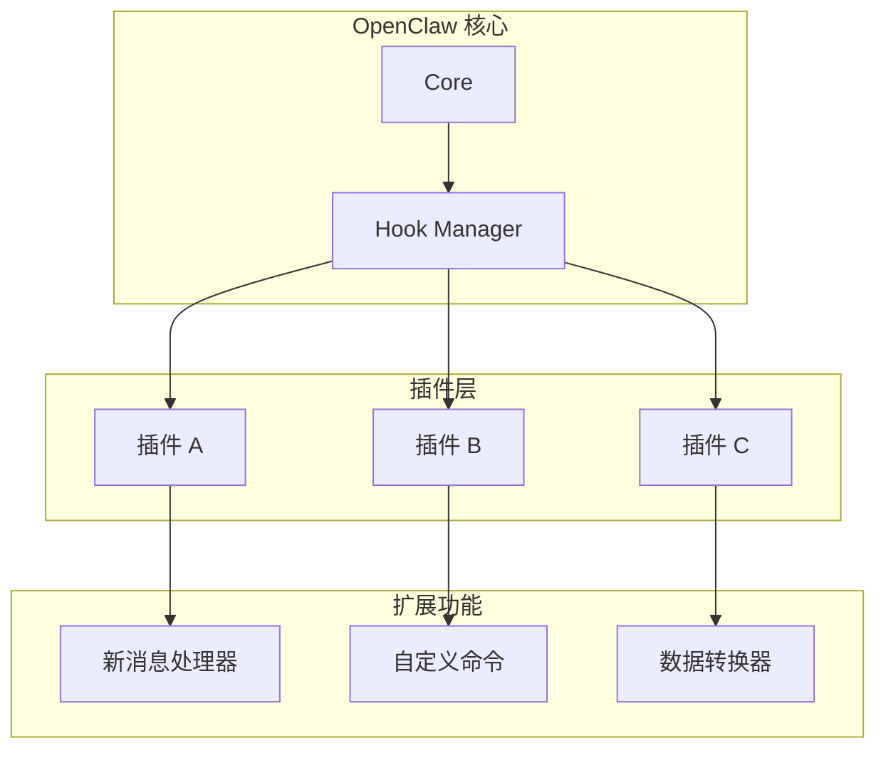

# 第 17 章：插件系统

> 本章将深入解析 OpenClaw 的插件系统，包括插件架构、钩子机制、开发插件和插件市场。

---

## 17.1 插件架构

### 17.1.1 什么是插件

插件是扩展 OpenClaw 功能的模块化组件：



**插件 vs 技能 vs 工具**：

| 特性 | 插件 | 技能 | 工具 |
|------|------|------|------|
| **作用域** | 系统级扩展 | 功能集合 | 单一功能 |
| **生命周期** | 随系统启动 | 按需加载 | 调用时执行 |
| **能力** | 拦截事件、修改行为 | 提供工具 | 执行具体操作 |
| **示例** | 消息过滤器 | Git 管理 | 文件读取 |

### 17.1.2 插件目录结构

```
plugins/
├── my-plugin/
│   ├── plugin.json          # 插件配置
│   ├── index.ts             # 入口文件
│   ├── hooks/
│   │   ├── on-message.ts    # 消息钩子
│   │   └── on-start.ts      # 启动钩子
│   └── utils/
│       └── helper.ts
└── another-plugin/
    └── ...
```

### 17.1.3 插件配置

```json
// plugin.json
{
  "name": "message-filter",
  "version": "1.0.0",
  "description": "过滤敏感消息内容",
  "author": "Your Name",
  "license": "MIT",
  "main": "index.ts",
  "hooks": [
    "on-message",
    "on-send"
  ],
  "config": {
    "schema": {
      "blockedWords": {
        "type": "array",
        "items": { "type": "string" },
        "default": []
      },
      "logViolations": {
        "type": "boolean",
        "default": true
      }
    }
  },
  "permissions": [
    "read:messages",
    "write:messages"
  ]
}
```

---

## 17.2 钩子机制

### 17.2.1 钩子类型

OpenClaw 提供多种钩子点：

| 钩子 | 触发时机 | 用途 |
|------|----------|------|
| `on-start` | 系统启动时 | 初始化资源 |
| `on-message` | 收到消息时 | 消息预处理 |
| `on-send` | 发送消息前 | 消息后处理 |
| `on-error` | 发生错误时 | 错误处理 |
| `on-channel-connect` | 通道连接时 | 通道初始化 |
| `on-agent-turn` | Agent 执行前 | 修改提示词 |

### 17.2.2 钩子实现

```typescript
// /src/plugins/hook-manager.ts

interface HookContext {
  pluginId: string;
  config: Record<string, unknown>;
  logger: Logger;
}

type HookHandler<T = unknown, R = T> = (
  data: T,
  context: HookContext
) => Promise<R> | R;

class HookManager {
  private hooks = new Map<string, HookHandler[]>();
  
  // 注册钩子
  register(hookName: string, handler: HookHandler): void {
    const handlers = this.hooks.get(hookName) || [];
    handlers.push(handler);
    this.hooks.set(hookName, handlers);
  }
  
  // 执行钩子
  async execute<T, R>(
    hookName: string,
    data: T,
    context: HookContext
  ): Promise<R> {
    const handlers = this.hooks.get(hookName) || [];
    
    let result: unknown = data;
    
    for (const handler of handlers) {
      try {
        result = await handler(result as T, context);
      } catch (error) {
        context.logger.error(`Hook ${hookName} failed:`, error);
        
        // 根据配置决定是否继续
        if (context.config.stopOnError) {
          throw error;
        }
      }
    }
    
    return result as R;
  }
  
  // 执行钩子（并行）
  async executeParallel<T>(
    hookName: string,
    data: T,
    context: HookContext
  ): Promise<unknown[]> {
    const handlers = this.hooks.get(hookName) || [];
    
    return Promise.all(
      handlers.map(async (handler) => {
        try {
          return await handler(data, context);
        } catch (error) {
          context.logger.error(`Hook ${hookName} failed:`, error);
          return null;
        }
      })
    );
  }
}
```

### 17.2.3 消息钩子示例

```typescript
// plugins/message-filter/hooks/on-message.ts

import type { InboundMessage } from '@/types';

export const onMessage: HookHandler<InboundMessage> = async (
  message,
  context
) => {
  const { blockedWords, logViolations } = context.config;
  
  // 检查敏感词
  const hasBlockedWord = blockedWords.some((word: string) =>
    message.content.toLowerCase().includes(word.toLowerCase())
  );
  
  if (hasBlockedWord) {
    if (logViolations) {
      context.logger.warn('Blocked message:', {
        from: message.from,
        content: message.content.slice(0, 100),
      });
    }
    
    // 返回 null 表示拦截消息
    return null;
  }
  
  // 修改消息内容
  let content = message.content;
  
  // 自动替换某些内容
  content = content.replace(/@here/g, '[mention: everyone]');
  content = content.replace(/@channel/g, '[mention: channel]');
  
  return {
    ...message,
    content,
  };
};
```

### 17.2.4 发送钩子示例

```typescript
// plugins/message-formatter/hooks/on-send.ts

import type { OutboundMessage } from '@/types';

export const onSend: HookHandler<OutboundMessage> = async (
  message,
  context
) => {
  const { formatLinks, addSignature } = context.config;
  
  let content = message.content;
  
  // 格式化链接
  if (formatLinks) {
    // Discord 中自动包裹链接
    if (message.channel === 'discord') {
      content = content.replace(
        /(https?:\/\/[^\s]+)/g,
        '<$1>'
      );
    }
  }
  
  // 添加签名
  if (addSignature) {
    const signature = '\n\n_由 OpenClaw 自动发送_';
    if (!content.includes(signature)) {
      content += signature;
    }
  }
  
  return {
    ...message,
    content,
  };
};
```

---

## 17.3 开发插件

### 17.3.1 插件开发流程

```
1. 创建目录
   mkdir plugins/my-plugin

2. 编写配置
   plugins/my-plugin/plugin.json

3. 实现功能
   plugins/my-plugin/index.ts

4. 注册钩子
   plugins/my-plugin/hooks/*.ts

5. 测试插件
   npm run dev

6. 打包发布
   npm run build
```

### 17.3.2 完整插件示例

```typescript
// plugins/auto-reply/index.ts

import { Plugin } from '@/plugins/types';

const autoReplyPlugin: Plugin = {
  name: 'auto-reply',
  version: '1.0.0',
  
  async initialize(context) {
    context.logger.info('Auto-reply plugin initialized');
    
    // 加载关键词配置
    const keywords = context.config.keywords || {};
    
    // 注册消息钩子
    context.hooks.register('on-message', async (message, ctx) => {
      // 检查是否匹配关键词
      for (const [keyword, reply] of Object.entries(keywords)) {
        if (message.content.toLowerCase().includes(keyword.toLowerCase())) {
          // 发送自动回复
          await ctx.sendMessage({
            channel: message.channel,
            to: message.chatId,
            message: reply as string,
            replyTo: message.id,
          });
          
          ctx.logger.info(`Auto-replied to ${message.from}`);
        }
      }
      
      return message;
    });
  },
  
  async destroy(context) {
    context.logger.info('Auto-reply plugin destroyed');
  },
};

export default autoReplyPlugin;
```

```json
// plugins/auto-reply/plugin.json
{
  "name": "auto-reply",
  "version": "1.0.0",
  "description": "根据关键词自动回复消息",
  "main": "index.ts",
  "hooks": ["on-message"],
  "config": {
    "schema": {
      "keywords": {
        "type": "object",
        "additionalProperties": { "type": "string" },
        "default": {
          "你好": "你好！有什么可以帮助你的？",
          "帮助": "我可以帮你回答问题、执行任务。请告诉我你的需求。"
        }
      }
    }
  }
}
```

### 17.3.3 数据库插件示例

```typescript
// plugins/message-logger/index.ts

import { Plugin } from '@/plugins/types';
import { Database } from 'better-sqlite3';

const messageLoggerPlugin: Plugin = {
  name: 'message-logger',
  version: '1.0.0',
  
  async initialize(context) {
    const db = new Database(context.config.dbPath || './messages.db');
    
    // 创建表
    db.exec(`
      CREATE TABLE IF NOT EXISTS messages (
        id INTEGER PRIMARY KEY AUTOINCREMENT,
        timestamp INTEGER NOT NULL,
        channel TEXT NOT NULL,
        from_user TEXT NOT NULL,
        content TEXT NOT NULL,
        message_type TEXT DEFAULT 'text'
      );
      
      CREATE INDEX IF NOT EXISTS idx_timestamp ON messages(timestamp);
      CREATE INDEX IF NOT EXISTS idx_channel ON messages(channel);
    `);
    
    // 注册消息钩子
    context.hooks.register('on-message', async (message, ctx) => {
      try {
        const stmt = db.prepare(`
          INSERT INTO messages (timestamp, channel, from_user, content, message_type)
          VALUES (?, ?, ?, ?, ?)
        `);
        
        stmt.run(
          message.timestamp,
          message.channel,
          message.from,
          message.content,
          message.type || 'text'
        );
        
        ctx.logger.debug('Message logged:', message.id);
      } catch (error) {
        ctx.logger.error('Failed to log message:', error);
      }
      
      return message;
    });
    
    // 保存数据库连接以便清理
    context.set('db', db);
  },
  
  async destroy(context) {
    const db = context.get('db') as Database;
    if (db) {
      db.close();
      context.logger.info('Database connection closed');
    }
  },
};

export default messageLoggerPlugin;
```

### 17.3.4 API 扩展插件

```typescript
// plugins/custom-api/index.ts

import { Plugin } from '@/plugins/types';
import { Router } from 'express';

const customApiPlugin: Plugin = {
  name: 'custom-api',
  version: '1.0.0',
  
  async initialize(context) {
    const router = Router();
    
    // 自定义 API 端点
    router.get('/stats', async (req, res) => {
      const stats = await context.getStats();
      res.json(stats);
    });
    
    router.post('/broadcast', async (req, res) => {
      const { message, channels } = req.body;
      
      for (const channel of channels) {
        await context.sendMessage({
          channel,
          message,
        });
      }
      
      res.json({ success: true, sentTo: channels.length });
    });
    
    // 注册到网关
    context.gateway.registerRouter('/custom', router);
    
    context.logger.info('Custom API routes registered');
  },
};

export default customApiPlugin;
```

---

## 17.4 插件管理

### 17.4.1 插件加载器

```typescript
// /src/plugins/loader.ts

class PluginLoader {
  private plugins = new Map<string, LoadedPlugin>();
  private pluginDir: string;
  
  constructor(pluginDir: string) {
    this.pluginDir = pluginDir;
  }
  
  async loadAll(): Promise<void> {
    const entries = await readdir(this.pluginDir, { withFileTypes: true });
    
    for (const entry of entries) {
      if (entry.isDirectory()) {
        try {
          await this.loadPlugin(entry.name);
        } catch (error) {
          console.error(`Failed to load plugin ${entry.name}:`, error);
        }
      }
    }
  }
  
  async loadPlugin(name: string): Promise<void> {
    const pluginPath = join(this.pluginDir, name);
    const configPath = join(pluginPath, 'plugin.json');
    
    // 读取配置
    const config = JSON.parse(await readFile(configPath, 'utf-8'));
    
    // 验证配置
    this.validateConfig(config);
    
    // 检查依赖
    await this.checkDependencies(config.dependencies);
    
    // 加载主文件
    const mainPath = join(pluginPath, config.main);
    const pluginModule = await import(mainPath);
    const plugin: Plugin = pluginModule.default;
    
    // 初始化
    const context = this.createPluginContext(config);
    await plugin.initialize(context);
    
    // 保存
    this.plugins.set(config.name, {
      config,
      instance: plugin,
      context,
    });
    
    console.log(`Plugin loaded: ${config.name} v${config.version}`);
  }
  
  async unloadPlugin(name: string): Promise<void> {
    const loaded = this.plugins.get(name);
    if (!loaded) {
      throw new Error(`Plugin not found: ${name}`);
    }
    
    // 执行清理
    if (loaded.instance.destroy) {
      await loaded.instance.destroy(loaded.context);
    }
    
    this.plugins.delete(name);
    
    console.log(`Plugin unloaded: ${name}`);
  }
  
  private validateConfig(config: PluginConfig): void {
    const required = ['name', 'version', 'main'];
    for (const field of required) {
      if (!config[field]) {
        throw new Error(`Missing required field: ${field}`);
      }
    }
  }
  
  private async checkDependencies(deps?: string[]): Promise<void> {
    if (!deps) return;
    
    for (const dep of deps) {
      if (!this.plugins.has(dep)) {
        throw new Error(`Missing dependency: ${dep}`);
      }
    }
  }
}
```

### 17.4.2 插件配置管理

```typescript
// /src/plugins/config-manager.ts

class PluginConfigManager {
  private configs = new Map<string, unknown>();
  private configFile: string;
  
  constructor(configFile: string) {
    this.configFile = configFile;
    this.loadConfigs();
  }
  
  private loadConfigs(): void {
    try {
      const content = readFileSync(this.configFile, 'utf-8');
      const data = JSON.parse(content);
      
      for (const [pluginName, config] of Object.entries(data)) {
        this.configs.set(pluginName, config);
      }
    } catch {
      // 配置文件不存在，创建空配置
      this.saveConfigs();
    }
  }
  
  get(pluginName: string): Record<string, unknown> {
    return (this.configs.get(pluginName) || {}) as Record<string, unknown>;
  }
  
  set(pluginName: string, config: unknown): void {
    this.configs.set(pluginName, config);
    this.saveConfigs();
  }
  
  private saveConfigs(): void {
    const data = Object.fromEntries(this.configs);
    writeFileSync(this.configFile, JSON.stringify(data, null, 2));
  }
  
  // 验证配置是否符合 schema
  validate(pluginName: string, schema: JSONSchema): boolean {
    const config = this.get(pluginName);
    const validator = new JSONSchemaValidator();
    return validator.validate(config, schema).valid;
  }
}
```

### 17.4.3 插件市场

```typescript
// /src/plugins/marketplace.ts

interface MarketplacePlugin {
  name: string;
  version: string;
  description: string;
  author: string;
  downloads: number;
  rating: number;
  repository: string;
}

class PluginMarketplace {
  private apiUrl = 'https://clawhub.com/api/plugins';
  
  // 搜索插件
  async search(query: string): Promise<MarketplacePlugin[]> {
    const response = await fetch(
      `${this.apiUrl}/search?q=${encodeURIComponent(query)}`
    );
    
    return await response.json();
  }
  
  // 安装插件
  async install(pluginName: string): Promise<void> {
    // 获取插件信息
    const info = await this.getPluginInfo(pluginName);
    
    // 下载插件
    const downloadUrl = `${this.apiUrl}/download/${pluginName}`;
    const response = await fetch(downloadUrl);
    const buffer = await response.arrayBuffer();
    
    // 解压到插件目录
    const pluginDir = join(this.pluginsDir, pluginName);
    await this.extractZip(Buffer.from(buffer), pluginDir);
    
    // 加载插件
    await this.loader.loadPlugin(pluginName);
    
    console.log(`Plugin installed: ${pluginName}`);
  }
  
  // 更新插件
  async update(pluginName: string): Promise<void> {
    // 先卸载
    await this.loader.unloadPlugin(pluginName);
    
    // 重新安装
    await this.install(pluginName);
    
    console.log(`Plugin updated: ${pluginName}`);
  }
  
  // 列出已安装插件的更新
  async checkUpdates(): Promise<Array<{ name: string; current: string; latest: string }>> {
    const updates = [];
    
    for (const [name, plugin] of this.loader.getPlugins()) {
      const info = await this.getPluginInfo(name);
      
      if (info.version !== plugin.config.version) {
        updates.push({
          name,
          current: plugin.config.version,
          latest: info.version,
        });
      }
    }
    
    return updates;
  }
}
```

---

## 本章小结

通过本章的学习，你应该掌握了：

1. **插件架构** - 什么是插件、目录结构、配置文件
2. **钩子机制** - 钩子类型、实现方式、消息处理
3. **开发插件** - 开发流程、完整示例、数据库和 API 扩展
4. **插件管理** - 加载器、配置管理、插件市场

---

*下一章：第 18 章 多节点部署*
