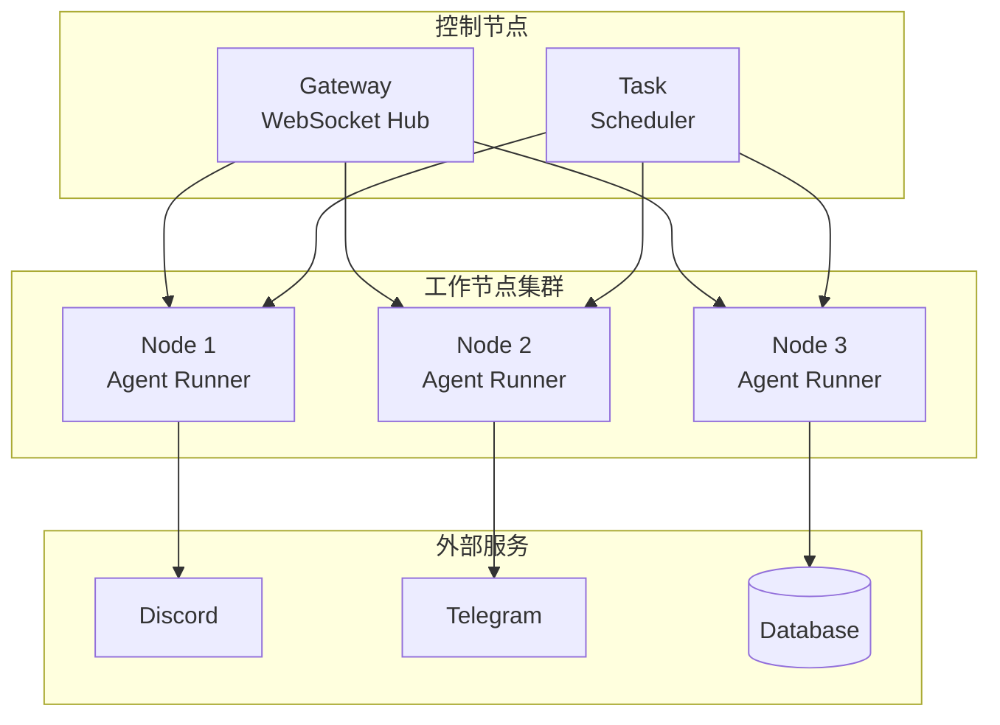

# 第 18 章：多节点部署

> 本章将深入解析 OpenClaw 的多节点部署架构，包括节点发现、任务分发和负载均衡。

---

## 18.1 节点架构

### 18.1.1 什么是多节点

多节点部署允许 OpenClaw 在多台机器上协同工作：



**节点类型**：

| 类型 | 角色 | 职责 |
|------|------|------|
| **Gateway** | 控制节点 | 消息路由、节点管理 |
| **Agent** | 工作节点 | 执行 AI 任务 |
| **Channel** | 通道节点 | 连接外部平台 |

### 18.1.2 节点通信协议

```typescript
// /src/nodes/protocol.ts

interface NodeMessage {
  id: string;
  type: MessageType;
  from: string;      // 发送节点 ID
  to?: string;       // 目标节点 ID（可选，广播时为空）
  timestamp: number;
  payload: unknown;
}

type MessageType =
  | 'heartbeat'      // 心跳
  | 'register'       // 节点注册
  | 'unregister'     // 节点注销
  | 'task_assign'    // 任务分配
  | 'task_result'    // 任务结果
  | 'broadcast'      // 广播消息
  | 'direct';        // 直接消息

// 心跳消息
interface HeartbeatMessage {
  nodeId: string;
  status: 'healthy' | 'busy' | 'offline';
  load: {
    cpu: number;     // CPU 使用率
    memory: number;  // 内存使用率
    tasks: number;   // 当前任务数
  };
  capabilities: string[];  // 能力列表
}

// 任务分配消息
interface TaskAssignMessage {
  taskId: string;
  type: string;
  payload: unknown;
  priority: number;
  timeout: number;
}

// 任务结果消息
interface TaskResultMessage {
  taskId: string;
  status: 'success' | 'failed' | 'timeout';
  result?: unknown;
  error?: string;
  duration: number;
}
```

### 18.1.3 节点状态管理

```typescript
// /src/nodes/node-registry.ts

interface NodeInfo {
  id: string;
  type: NodeType;
  address: string;
  status: NodeStatus;
  lastHeartbeat: number;
  capabilities: string[];
  load: NodeLoad;
  metadata: Record<string, unknown>;
}

type NodeStatus = 'online' | 'offline' | 'busy' | 'unhealthy';

interface NodeLoad {
  cpu: number;
  memory: number;
  tasks: number;
  maxTasks: number;
}

class NodeRegistry {
  private nodes = new Map<string, NodeInfo>();
  private heartbeatTimeout = 30000;  // 30秒超时
  
  // 注册节点
  register(node: NodeInfo): void {
    this.nodes.set(node.id, {
      ...node,
      status: 'online',
      lastHeartbeat: Date.now(),
    });
    
    console.log(`Node registered: ${node.id} (${node.type})`);
  }
  
  // 注销节点
  unregister(nodeId: string): void {
    this.nodes.delete(nodeId);
    console.log(`Node unregistered: ${nodeId}`);
  }
  
  // 更新心跳
  updateHeartbeat(nodeId: string, heartbeat: HeartbeatMessage): void {
    const node = this.nodes.get(nodeId);
    if (!node) return;
    
    node.lastHeartbeat = Date.now();
    node.status = heartbeat.status === 'busy' ? 'busy' : 'online';
    node.load = {
      cpu: heartbeat.load.cpu,
      memory: heartbeat.load.memory,
      tasks: heartbeat.load.tasks,
      maxTasks: node.load.maxTasks,
    };
  }
  
  // 获取可用节点
  getAvailableNodes(capability?: string): NodeInfo[] {
    const now = Date.now();
    
    return Array.from(this.nodes.values()).filter(node => {
      // 检查在线状态
      if (node.status === 'offline') return false;
      
      // 检查心跳超时
      if (now - node.lastHeartbeat > this.heartbeatTimeout) {
        node.status = 'offline';
        return false;
      }
      
      // 检查能力
      if (capability && !node.capabilities.includes(capability)) {
        return false;
      }
      
      return true;
    });
  }
  
  // 获取负载最低的节点
  getLeastLoadedNode(capability?: string): NodeInfo | null {
    const available = this.getAvailableNodes(capability);
    
    if (available.length === 0) return null;
    
    return available.sort((a, b) => {
      const loadA = a.load.tasks / a.load.maxTasks;
      const loadB = b.load.tasks / b.load.maxTasks;
      return loadA - loadB;
    })[0];
  }
  
  // 清理离线节点
  cleanup(): void {
    const now = Date.now();
    
    for (const [id, node] of this.nodes) {
      if (now - node.lastHeartbeat > this.heartbeatTimeout * 2) {
        this.nodes.delete(id);
        console.log(`Cleaned up offline node: ${id}`);
      }
    }
  }
}
```

---

## 18.2 节点发现

### 18.2.1 静态配置

```typescript
// config/nodes.json
{
  "nodes": [
    {
      "id": "agent-01",
      "type": "agent",
      "address": "192.168.1.101:8080",
      "capabilities": ["llm", "tools", "memory"],
      "maxTasks": 5
    },
    {
      "id": "agent-02",
      "type": "agent",
      "address": "192.168.1.102:8080",
      "capabilities": ["llm", "tools"],
      "maxTasks": 3
    },
    {
      "id": "channel-discord",
      "type": "channel",
      "address": "192.168.1.103:8080",
      "capabilities": ["discord"],
      "maxTasks": 10
    }
  ]
}
```

### 18.2.2 动态发现（mDNS）

```typescript
// /src/nodes/discovery.ts

import { Bonjour } from 'bonjour-service';

class NodeDiscovery {
  private bonjour: Bonjour;
  private serviceType = 'openclaw';
  
  constructor() {
    this.bonjour = new Bonjour();
  }
  
  // 发布服务
  advertise(nodeId: string, port: number, metadata: object): void {
    this.bonjour.publish({
      name: nodeId,
      type: this.serviceType,
      port,
      txt: metadata,
    });
    
    console.log(`Advertising node: ${nodeId} on port ${port}`);
  }
  
  // 发现服务
  discover(callback: (service: DiscoveredNode) => void): void {
    const browser = this.bonjour.find({ type: this.serviceType });
    
    browser.on('up', (service) => {
      callback({
        id: service.name,
        address: service.referer.address,
        port: service.port,
        metadata: service.txt,
      });
    });
    
    browser.on('down', (service) => {
      console.log(`Node went offline: ${service.name}`);
    });
  }
  
  // 停止发现
  stop(): void {
    this.bonjour.destroy();
  }
}

// 使用示例
const discovery = new NodeDiscovery();

// 作为节点发布自己
discovery.advertise('agent-01', 8080, {
  type: 'agent',
  capabilities: 'llm,tools,memory',
  version: '1.0.0',
});

// 发现其他节点
discovery.discover((node) => {
  console.log('Discovered node:', node);
  nodeRegistry.register({
    id: node.id,
    type: node.metadata.type as NodeType,
    address: `${node.address}:${node.port}`,
    status: 'online',
    lastHeartbeat: Date.now(),
    capabilities: (node.metadata.capabilities as string).split(','),
    load: { cpu: 0, memory: 0, tasks: 0, maxTasks: 5 },
    metadata: node.metadata,
  });
});
```

### 18.2.3 云端注册中心

```typescript
// /src/nodes/cloud-registry.ts

class CloudNodeRegistry {
  private registryUrl: string;
  private apiKey: string;
  
  constructor(config: { url: string; apiKey: string }) {
    this.registryUrl = config.url;
    this.apiKey = config.apiKey;
  }
  
  // 注册到云端
  async register(node: NodeInfo): Promise<void> {
    await fetch(`${this.registryUrl}/nodes`, {
      method: 'POST',
      headers: {
        'Authorization': `Bearer ${this.apiKey}`,
        'Content-Type': 'application/json',
      },
      body: JSON.stringify(node),
    });
  }
  
  // 从云端发现节点
  async discover(region?: string): Promise<NodeInfo[]> {
    const url = new URL(`${this.registryUrl}/nodes`);
    if (region) url.searchParams.set('region', region);
    
    const response = await fetch(url.toString(), {
      headers: { 'Authorization': `Bearer ${this.apiKey}` },
    });
    
    return await response.json();
  }
  
  // 发送心跳
  async heartbeat(nodeId: string, status: HeartbeatMessage): Promise<void> {
    await fetch(`${this.registryUrl}/nodes/${nodeId}/heartbeat`, {
      method: 'POST',
      headers: {
        'Authorization': `Bearer ${this.apiKey}`,
        'Content-Type': 'application/json',
      },
      body: JSON.stringify(status),
    });
  }
}
```

---

## 18.3 任务分发

### 18.3.1 任务队列

```typescript
// /src/nodes/task-queue.ts

interface Task {
  id: string;
  type: string;
  payload: unknown;
  priority: number;      // 1-10，数字越小优先级越高
  timeout: number;       // 超时时间（毫秒）
  createdAt: number;
  assignedTo?: string;   // 分配给哪个节点
  startedAt?: number;
  completedAt?: number;
  status: 'pending' | 'assigned' | 'running' | 'completed' | 'failed';
  result?: unknown;
  error?: string;
}

class TaskQueue {
  private queue: Task[] = [];
  private running = new Map<string, Task>();  // nodeId -> task
  
  // 添加任务
  enqueue(task: Omit<Task, 'id' | 'createdAt' | 'status'>): string {
    const fullTask: Task = {
      ...task,
      id: generateId(),
      createdAt: Date.now(),
      status: 'pending',
    };
    
    // 按优先级插入
    const insertIndex = this.queue.findIndex(
      t => t.priority > fullTask.priority
    );
    
    if (insertIndex === -1) {
      this.queue.push(fullTask);
    } else {
      this.queue.splice(insertIndex, 0, fullTask);
    }
    
    return fullTask.id;
  }
  
  // 获取下一个任务
  dequeue(nodeCapabilities: string[]): Task | null {
    // 找到第一个匹配的待处理任务
    const index = this.queue.findIndex(task =>
      task.status === 'pending' &&
      this.matchesCapabilities(task, nodeCapabilities)
    );
    
    if (index === -1) return null;
    
    const task = this.queue.splice(index, 1)[0];
    task.status = 'assigned';
    
    return task;
  }
  
  // 标记任务开始
  markStarted(taskId: string, nodeId: string): void {
    const task = this.findTask(taskId);
    if (task) {
      task.status = 'running';
      task.assignedTo = nodeId;
      task.startedAt = Date.now();
      this.running.set(nodeId, task);
    }
  }
  
  // 标记任务完成
  markCompleted(
    taskId: string,
    result: unknown
  ): void {
    const task = this.findTask(taskId);
    if (task) {
      task.status = 'completed';
      task.completedAt = Date.now();
      task.result = result;
      this.running.delete(task.assignedTo!);
    }
  }
  
  // 标记任务失败
  markFailed(taskId: string, error: string): void {
    const task = this.findTask(taskId);
    if (task) {
      task.status = 'failed';
      task.completedAt = Date.now();
      task.error = error;
      this.running.delete(task.assignedTo!);
    }
  }
  
  // 重新分配失败任务
  reassignFailedTasks(): void {
    for (const [nodeId, task] of this.running) {
      // 检查是否超时
      if (Date.now() - task.startedAt! > task.timeout) {
        console.log(`Task ${task.id} timed out, reassigning...`);
        
        task.status = 'pending';
        task.assignedTo = undefined;
        task.startedAt = undefined;
        
        this.running.delete(nodeId);
        this.queue.unshift(task);
      }
    }
  }
  
  private findTask(taskId: string): Task | undefined {
    return this.queue.find(t => t.id === taskId) ||
      Array.from(this.running.values()).find(t => t.id === taskId);
  }
  
  private matchesCapabilities(
    task: Task,
    capabilities: string[]
  ): boolean {
    // 根据任务类型判断所需能力
    const requiredCapabilities = this.getRequiredCapabilities(task.type);
    
    return requiredCapabilities.every(c => capabilities.includes(c));
  }
  
  private getRequiredCapabilities(taskType: string): string[] {
    const capabilityMap: Record<string, string[]> = {
      'agent-turn': ['llm'],
      'tool-execution': ['tools'],
      'memory-search': ['memory'],
      'image-analysis': ['vision'],
      'speech-transcription': ['speech'],
    };
    
    return capabilityMap[taskType] || [];
  }
}
```

### 18.3.2 调度器

```typescript
// /src/nodes/scheduler.ts

class TaskScheduler {
  private queue: TaskQueue;
  private registry: NodeRegistry;
  private checkInterval: NodeJS.Timeout;
  
  constructor(queue: TaskQueue, registry: NodeRegistry) {
    this.queue = queue;
    this.registry = registry;
    
    // 启动调度循环
    this.checkInterval = setInterval(() => {
      this.scheduleTasks();
    }, 1000);
  }
  
  async scheduleTasks(): Promise<void> {
    // 获取可用节点
    const availableNodes = this.registry.getAvailableNodes();
    
    if (availableNodes.length === 0) {
      console.warn('No available nodes for task scheduling');
      return;
    }
    
    // 为每个空闲节点分配任务
    for (const node of availableNodes) {
      // 检查节点是否已满
      if (node.load.tasks >= node.load.maxTasks) {
        continue;
      }
      
      // 获取匹配的任务
      const task = this.queue.dequeue(node.capabilities);
      
      if (task) {
        await this.assignTask(task, node);
      }
    }
    
    // 检查并重新分配超时任务
    this.queue.reassignFailedTasks();
  }
  
  private async assignTask(task: Task, node: NodeInfo): Promise<void> {
    console.log(`Assigning task ${task.id} to node ${node.id}`);
    
    try {
      // 发送任务到节点
      const response = await fetch(`http://${node.address}/tasks`, {
        method: 'POST',
        headers: { 'Content-Type': 'application/json' },
        body: JSON.stringify({
          taskId: task.id,
          type: task.type,
          payload: task.payload,
          timeout: task.timeout,
        }),
      });
      
      if (!response.ok) {
        throw new Error(`Failed to assign task: ${response.statusText}`);
      }
      
      // 标记任务已分配
      this.queue.markStarted(task.id, node.id);
      
    } catch (error) {
      console.error(`Failed to assign task ${task.id}:`, error);
      
      // 将任务放回队列
      task.status = 'pending';
      task.assignedTo = undefined;
    }
  }
  
  // 处理任务结果
  async handleTaskResult(
    taskId: string,
    result: TaskResultMessage
  ): Promise<void> {
    if (result.status === 'success') {
      this.queue.markCompleted(taskId, result.result);
    } else {
      this.queue.markFailed(taskId, result.error || 'Unknown error');
    }
  }
  
  stop(): void {
    clearInterval(this.checkInterval);
  }
}
```

### 18.3.3 工作节点实现

```typescript
// /src/nodes/worker-node.ts

class WorkerNode {
  private nodeId: string;
  private gatewayUrl: string;
  private capabilities: string[];
  private currentTasks = new Map<string, AbortController>();
  private heartbeatInterval: NodeJS.Timeout;
  
  constructor(config: {
    nodeId: string;
    gatewayUrl: string;
    capabilities: string[];
  }) {
    this.nodeId = config.nodeId;
    this.gatewayUrl = config.gatewayUrl;
    this.capabilities = config.capabilities;
  }
  
  async start(): Promise<void> {
    // 注册到网关
    await this.register();
    
    // 启动心跳
    this.startHeartbeat();
    
    // 启动 HTTP 服务接收任务
    this.startHttpServer();
    
    console.log(`Worker node ${this.nodeId} started`);
  }
  
  private async register(): Promise<void> {
    await fetch(`${this.gatewayUrl}/nodes/register`, {
      method: 'POST',
      headers: { 'Content-Type': 'application/json' },
      body: JSON.stringify({
        id: this.nodeId,
        type: 'agent',
        capabilities: this.capabilities,
        address: this.getOwnAddress(),
      }),
    });
  }
  
  private startHeartbeat(): void {
    this.heartbeatInterval = setInterval(async () => {
      const load = await this.getCurrentLoad();
      
      await fetch(`${this.gatewayUrl}/nodes/${this.nodeId}/heartbeat`, {
        method: 'POST',
        headers: { 'Content-Type': 'application/json' },
        body: JSON.stringify({
          nodeId: this.nodeId,
          status: this.getStatus(),
          load,
          capabilities: this.capabilities,
        }),
      });
    }, 10000);  // 每10秒
  }
  
  private startHttpServer(): void {
    const app = express();
    
    app.post('/tasks', async (req, res) => {
      const { taskId, type, payload, timeout } = req.body;
      
      // 接受任务
      res.json({ accepted: true });
      
      // 异步执行任务
      this.executeTask(taskId, type, payload, timeout);
    });
    
    app.listen(8080);
  }
  
  private async executeTask(
    taskId: string,
    type: string,
    payload: unknown,
    timeout: number
  ): Promise<void> {
    const abortController = new AbortController();
    this.currentTasks.set(taskId, abortController);
    
    const startTime = Date.now();
    
    try {
      // 设置超时
      const timeoutPromise = new Promise((_, reject) => {
        setTimeout(() => {
          abortController.abort();
          reject(new Error('Task timeout'));
        }, timeout);
      });
      
      // 执行任务
      const result = await Promise.race([
        this.runTask(type, payload, abortController.signal),
        timeoutPromise,
      ]);
      
      // 上报成功
      await this.reportResult(taskId, {
        status: 'success',
        result,
        duration: Date.now() - startTime,
      });
      
    } catch (error) {
      // 上报失败
      await this.reportResult(taskId, {
        status: 'failed',
        error: (error as Error).message,
        duration: Date.now() - startTime,
      });
      
    } finally {
      this.currentTasks.delete(taskId);
    }
  }
  
  private async runTask(
    type: string,
    payload: unknown,
    signal: AbortSignal
  ): Promise<unknown> {
    switch (type) {
      case 'agent-turn':
        return this.runAgentTurn(payload as AgentTurnPayload, signal);
      
      case 'tool-execution':
        return this.runToolExecution(payload as ToolExecutionPayload, signal);
      
      default:
        throw new Error(`Unknown task type: ${type}`);
    }
  }
  
  private async reportResult(
    taskId: string,
    result: TaskResultMessage
  ): Promise<void> {
    await fetch(`${this.gatewayUrl}/tasks/${taskId}/result`, {
      method: 'POST',
      headers: { 'Content-Type': 'application/json' },
      body: JSON.stringify(result),
    });
  }
  
  private async getCurrentLoad(): Promise<NodeLoad> {
    const cpuUsage = await this.getCPUUsage();
    const memoryUsage = this.getMemoryUsage();
    
    return {
      cpu: cpuUsage,
      memory: memoryUsage,
      tasks: this.currentTasks.size,
      maxTasks: 5,
    };
  }
  
  private getStatus(): 'healthy' | 'busy' | 'offline' {
    if (this.currentTasks.size >= 5) {
      return 'busy';
    }
    return 'healthy';
  }
}
```

---

## 18.4 负载均衡

### 18.4.1 负载均衡策略

```typescript
// /src/nodes/load-balancer.ts

type LoadBalanceStrategy =
  | 'round-robin'      // 轮询
  | 'least-connections' // 最少连接
  | 'least-load'       // 最低负载
  | 'weighted'         // 加权
  | 'consistent-hash'; // 一致性哈希

class LoadBalancer {
  private strategy: LoadBalanceStrategy;
  private registry: NodeRegistry;
  private roundRobinIndex = 0;
  
  constructor(
    strategy: LoadBalanceStrategy,
    registry: NodeRegistry
  ) {
    this.strategy = strategy;
    this.registry = registry;
  }
  
  selectNode(
    task: Task,
    availableNodes: NodeInfo[]
  ): NodeInfo | null {
    if (availableNodes.length === 0) return null;
    
    switch (this.strategy) {
      case 'round-robin':
        return this.roundRobin(availableNodes);
      
      case 'least-connections':
        return this.leastConnections(availableNodes);
      
      case 'least-load':
        return this.leastLoad(availableNodes);
      
      case 'weighted':
        return this.weighted(availableNodes);
      
      case 'consistent-hash':
        return this.consistentHash(task, availableNodes);
      
      default:
        return availableNodes[0];
    }
  }
  
  private roundRobin(nodes: NodeInfo[]): NodeInfo {
    const node = nodes[this.roundRobinIndex % nodes.length];
    this.roundRobinIndex++;
    return node;
  }
  
  private leastConnections(nodes: NodeInfo[]): NodeInfo {
    return nodes.sort((a, b) => a.load.tasks - b.load.tasks)[0];
  }
  
  private leastLoad(nodes: NodeInfo[]): NodeInfo {
    return nodes.sort((a, b) => {
      const loadA = a.load.cpu * 0.5 + a.load.memory * 0.5;
      const loadB = b.load.cpu * 0.5 + b.load.memory * 0.5;
      return loadA - loadB;
    })[0];
  }
  
  private weighted(nodes: NodeInfo[]): NodeInfo {
    // 根据节点权重选择
    const weights = nodes.map(n => n.load.maxTasks);
    const totalWeight = weights.reduce((a, b) => a + b, 0);
    
    let random = Math.random() * totalWeight;
    
    for (let i = 0; i < nodes.length; i++) {
      random -= weights[i];
      if (random <= 0) {
        return nodes[i];
      }
    }
    
    return nodes[nodes.length - 1];
  }
  
  private consistentHash(task: Task, nodes: NodeInfo[]): NodeInfo {
    // 使用任务 ID 的哈希值选择节点
    const hash = this.hashString(task.id);
    const index = hash % nodes.length;
    return nodes[index];
  }
  
  private hashString(str: string): number {
    let hash = 0;
    for (let i = 0; i < str.length; i++) {
      const char = str.charCodeAt(i);
      hash = ((hash << 5) - hash) + char;
      hash = hash & hash;
    }
    return Math.abs(hash);
  }
}
```

### 18.4.2 故障转移

```typescript
// /src/nodes/failover.ts

class FailoverManager {
  private maxRetries = 3;
  private retryDelay = 1000;
  
  async executeWithFailover<T>(
    task: Task,
    nodes: NodeInfo[],
    executor: (node: NodeInfo) => Promise<T>
  ): Promise<T> {
    const triedNodes = new Set<string>();
    let lastError: Error;
    
    for (let attempt = 0; attempt < this.maxRetries; attempt++) {
      // 选择未尝试过的节点
      const availableNodes = nodes.filter(n => !triedNodes.has(n.id));
      
      if (availableNodes.length === 0) {
        throw new Error('All nodes failed');
      }
      
      const node = availableNodes[0];
      triedNodes.add(node.id);
      
      try {
        return await executor(node);
      } catch (error) {
        lastError = error as Error;
        console.warn(`Node ${node.id} failed, trying next...`);
        
        // 标记节点为不健康
        node.status = 'unhealthy';
        
        // 等待后重试
        if (attempt < this.maxRetries - 1) {
          await sleep(this.retryDelay * Math.pow(2, attempt));
        }
      }
    }
    
    throw lastError!;
  }
}
```

---

## 本章小结

通过本章的学习，你应该掌握了：

1. **节点架构** - 节点类型、通信协议、状态管理
2. **节点发现** - 静态配置、mDNS、云端注册中心
3. **任务分发** - 任务队列、调度器、工作节点实现
4. **负载均衡** - 多种策略、故障转移

---

*下一章：第 19 章 安全与权限*
