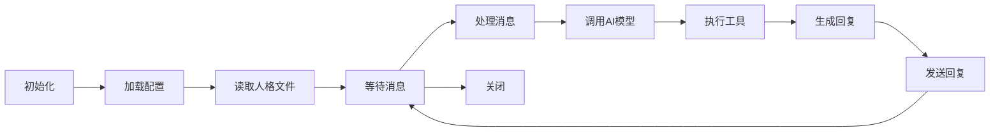

# 第 12 章：Agent 运行器

> 本章将深入解析 OpenClaw 中 Agent 的运行机制，包括生命周期管理、提示词工程、上下文处理和多轮对话等核心内容。

---

## 12.1 Agent 生命周期

### 12.1.1 生命周期概述

Agent 从启动到结束的完整生命周期：



### 12.1.2 初始化流程

```typescript
class AgentLifecycle {
  async initialize(configPath: string): Promise<void> {
    // 1. 加载配置文件
    this.config = await this.loadConfig(configPath);
    
    // 2. 初始化记忆系统
    this.memory = new MemoryManager({
      workspaceDir: this.config.workspaceDir,
    });
    await this.memory.initialize();
    
    // 3. 注册工具
    this.tools = new ToolRegistry();
    await this.registerBuiltinTools();
    
    // 4. 加载人格
    await this.loadPersona();
    
    // 5. 预热模型连接
    await this.warmupModelConnection();
    
    console.log('✅ Agent ready');
  }
  
  private async loadPersona(): Promise<void> {
    // 读取 SOUL.md
    const soulPath = join(this.config.workspaceDir, 'SOUL.md');
    const soulContent = await readFile(soulPath, 'utf-8');
    
    // 读取 IDENTITY.md
    const identityPath = join(this.config.workspaceDir, 'IDENTITY.md');
    const identityContent = await readFile(identityPath, 'utf-8');
    
    // 构建系统提示词
    this.systemPrompt = this.buildSystemPrompt({
      soul: soulContent,
      identity: identityContent,
    });
  }
}
```

### 12.1.3 消息处理循环

```typescript
class MessageProcessingLoop {
  private isRunning = false;
  
  async start(): Promise<void> {
    this.isRunning = true;
    
    while (this.isRunning) {
      const message = await this.getNextMessage();
      
      if (message) {
        await this.processMessage(message);
      } else {
        await sleep(100);
      }
    }
  }
  
  private async processMessage(message: IncomingMessage): Promise<void> {
    try {
      // 1. 预处理
      const processedMessage = await this.preprocess(message);
      
      // 2. 构建上下文
      const context = await this.buildContext(processedMessage);
      
      // 3. 调用AI
      const response = await this.callAI(context);
      
      // 4. 处理响应
      const reply = await this.processResponse(response);
      
      // 5. 发送回复
      await this.sendReply(reply, message);
      
      // 6. 记录历史
      await this.recordHistory(message, reply);
      
    } catch (error) {
      console.error('Message processing failed:', error);
      await this.handleError(error, message);
    }
  }
}
```

---

## 12.2 提示词工程

### 12.2.1 系统提示词结构

```typescript
interface SystemPromptParts {
  identity: string;
  personality: string;
  capabilities: string;
  constraints: string;
}

class PromptBuilder {
  buildSystemPrompt(parts: SystemPromptParts): string {
    const sections: string[] = [];
    
    sections.push(this.formatSection('Identity', parts.identity));
    sections.push(this.formatSection('Personality', parts.personality));
    sections.push(this.formatSection('Capabilities', parts.capabilities));
    sections.push(this.formatSection('Constraints', parts.constraints));
    
    return sections.join('\n\n');
  }
  
  private formatSection(title: string, content: string): string {
    return `## ${title}\n\n${content}`;
  }
}
```

### 12.2.2 少样本提示（Few-Shot）

```typescript
interface FewShotExample {
  input: string;
  output: string;
}

class FewShotPromptBuilder {
  private examples: FewShotExample[] = [];
  
  addExample(example: FewShotExample): void {
    this.examples.push(example);
  }
  
  buildFewShotPrompt(task: string): string {
    const parts: string[] = [];
    
    parts.push(`Task: ${task}`);
    parts.push('');
    parts.push('Examples:');
    
    for (let i = 0; i < this.examples.length; i++) {
      const ex = this.examples[i];
      parts.push(`\nExample ${i + 1}:`);
      parts.push(`Input: ${ex.input}`);
      parts.push(`Output: ${ex.output}`);
    }
    
    return parts.join('\n');
  }
}
```

### 12.2.3 思维链（Chain-of-Thought）

```typescript
class ChainOfThoughtPrompt {
  buildCOTPrompt(question: string): string {
    return `
Question: ${question}

Let's think through this step by step:
1. First, let's understand what we're being asked
2. Then, break down the problem into parts
3. Analyze each part systematically
4. Finally, combine our findings into an answer

Step-by-step reasoning:
`;
  }
}
```

---

## 12.3 上下文管理

### 12.3.1 上下文窗口管理

```typescript
interface ContextWindow {
  systemPrompt: string;
  messages: Message[];
  totalTokens: number;
}

class ContextWindowManager {
  private maxTokens: number;
  
  buildContextWindow(
    systemPrompt: string,
    history: Message[],
    currentMessage: string
  ): ContextWindow {
    const availableTokens = this.maxTokens;
    
    const systemTokens = this.estimateTokens(systemPrompt);
    const currentTokens = this.estimateTokens(currentMessage);
    const historyBudget = availableTokens - systemTokens - currentTokens;
    
    const selectedHistory = this.selectHistoryMessages(
      history,
      historyBudget
    );
    
    const messages: Message[] = [
      ...selectedHistory,
      { role: 'user', content: currentMessage },
    ];
    
    return {
      systemPrompt,
      messages,
      totalTokens: systemTokens + messages.reduce((sum, m) => 
        sum + this.estimateTokens(m.content), 0),
    };
  }
  
  private selectHistoryMessages(
    history: Message[],
    budget: number
  ): Message[] {
    const selected: Message[] = [];
    let usedTokens = 0;
    
    for (let i = history.length - 1; i >= 0; i--) {
      const message = history[i];
      const tokens = this.estimateTokens(message.content);
      
      if (usedTokens + tokens <= budget) {
        selected.unshift(message);
        usedTokens += tokens;
      } else {
        break;
      }
    }
    
    return selected;
  }
  
  estimateTokens(text: string): number {
    return Math.ceil(text.length / 3.5);
  }
}
```

### 12.3.2 上下文修剪策略

```typescript
enum PruningStrategy {
  SLIDING_WINDOW = 'sliding_window',
  SUMMARIZATION = 'summarization',
  IMPORTANCE = 'importance',
}

class ContextPruner {
  async prune(
    messages: Message[],
    targetTokenCount: number
  ): Promise<Message[]> {
    // 保留最近的消息
    const pruned: Message[] = [];
    let tokenCount = 0;
    
    for (let i = messages.length - 1; i >= 0; i--) {
      const msg = messages[i];
      const tokens = this.estimateTokens(msg.content);
      
      if (tokenCount + tokens <= targetTokenCount) {
        pruned.unshift(msg);
        tokenCount += tokens;
      } else {
        break;
      }
    }
    
    return pruned;
  }
  
  private estimateTokens(text: string): number {
    return Math.ceil(text.length / 3.5);
  }
}
```

---

## 12.4 多轮对话

### 12.4.1 对话状态维护

```typescript
interface ConversationState {
  sessionKey: string;
  messages: Message[];
  metadata: {
    startedAt: Date;
    lastActivity: Date;
    messageCount: number;
  };
}

class ConversationManager {
  private conversations = new Map<string, ConversationState>();
  
  getOrCreateConversation(sessionKey: string): ConversationState {
    if (!this.conversations.has(sessionKey)) {
      this.conversations.set(sessionKey, {
        sessionKey,
        messages: [],
        metadata: {
          startedAt: new Date(),
          lastActivity: new Date(),
          messageCount: 0,
        },
      });
    }
    
    return this.conversations.get(sessionKey)!;
  }
  
  addMessage(sessionKey: string, message: Message): void {
    const conversation = this.getOrCreateConversation(sessionKey);
    conversation.messages.push(message);
    conversation.metadata.lastActivity = new Date();
    conversation.metadata.messageCount++;
  }
  
  getHistory(sessionKey: string, limit: number = 20): Message[] {
    const conversation = this.conversations.get(sessionKey);
    if (!conversation) return [];
    
    return conversation.messages.slice(-limit);
  }
}
```

### 12.4.2 意图识别

```typescript
interface Intent {
  type: string;
  confidence: number;
  entities: Record<string, string>;
}

class IntentRecognizer {
  async recognizeIntent(message: string): Promise<Intent> {
    const prompt = `
Analyze the following user message and identify the intent:

Message: "${message}"

Possible intents:
- question: User is asking for information
- command: User wants the system to do something
- greeting: User is saying hello
- farewell: User is saying goodbye
- feedback: User is providing feedback
- other: None of the above

Respond in JSON format:
{
  "type": "intent_type",
  "confidence": 0.95,
  "entities": {
    "key": "value"
  }
}
`;
    
    const response = await this.model.generate(prompt);
    return JSON.parse(response);
  }
}
```

### 12.4.3 对话恢复

```typescript
class ConversationRecovery {
  async saveConversation(
    sessionKey: string,
    state: ConversationState
  ): Promise<void> {
    const filePath = join(
      this.config.sessionsDir,
      `${sessionKey}.json`
    );
    
    await writeFile(
      filePath,
      JSON.stringify(state, null, 2)
    );
  }
  
  async loadConversation(
    sessionKey: string
  ): Promise<ConversationState | null> {
    const filePath = join(
      this.config.sessionsDir,
      `${sessionKey}.json`
    );
    
    try {
      const data = await readFile(filePath, 'utf-8');
      return JSON.parse(data);
    } catch {
      return null;
    }
  }
  
  async resumeConversation(sessionKey: string): Promise<void> {
    const saved = await this.loadConversation(sessionKey);
    
    if (saved) {
      // 恢复对话状态
      this.conversationManager.conversations.set(
        sessionKey,
        saved
      );
      
      console.log(`Resumed conversation: ${sessionKey}`);
    }
  }
}
```

---

## 本章小结

通过本章的学习，你应该掌握了：

1. **Agent 生命周期** - 初始化、消息处理、资源清理
2. **提示词工程** - 系统提示词构建、少样本提示、思维链
3. **上下文管理** - 窗口管理、修剪策略、记忆注入
4. **多轮对话** - 状态维护、意图识别、对话恢复

---

*下一章：第 13 章 工具系统*
