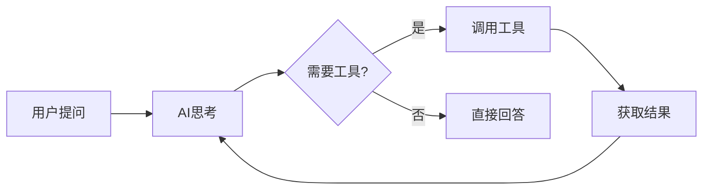

# 第 13 章：工具系统

> 本章将深入解析 OpenClaw 的工具系统，包括工具的定义、实现、注册和调用机制。

---

## 13.1 工具概述

### 13.1.1 什么是工具

工具（Tools）是 AI Agent 调用外部功能的方式，让 AI 能够：

- 执行代码
- 访问文件系统
- 查询数据库
- 调用外部 API
- 控制浏览器
- 等等



### 13.1.2 工具 vs 技能

| 特性 | 工具（Tools） | 技能（Skills） |
|------|--------------|---------------|
| **粒度** | 单一功能 | 功能集合 |
| **定义** | JSON Schema | 代码包 |
| **安装** | 内置或代码 | 独立安装 |
| **示例** | 文件读取、网络请求 | Git 管理、Docker 操作 |

### 13.1.3 工具分类

OpenClaw 内置工具分类：

| 类别 | 工具 | 说明 |
|------|------|------|
| **文件** | read_file, write_file | 文件读写 |
| **代码** | execute_code | 代码执行 |
| **网络** | web_search, fetch_url | 网络请求 |
| **浏览器** | browser_open, browser_click | 浏览器控制 |
| **系统** | execute_command | 系统命令 |
| **媒体** | read_image, transcribe_audio | 媒体处理 |

---

## 13.2 工具定义

### 13.2.1 JSON Schema 定义

工具使用 JSON Schema 定义接口：

```typescript
// /src/agents/tools/types.ts

interface ToolDefinition {
  name: string;
  description: string;
  parameters: {
    type: 'object';
    properties: Record<string, ParameterSchema>;
    required?: string[];
  };
}

interface ParameterSchema {
  type: 'string' | 'number' | 'boolean' | 'array' | 'object';
  description: string;
  enum?: unknown[];
  items?: ParameterSchema;
  properties?: Record<string, ParameterSchema>;
}

// 示例：文件读取工具
const readFileTool: ToolDefinition = {
  name: 'read_file',
  description: '读取文件内容',
  parameters: {
    type: 'object',
    properties: {
      file_path: {
        type: 'string',
        description: '要读取的文件路径',
      },
      offset: {
        type: 'number',
        description: '起始行号（可选）',
      },
      limit: {
        type: 'number',
        description: '读取行数（可选）',
      },
    },
    required: ['file_path'],
  },
};

// 示例：网络搜索工具
const webSearchTool: ToolDefinition = {
  name: 'web_search',
  description: '搜索网络信息',
  parameters: {
    type: 'object',
    properties: {
      query: {
        type: 'string',
        description: '搜索关键词',
      },
      count: {
        type: 'number',
        description: '返回结果数量',
        enum: [5, 10, 20],
      },
    },
    required: ['query'],
  },
};
```

### 13.2.2 参数类型详解

```typescript
// 字符串参数
const stringParam: ParameterSchema = {
  type: 'string',
  description: '文件路径',
  minLength: 1,
  maxLength: 255,
  pattern: '^[\\w\\-\\.\\/]+$',
};

// 数值参数
const numberParam: ParameterSchema = {
  type: 'number',
  description: '超时时间（秒）',
  minimum: 1,
  maximum: 300,
  default: 30,
};

// 布尔参数
const booleanParam: ParameterSchema = {
  type: 'boolean',
  description: '是否递归',
  default: false,
};

// 枚举参数
const enumParam: ParameterSchema = {
  type: 'string',
  description: '排序方式',
  enum: ['asc', 'desc', 'none'],
  default: 'none',
};

// 数组参数
const arrayParam: ParameterSchema = {
  type: 'array',
  description: '文件列表',
  items: {
    type: 'string',
    description: '文件路径',
  },
  minItems: 1,
  maxItems: 10,
};

// 对象参数
const objectParam: ParameterSchema = {
  type: 'object',
  description: '配置选项',
  properties: {
    encoding: {
      type: 'string',
      enum: ['utf8', 'base64'],
    },
    timeout: {
      type: 'number',
    },
  },
};
```

### 13.2.3 描述编写技巧

```typescript
// 好的描述示例
const goodTools: ToolDefinition[] = [
  {
    name: 'calculate',
    description: `
      执行数学计算。
      支持基本运算：+、-、*、/、^（幂）、sqrt（平方根）
      示例："2 + 3 * 4"、"sqrt(16)"、"2^10"
    `.trim(),
    parameters: {
      type: 'object',
      properties: {
        expression: {
          type: 'string',
          description: '数学表达式，如 "2 + 3"',
        },
      },
      required: ['expression'],
    },
  },
  {
    name: 'send_email',
    description: `
      发送电子邮件。
      注意：
      1. 收件人地址必须有效
      2. 主题不能为空
      3. 邮件内容支持纯文本或 HTML
    `.trim(),
    parameters: {
      type: 'object',
      properties: {
        to: {
          type: 'string',
          description: '收件人邮箱地址',
        },
        subject: {
          type: 'string',
          description: '邮件主题',
        },
        body: {
          type: 'string',
          description: '邮件正文',
        },
        is_html: {
          type: 'boolean',
          description: '是否为 HTML 格式',
          default: false,
        },
      },
      required: ['to', 'subject', 'body'],
    },
  },
];
```

---

## 13.3 工具实现

### 13.3.1 同步工具

```typescript
// /src/agents/tools/implementations/read-file.ts

import { readFile } from 'fs/promises';
import { resolve } from 'path';

interface ReadFileParams {
  file_path: string;
  offset?: number;
  limit?: number;
}

interface ReadFileResult {
  content: string;
  total_lines: number;
  read_lines: number;
}

export function readFileTool(): Tool {
  return {
    definition: {
      name: 'read_file',
      description: '读取文件内容，支持指定行范围',
      parameters: {
        type: 'object',
        properties: {
          file_path: {
            type: 'string',
            description: '文件路径（相对或绝对）',
          },
          offset: {
            type: 'number',
            description: '起始行号（1-based，可选）',
          },
          limit: {
            type: 'number',
            description: '读取行数（可选）',
          },
        },
        required: ['file_path'],
      },
    },
    
    async execute(params: ReadFileParams): Promise<ReadFileResult> {
      // 安全检查：解析并验证路径
      const resolvedPath = resolve(params.file_path);
      const workspacePath = resolve(process.cwd());
      
      if (!resolvedPath.startsWith(workspacePath)) {
        throw new Error('Access denied: path outside workspace');
      }
      
      // 读取文件
      const content = await readFile(resolvedPath, 'utf-8');
      const lines = content.split('\n');
      
      // 应用行范围
      const offset = (params.offset || 1) - 1;
      const limit = params.limit || lines.length;
      
      const selectedLines = lines.slice(offset, offset + limit);
      
      return {
        content: selectedLines.join('\n'),
        total_lines: lines.length,
        read_lines: selectedLines.length,
      };
    },
  };
}
```

### 13.3.2 异步工具

```typescript
// /src/agents/tools/implementations/web-search.ts

interface WebSearchParams {
  query: string;
  count?: number;
}

interface WebSearchResult {
  results: Array<{
    title: string;
    url: string;
    snippet: string;
  }>;
}

export function webSearchTool(apiKey: string): Tool {
  return {
    definition: {
      name: 'web_search',
      description: '搜索网络信息',
      parameters: {
        type: 'object',
        properties: {
          query: {
            type: 'string',
            description: '搜索关键词',
          },
          count: {
            type: 'number',
            description: '返回结果数量（默认10）',
            default: 10,
          },
        },
        required: ['query'],
      },
    },
    
    async execute(params: WebSearchParams): Promise<WebSearchResult> {
      const response = await fetch(
        'https://api.search.com/v1/search',
        {
          method: 'POST',
          headers: {
            'Authorization': `Bearer ${apiKey}`,
            'Content-Type': 'application/json',
          },
          body: JSON.stringify({
            q: params.query,
            num: params.count || 10,
          }),
        }
      );
      
      if (!response.ok) {
        throw new Error(`Search failed: ${response.statusText}`);
      }
      
      const data = await response.json();
      
      return {
        results: data.results.map((r: any) => ({
          title: r.title,
          url: r.url,
          snippet: r.snippet,
        })),
      };
    },
  };
}
```

### 13.3.3 流式工具

```typescript
// /src/agents/tools/implementations/execute-command.ts

import { spawn } from 'child_process';
import { Readable } from 'stream';

interface ExecuteCommandParams {
  command: string;
  args?: string[];
  cwd?: string;
  timeout?: number;
}

interface ExecuteCommandResult {
  exit_code: number;
  stdout: string;
  stderr: string;
}

export function executeCommandTool(): Tool {
  return {
    definition: {
      name: 'execute_command',
      description: '执行系统命令（带安全限制）',
      parameters: {
        type: 'object',
        properties: {
          command: {
            type: 'string',
            description: '命令名称',
          },
          args: {
            type: 'array',
            items: { type: 'string' },
            description: '命令参数',
          },
          cwd: {
            type: 'string',
            description: '工作目录',
          },
          timeout: {
            type: 'number',
            description: '超时时间（秒，默认30）',
            default: 30,
          },
        },
        required: ['command'],
      },
    },
    
    async execute(
      params: ExecuteCommandParams
    ): Promise<ExecuteCommandResult> {
      // 安全检查
      const blockedCommands = ['rm', 'sudo', 'chmod', 'chown'];
      if (blockedCommands.includes(params.command)) {
        throw new Error(`Command '${params.command}' is not allowed`);
      }
      
      return new Promise((resolve, reject) => {
        const child = spawn(params.command, params.args || [], {
          cwd: params.cwd,
          timeout: (params.timeout || 30) * 1000,
        });
        
        let stdout = '';
        let stderr = '';
        
        child.stdout.on('data', (data) => {
          stdout += data.toString();
        });
        
        child.stderr.on('data', (data) => {
          stderr += data.toString();
        });
        
        child.on('close', (code) => {
          resolve({
            exit_code: code || 0,
            stdout: stdout.slice(0, 10000), // 限制输出大小
            stderr: stderr.slice(0, 10000),
          });
        });
        
        child.on('error', (error) => {
          reject(error);
        });
      });
    },
  };
}
```

### 13.3.4 工具组合

```typescript
// 组合多个工具完成复杂任务
class ToolComposer {
  private tools: Tool[];
  
  constructor(tools: Tool[]) {
    this.tools = tools;
  }
  
  // 组合：搜索并下载
  async searchAndDownload(
    query: string,
    downloadDir: string
  ): Promise<string> {
    // 1. 搜索
    const searchTool = this.getTool('web_search');
    const searchResult = await searchTool.execute({ query, count: 5 });
    
    // 2. 获取第一个结果的页面
    const fetchTool = this.getTool('fetch_url');
    const page = await fetchTool.execute({
      url: searchResult.results[0].url,
    });
    
    // 3. 保存到文件
    const writeTool = this.getTool('write_file');
    const filename = `search_result_${Date.now()}.html`;
    await writeTool.execute({
      file_path: join(downloadDir, filename),
      content: page.content,
    });
    
    return filename;
  }
  
  private getTool(name: string): Tool {
    const tool = this.tools.find(t => t.definition.name === name);
    if (!tool) {
      throw new Error(`Tool not found: ${name}`);
    }
    return tool;
  }
}
```

---

## 13.4 工具注册与发现

### 13.4.1 内置工具注册

```typescript
// /src/agents/tools/registry.ts

class ToolRegistry {
  private tools = new Map<string, Tool>();
  
  // 注册内置工具
  registerBuiltinTools(): void {
    // 文件操作
    this.register(readFileTool());
    this.register(writeFileTool());
    this.register(listDirectoryTool());
    
    // 代码执行
    this.register(executeCodeTool());
    this.register(executeCommandTool());
    
    // 网络请求
    this.register(webSearchTool(this.config.searchApiKey));
    this.register(fetchUrlTool());
    
    // 浏览器控制
    this.register(browserOpenTool());
    this.register(browserClickTool());
    this.register(browserTypeTool());
    
    // 媒体处理
    this.register(readImageTool());
    this.register(transcribeAudioTool());
  }
  
  register(tool: Tool): void {
    // 验证工具定义
    this.validateTool(tool);
    
    this.tools.set(tool.definition.name, tool);
    console.log(`Registered tool: ${tool.definition.name}`);
  }
  
  unregister(name: string): void {
    this.tools.delete(name);
  }
  
  get(name: string): Tool | undefined {
    return this.tools.get(name);
  }
  
  getAll(): Tool[] {
    return Array.from(this.tools.values());
  }
  
  getDefinitions(): ToolDefinition[] {
    return this.getAll().map(t => t.definition);
  }
  
  private validateTool(tool: Tool): void {
    const def = tool.definition;
    
    // 验证必需字段
    if (!def.name || !def.description) {
      throw new Error('Tool must have name and description');
    }
    
    // 验证参数定义
    if (!def.parameters || def.parameters.type !== 'object') {
      throw new Error('Tool parameters must be an object');
    }
    
    // 验证执行函数
    if (typeof tool.execute !== 'function') {
      throw new Error('Tool must have an execute function');
    }
  }
}
```

### 13.4.2 技能工具加载

```typescript
// /src/agents/skills/loader.ts

class SkillLoader {
  private registry: ToolRegistry;
  
  async loadSkill(skillName: string): Promise<void> {
    const skillPath = join(
      this.config.skillsDir,
      skillName,
      'index.js'
    );
    
    // 动态加载技能模块
    const skillModule = await import(skillPath);
    
    // 获取技能定义
    const skill: Skill = skillModule.default;
    
    // 验证技能
    this.validateSkill(skill);
    
    // 注册技能中的工具
    for (const tool of skill.tools) {
      this.registry.register(tool);
    }
    
    console.log(`Loaded skill: ${skill.name}`);
  }
  
  async loadAllSkills(): Promise<void> {
    const skillDirs = await readdir(this.config.skillsDir);
    
    for (const dir of skillDirs) {
      try {
        await this.loadSkill(dir);
      } catch (error) {
        console.error(`Failed to load skill ${dir}:`, error);
      }
    }
  }
  
  private validateSkill(skill: Skill): void {
    if (!skill.name || !skill.version) {
      throw new Error('Skill must have name and version');
    }
    
    if (!Array.isArray(skill.tools)) {
      throw new Error('Skill must have tools array');
    }
  }
}

// 技能定义示例
interface Skill {
  name: string;
  version: string;
  description: string;
  tools: Tool[];
  hooks?: {
    onInstall?: () => Promise<void>;
    onUninstall?: () => Promise<void>;
  };
}
```

### 13.4.3 动态工具注册

```typescript
// /src/agents/tools/dynamic-registration.ts

class DynamicToolRegistrar {
  private registry: ToolRegistry;
  
  // 从配置动态注册工具
  async registerFromConfig(config: ToolConfig[]): Promise<void> {
    for (const toolConfig of config) {
      const tool = await this.createToolFromConfig(toolConfig);
      this.registry.register(tool);
    }
  }
  
  // 从 API 端点创建工具
  async createApiTool(
    name: string,
    endpoint: string,
    schema: ToolDefinition
  ): Promise<Tool> {
    return {
      definition: schema,
      
      async execute(params: unknown) {
        const response = await fetch(endpoint, {
          method: 'POST',
          headers: { 'Content-Type': 'application/json' },
          body: JSON.stringify(params),
        });
        
        if (!response.ok) {
          throw new Error(`API call failed: ${response.statusText}`);
        }
        
        return await response.json();
      },
    };
  }
  
  // 从数据库加载工具
  async loadToolsFromDatabase(): Promise<void> {
    const tools = await db.query('SELECT * FROM custom_tools');
    
    for (const toolData of tools) {
      const tool: Tool = {
        definition: JSON.parse(toolData.definition),
        execute: this.createSandboxedExecute(toolData.code),
      };
      
      this.registry.register(tool);
    }
  }
  
  private createSandboxedExecute(code: string): Function {
    // 在沙箱中执行工具代码
    return async (params: unknown) => {
      const sandbox = {
        params,
        fetch,
        console,
        // 限制可用的全局对象
      };
      
      const fn = new Function(
        'sandbox',
        `with (sandbox) { ${code} }`
      );
      
      return await fn(sandbox);
    };
  }
}
```

---

## 13.5 开发自定义工具

### 13.5.1 工具开发流程

```
1. 需求分析
   └── 确定工具功能和使用场景

2. 接口设计
   └── 定义参数和返回值

3. 实现功能
   └── 编写工具代码

4. 添加测试
   └── 单元测试和集成测试

5. 编写文档
   └── 使用说明和示例

6. 注册工具
   └── 添加到工具注册表
```

### 13.5.2 天气查询工具示例

```typescript
// /src/agents/tools/implementations/weather.ts

interface WeatherParams {
  city: string;
  days?: number;
}

interface WeatherResult {
  city: string;
  current: {
    temperature: number;
    condition: string;
    humidity: number;
    wind_speed: number;
  };
  forecast: Array<{
    date: string;
    high: number;
    low: number;
    condition: string;
  }>;
}

export function weatherTool(apiKey: string): Tool {
  return {
    definition: {
      name: 'get_weather',
      description: '获取指定城市的天气信息',
      parameters: {
        type: 'object',
        properties: {
          city: {
            type: 'string',
            description: '城市名称，如 "北京"、"Shanghai"',
          },
          days: {
            type: 'number',
            description: '预报天数（1-7天，默认3天）',
            minimum: 1,
            maximum: 7,
            default: 3,
          },
        },
        required: ['city'],
      },
    },
    
    async execute(params: WeatherParams): Promise<WeatherResult> {
      // 调用天气 API
      const response = await fetch(
        `https://api.weather.com/v1/current?city=${encodeURIComponent(params.city)}`,
        {
          headers: { 'Authorization': `Bearer ${apiKey}` },
        }
      );
      
      if (!response.ok) {
        if (response.status === 404) {
          throw new Error(`City not found: ${params.city}`);
        }
        throw new Error(`Weather API error: ${response.statusText}`);
      }
      
      const data = await response.json();
      
      return {
        city: data.location.name,
        current: {
          temperature: data.current.temp_c,
          condition: data.current.condition.text,
          humidity: data.current.humidity,
          wind_speed: data.current.wind_kph,
        },
        forecast: data.forecast.forecastday.map((day: any) => ({
          date: day.date,
          high: day.day.maxtemp_c,
          low: day.day.mintemp_c,
          condition: day.day.condition.text,
        })),
      };
    },
  };
}

// 测试
describe('weatherTool', () => {
  it('should return weather for a valid city', async () => {
    const tool = weatherTool('test-api-key');
    
    const result = await tool.execute({ city: 'Beijing' });
    
    expect(result.city).toBe('Beijing');
    expect(result.current).toHaveProperty('temperature');
    expect(result.forecast).toHaveLength(3);
  });
  
  it('should throw error for invalid city', async () => {
    const tool = weatherTool('test-api-key');
    
    await expect(
      tool.execute({ city: 'InvalidCity123' })
    ).rejects.toThrow('City not found');
  });
});
```

### 13.5.3 数据库查询工具

```typescript
// /src/agents/tools/implementations/database.ts

interface QueryDatabaseParams {
  connection: string;
  query: string;
  params?: unknown[];
}

interface QueryDatabaseResult {
  rows: unknown[];
  rowCount: number;
  columns: string[];
}

export function queryDatabaseTool(): Tool {
  return {
    definition: {
      name: 'query_database',
      description: '执行 SQL 查询（只读）',
      parameters: {
        type: 'object',
        properties: {
          connection: {
            type: 'string',
            description: '数据库连接名称',
            enum: ['main', 'analytics', 'readonly'],
          },
          query: {
            type: 'string',
            description: 'SQL 查询语句（仅 SELECT）',
          },
          params: {
            type: 'array',
            description: '查询参数（可选）',
            items: { type: 'string' },
          },
        },
        required: ['connection', 'query'],
      },
    },
    
    async execute(
      params: QueryDatabaseParams
    ): Promise<QueryDatabaseResult> {
      // 安全检查：只允许 SELECT
      const normalizedQuery = params.query.trim().toLowerCase();
      if (!normalizedQuery.startsWith('select')) {
        throw new Error('Only SELECT queries are allowed');
      }
      
      // 获取连接
      const db = getDatabaseConnection(params.connection);
      
      try {
        // 设置查询超时
        await db.query('SET statement_timeout = 30000');
        
        // 执行查询
        const result = await db.query(params.query, params.params);
        
        return {
          rows: result.rows,
          rowCount: result.rowCount,
          columns: result.fields.map((f: any) => f.name),
        };
      } catch (error) {
        throw new Error(`Query failed: ${(error as Error).message}`);
      }
    },
  };
}
```

### 13.5.4 工具最佳实践

```typescript
// 工具开发最佳实践

// 1. 输入验证
function validateInput(params: unknown, schema: JSONSchema): void {
  const validator = new JSONSchemaValidator();
  const result = validator.validate(params, schema);
  
  if (!result.valid) {
    throw new Error(`Invalid input: ${result.errors.join(', ')}`);
  }
}

// 2. 错误处理
class ToolError extends Error {
  constructor(
    message: string,
    public code: string,
    public retryable: boolean = false
  ) {
    super(message);
  }
}

// 3. 超时控制
async function withTimeout<T>(
  promise: Promise<T>,
  timeoutMs: number
): Promise<T> {
  return Promise.race([
    promise,
    new Promise<never>((_, reject) =>
      setTimeout(
        () => reject(new ToolError('Timeout', 'TIMEOUT')),
        timeoutMs
      )
    ),
  ]);
}

// 4. 结果格式化
function formatToolResult(result: unknown): string {
  if (typeof result === 'string') {
    return result;
  }
  
  if (typeof result === 'object') {
    return JSON.stringify(result, null, 2);
  }
  
  return String(result);
}

// 5. 日志记录
function logToolExecution(
  toolName: string,
  params: unknown,
  result: unknown,
  duration: number
): void {
  console.log(`[Tool] ${toolName}`, {
    params: sanitizeForLog(params),
    success: !(result instanceof Error),
    duration: `${duration}ms`,
  });
}

// 6. 敏感信息过滤
function sanitizeForLog(data: unknown): unknown {
  if (typeof data !== 'object' || data === null) {
    return data;
  }
  
  const sensitiveKeys = ['password', 'token', 'secret', 'key'];
  const sanitized: Record<string, unknown> = {};
  
  for (const [key, value] of Object.entries(data)) {
    if (sensitiveKeys.some(sk => key.toLowerCase().includes(sk))) {
      sanitized[key] = '***';
    } else {
      sanitized[key] = sanitizeForLog(value);
    }
  }
  
  return sanitized;
}
```

---

## 本章小结

通过本章的学习，你应该掌握了：

1. **工具概述** - 什么是工具、工具 vs 技能、工具分类
2. **工具定义** - JSON Schema、参数类型、描述编写
3. **工具实现** - 同步、异步、流式工具，工具组合
4. **工具注册** - 内置工具、技能工具、动态注册
5. **自定义工具** - 开发流程、示例、最佳实践

---

*下一章：第 14 章 记忆系统（RAG）*
