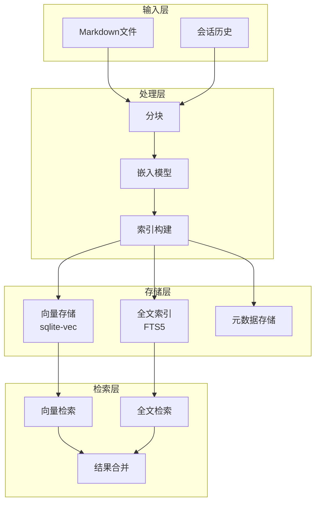

# 第 14 章：记忆系统（RAG）

> 本章将深入解析 OpenClaw 的记忆系统，包括向量嵌入、存储、检索和优化等核心技术。

---

## 14.1 RAG 概述

### 14.1.1 什么是 RAG

RAG（Retrieval-Augmented Generation，检索增强生成）是一种将外部知识检索与语言模型生成相结合的技术：


**RAG 的优势**：

| 优势 | 说明 |
|------|------|
| **知识更新** | 无需重新训练模型即可更新知识 |
| **可解释性** | 可以追溯答案来源 |
| **减少幻觉** | 基于真实文档生成，减少编造 |
| **领域适配** | 轻松适配特定领域知识 |

### 14.1.2 OpenClaw 记忆架构



### 14.1.3 记忆系统组件

| 组件 | 功能 | 技术 |
|------|------|------|
| **文档加载器** | 读取 Markdown 文件 | 文件系统监听 |
| **文本分割器** | 将文档切分为块 | 语义分割 |
| **嵌入模型** | 文本向量化 | OpenAI/Gemini/本地模型 |
| **向量数据库** | 存储向量索引 | sqlite-vec |
| **全文索引** | 关键词检索 | SQLite FTS5 |
| **检索器** | 混合检索 | 向量+关键词 |

---

## 14.2 嵌入模型

### 14.2.1 嵌入原理

文本嵌入将文本转换为高维向量，语义相似的文本在向量空间中距离更近：

```
文本: "苹果是一种水果"
     ↓ 嵌入模型
向量: [0.23, -0.56, 0.89, ..., 0.12]  (1536 维)

文本: "iPhone 是智能手机"
     ↓ 嵌入模型
向量: [0.45, -0.12, 0.67, ..., -0.34]

相似度计算: cos(θ) = (A·B) / (|A|×|B|)
```

### 14.2.2 模型选择

OpenClaw 支持多种嵌入模型：

| 提供商 | 模型 | 维度 | 特点 |
|--------|------|------|------|
| **OpenAI** | text-embedding-3-small | 1536 | 效果好，速度快 |
| **OpenAI** | text-embedding-3-large | 3072 | 效果更好 |
| **Gemini** | embedding-001 | 768 | Google 出品 |
| **Voyage** | voyage-2 | 1024 | 专业嵌入模型 |
| **本地** | embeddinggemma | 384 | 无需网络，隐私好 |

**配置示例**：

```json
{
  "memory": {
    "enabled": true,
    "provider": "openai",
    "model": "text-embedding-3-small",
    "apiKey": "${OPENAI_API_KEY}",
    "cache": {
      "enabled": true,
      "maxEntries": 10000
    }
  }
}
```

### 14.2.3 嵌入实现

```typescript
// /src/memory/embeddings.ts

interface EmbeddingProvider {
  id: string;
  model: string;
  maxInputTokens: number;
  embedQuery(text: string): Promise<number[]>;
  embedBatch(texts: string[]): Promise<number[][]>;
}

// OpenAI 嵌入
class OpenAIEmbeddingProvider implements EmbeddingProvider {
  id = 'openai';
  model = 'text-embedding-3-small';
  maxInputTokens = 8191;
  
  constructor(private apiKey: string) {}
  
  async embedQuery(text: string): Promise<number[]> {
    const response = await fetch('https://api.openai.com/v1/embeddings', {
      method: 'POST',
      headers: {
        'Authorization': `Bearer ${this.apiKey}`,
        'Content-Type': 'application/json',
      },
      body: JSON.stringify({
        input: text,
        model: this.model,
      }),
    });
    
    const data = await response.json();
    return data.data[0].embedding;
  }
  
  async embedBatch(texts: string[]): Promise<number[][]> {
    const response = await fetch('https://api.openai.com/v1/embeddings', {
      method: 'POST',
      headers: {
        'Authorization': `Bearer ${this.apiKey}`,
        'Content-Type': 'application/json',
      },
      body: JSON.stringify({
        input: texts,
        model: this.model,
      }),
    });
    
    const data = await response.json();
    return data.data.map((d: any) => d.embedding);
  }
}

// 本地嵌入（使用 node-llama-cpp）
class LocalEmbeddingProvider implements EmbeddingProvider {
  id = 'local';
  model = 'embeddinggemma-300m';
  maxInputTokens = 512;
  private context: LlamaEmbeddingContext | null = null;
  
  async initialize() {
    const { getLlama } = await import('node-llama-cpp');
    const llama = await getLlama();
    
    const model = await llama.loadModel({
      modelPath: await llama.resolveModelFile(
        'hf:ggml-org/embeddinggemma-300m-qat-q8_0-GGUF/embeddinggemma-300m-qat-Q8_0.gguf'
      ),
    });
    
    this.context = await model.createEmbeddingContext();
  }
  
  async embedQuery(text: string): Promise<number[]> {
    if (!this.context) {
      throw new Error('Provider not initialized');
    }
    
    const embedding = await this.context.getEmbeddingFor(text);
    return Array.from(embedding.vector);
  }
  
  async embedBatch(texts: string[]): Promise<number[][]> {
    return Promise.all(texts.map(t => this.embedQuery(t)));
  }
}
```

### 14.2.4 批量嵌入优化

```typescript
// /src/memory/batch-embeddings.ts

class BatchEmbeddingProcessor {
  private batchSize = 100;
  private concurrency = 5;
  
  async processBatches(
    chunks: TextChunk[],
    provider: EmbeddingProvider
  ): Promise<EmbeddedChunk[]> {
    const results: EmbeddedChunk[] = [];
    
    // 分批次处理
    for (let i = 0; i < chunks.length; i += this.batchSize) {
      const batch = chunks.slice(i, i + this.batchSize);
      
      console.log(`Processing batch ${i / this.batchSize + 1}/${Math.ceil(chunks.length / this.batchSize)}`);
      
      // 批量嵌入
      const embeddings = await provider.embedBatch(
        batch.map(c => c.text)
      );
      
      // 组合结果
      for (let j = 0; j < batch.length; j++) {
        results.push({
          ...batch[j],
          embedding: embeddings[j],
        });
      }
    }
    
    return results;
  }
  
  // 带重试的批量处理
  async processWithRetry(
    chunks: TextChunk[],
    provider: EmbeddingProvider,
    maxRetries = 3
  ): Promise<EmbeddedChunk[]> {
    const results: EmbeddedChunk[] = [];
    const failed: TextChunk[] = [];
    
    for (let attempt = 0; attempt < maxRetries; attempt++) {
      const toProcess = attempt === 0 ? chunks : failed;
      failed.length = 0;
      
      try {
        const batchResults = await this.processBatches(toProcess, provider);
        results.push(...batchResults);
      } catch (error) {
        console.error(`Batch attempt ${attempt + 1} failed:`, error);
        
        // 如果批量失败，逐个重试
        for (const chunk of toProcess) {
          try {
            const embedding = await provider.embedQuery(chunk.text);
            results.push({ ...chunk, embedding });
          } catch {
            failed.push(chunk);
          }
        }
      }
      
      if (failed.length === 0) break;
    }
    
    if (failed.length > 0) {
      console.warn(`${failed.length} chunks failed to embed`);
    }
    
    return results;
  }
}
```

---

## 14.3 记忆存储

### 14.3.1 数据库设计

```sql
-- 文件表
CREATE TABLE files (
    id INTEGER PRIMARY KEY,
    path TEXT UNIQUE NOT NULL,
    source TEXT NOT NULL,  -- 'memory' 或 'sessions'
    last_modified INTEGER NOT NULL,
    size INTEGER,
    checksum TEXT
);

-- 文本块表
CREATE TABLE chunks (
    id TEXT PRIMARY KEY,
    file_id INTEGER NOT NULL,
    content TEXT NOT NULL,
    start_line INTEGER,
    end_line INTEGER,
    token_count INTEGER,
    FOREIGN KEY (file_id) REFERENCES files(id)
);

-- 向量表（使用 sqlite-vec）
CREATE VIRTUAL TABLE chunks_vec USING vec0(
    chunk_id TEXT PRIMARY KEY,
    embedding FLOAT[1536]  -- 根据模型维度调整
);

-- 全文搜索表
CREATE VIRTUAL TABLE chunks_fts USING fts5(
    content,
    content='chunks',
    content_rowid='id'
);

-- 嵌入缓存表
CREATE TABLE embedding_cache (
    text_hash TEXT PRIMARY KEY,
    provider_model TEXT NOT NULL,
    embedding BLOB NOT NULL,
    created_at INTEGER DEFAULT (unixepoch())
);

-- 同步元数据表
CREATE TABLE sync_meta (
    key TEXT PRIMARY KEY,
    value TEXT
);
```

### 14.3.2 文件分块

```typescript
// /src/memory/chunking.ts

interface TextChunk {
  id: string;
  text: string;
  startLine: number;
  endLine: number;
  tokenCount: number;
}

class TextChunker {
  private maxChunkSize = 1000;  // 最大 Token 数
  private chunkOverlap = 200;   // 重叠 Token 数
  
  chunkDocument(content: string): TextChunk[] {
    const lines = content.split('\n');
    const chunks: TextChunk[] = [];
    
    let currentChunk: string[] = [];
    let currentTokens = 0;
    let startLine = 0;
    
    for (let i = 0; i < lines.length; i++) {
      const line = lines[i];
      const lineTokens = this.estimateTokens(line);
      
      // 检查是否需要分割
      if (currentTokens + lineTokens > this.maxChunkSize && currentChunk.length > 0) {
        // 保存当前块
        chunks.push(this.createChunk(currentChunk, startLine, i - 1));
        
        // 保留重叠部分
        const overlapLines = this.getOverlapLines(currentChunk);
        currentChunk = [...overlapLines, line];
        currentTokens = overlapLines.reduce((sum, l) => 
          sum + this.estimateTokens(l), 0) + lineTokens;
        startLine = i - overlapLines.length;
      } else {
        currentChunk.push(line);
        currentTokens += lineTokens;
      }
    }
    
    // 保存最后一个块
    if (currentChunk.length > 0) {
      chunks.push(this.createChunk(currentChunk, startLine, lines.length - 1));
    }
    
    return chunks;
  }
  
  private createChunk(
    lines: string[],
    startLine: number,
    endLine: number
  ): TextChunk {
    const text = lines.join('\n');
    
    return {
      id: this.generateChunkId(text),
      text,
      startLine: startLine + 1,  // 1-based
      endLine: endLine + 1,
      tokenCount: this.estimateTokens(text),
    };
  }
  
  private getOverlapLines(lines: string[]): string[] {
    let overlapTokens = 0;
    const overlapLines: string[] = [];
    
    for (let i = lines.length - 1; i >= 0; i--) {
      const lineTokens = this.estimateTokens(lines[i]);
      if (overlapTokens + lineTokens <= this.chunkOverlap) {
        overlapLines.unshift(lines[i]);
        overlapTokens += lineTokens;
      } else {
        break;
      }
    }
    
    return overlapLines;
  }
  
  private estimateTokens(text: string): number {
    // 粗略估计：英文约 4 字符/Token，中文约 1.5 字符/Token
    return Math.ceil(text.length / 3);
  }
  
  private generateChunkId(text: string): string {
    // 使用文本哈希作为 ID
    return createHash('sha256').update(text).digest('hex').slice(0, 16);
  }
}

// 智能分块：按段落分割
class SemanticChunker extends TextChunker {
  chunkDocument(content: string): TextChunk[] {
    // 按段落分割（空行分隔）
    const paragraphs = content.split(/\n\s*\n/);
    const chunks: TextChunk[] = [];
    
    let currentChunk: string[] = [];
    let currentTokens = 0;
    let startPara = 0;
    
    for (let i = 0; i < paragraphs.length; i++) {
      const para = paragraphs[i].trim();
      if (!para) continue;
      
      const paraTokens = this.estimateTokens(para);
      
      if (currentTokens + paraTokens > this.maxChunkSize && currentChunk.length > 0) {
        chunks.push(this.createChunkFromParagraphs(
          currentChunk, startPara, i - 1
        ));
        
        currentChunk = [para];
        currentTokens = paraTokens;
        startPara = i;
      } else {
        currentChunk.push(para);
        currentTokens += paraTokens;
      }
    }
    
    if (currentChunk.length > 0) {
      chunks.push(this.createChunkFromParagraphs(
        currentChunk, startPara, paragraphs.length - 1
      ));
    }
    
    return chunks;
  }
  
  private createChunkFromParagraphs(
    paragraphs: string[],
    startIdx: number,
    endIdx: number
  ): TextChunk {
    const text = paragraphs.join('\n\n');
    
    return {
      id: this.generateChunkId(text),
      text,
      startLine: startIdx + 1,
      endLine: endIdx + 1,
      tokenCount: this.estimateTokens(text),
    };
  }
}
```

### 14.3.3 索引构建

```typescript
// /src/memory/indexing.ts

class MemoryIndexer {
  private db: Database;
  private provider: EmbeddingProvider;
  
  constructor(db: Database, provider: EmbeddingProvider) {
    this.db = db;
    this.provider = provider;
  }
  
  async indexFile(filePath: string, content: string): Promise<void> {
    // 1. 分块
    const chunker = new SemanticChunker();
    const chunks = chunker.chunkDocument(content);
    
    // 2. 获取嵌入
    const embeddings = await this.provider.embedBatch(
      chunks.map(c => c.text)
    );
    
    // 3. 开始事务
    const transaction = this.db.transaction(() => {
      // 插入或更新文件记录
      const fileStmt = this.db.prepare(
        `INSERT OR REPLACE INTO files (path, source, last_modified, size, checksum)
         VALUES (?, 'memory', ?, ?, ?)`
      );
      
      const stats = statSync(filePath);
      const checksum = createHash('sha256').update(content).digest('hex');
      
      const fileResult = fileStmt.run(
        filePath,
        Math.floor(stats.mtimeMs / 1000),
        stats.size,
        checksum
      );
      
      const fileId = fileResult.lastInsertRowid;
      
      // 删除旧块
      this.db.prepare('DELETE FROM chunks WHERE file_id = ?').run(fileId);
      
      // 插入新块
      const chunkStmt = this.db.prepare(
        `INSERT INTO chunks (id, file_id, content, start_line, end_line, token_count)
         VALUES (?, ?, ?, ?, ?, ?)`
      );
      
      const vecStmt = this.db.prepare(
        `INSERT INTO chunks_vec (chunk_id, embedding)
         VALUES (?, ?)`
      );
      
      for (let i = 0; i < chunks.length; i++) {
        const chunk = chunks[i];
        const embedding = embeddings[i];
        
        chunkStmt.run(
          chunk.id,
          fileId,
          chunk.text,
          chunk.startLine,
          chunk.endLine,
          chunk.tokenCount
        );
        
        vecStmt.run(chunk.id, JSON.stringify(embedding));
      }
    });
    
    transaction();
    
    console.log(`Indexed ${filePath}: ${chunks.length} chunks`);
  }
  
  async removeFile(filePath: string): Promise<void> {
    const file = this.db.prepare(
      'SELECT id FROM files WHERE path = ?'
    ).get(filePath);
    
    if (!file) return;
    
    const transaction = this.db.transaction(() => {
      // 获取块 ID
      const chunks = this.db.prepare(
        'SELECT id FROM chunks WHERE file_id = ?'
      ).all(file.id);
      
      // 删除向量
      for (const chunk of chunks) {
        this.db.prepare(
          'DELETE FROM chunks_vec WHERE chunk_id = ?'
        ).run(chunk.id);
      }
      
      // 删除块
      this.db.prepare('DELETE FROM chunks WHERE file_id = ?').run(file.id);
      
      // 删除文件记录
      this.db.prepare('DELETE FROM files WHERE id = ?').run(file.id);
    });
    
    transaction();
    
    console.log(`Removed ${filePath} from index`);
  }
}
```

---

## 14.4 记忆检索

### 14.4.1 向量检索

```typescript
// /src/memory/vector-search.ts

interface VectorSearchResult {
  chunkId: string;
  content: string;
  path: string;
  startLine: number;
  endLine: number;
  score: number;
}

class VectorSearcher {
  private db: Database;
  private provider: EmbeddingProvider;
  
  constructor(db: Database, provider: EmbeddingProvider) {
    this.db = db;
    this.provider = provider;
  }
  
  async search(
    query: string,
    topK: number = 10
  ): Promise<VectorSearchResult[]> {
    // 1. 获取查询向量
    const queryVector = await this.provider.embedQuery(query);
    
    // 2. 向量相似度搜索
    const results = this.db.prepare(
      `SELECT 
        c.id,
        c.content,
        f.path,
        c.start_line,
        c.end_line,
        vec_distance_L2(cv.embedding, ?) as distance
      FROM chunks_vec cv
      JOIN chunks c ON cv.chunk_id = c.id
      JOIN files f ON c.file_id = f.id
      ORDER BY distance
      LIMIT ?`
    ).all(JSON.stringify(queryVector), topK);
    
    // 3. 转换为相似度分数（距离越小越相似）
    return results.map((r: any) => ({
      chunkId: r.id,
      content: r.content,
      path: r.path,
      startLine: r.start_line,
      endLine: r.end_line,
      score: 1 / (1 + r.distance),  // 转换为 0-1 分数
    }));
  }
}
```

### 14.4.2 全文检索

```typescript
// /src/memory/fulltext-search.ts

interface FullTextSearchResult {
  chunkId: string;
  content: string;
  path: string;
  startLine: number;
  endLine: number;
  score: number;
}

class FullTextSearcher {
  private db: Database;
  
  constructor(db: Database) {
    this.db = db;
  }
  
  search(query: string, topK: number = 10): FullTextSearchResult[] {
    // 构建 FTS 查询
    const ftsQuery = this.buildFtsQuery(query);
    
    const results = this.db.prepare(
      `SELECT 
        c.id,
        c.content,
        f.path,
        c.start_line,
        c.end_line,
        rank as score
      FROM chunks_fts fts
      JOIN chunks c ON fts.rowid = c.id
      JOIN files f ON c.file_id = f.id
      WHERE chunks_fts MATCH ?
      ORDER BY rank
      LIMIT ?`
    ).all(ftsQuery, topK);
    
    return results.map((r: any) => ({
      chunkId: r.id,
      content: r.content,
      path: r.path,
      startLine: r.start_line,
      endLine: r.end_line,
      score: this.bm25ToScore(r.score),
    }));
  }
  
  private buildFtsQuery(query: string): string {
    // 提取关键词
    const tokens = query
      .toLowerCase()
      .match(/[\w\u4e00-\u9fa5]+/g) || [];
    
    // 构建 AND 查询
    return tokens
      .map(t => `"${t}"`)
      .join(' AND ');
  }
  
  private bm25ToScore(bm25Rank: number): number {
    // BM25 排名转换为相似度分数
    return 1 / (1 + Math.max(0, bm25Rank));
  }
}
```

### 14.4.3 混合检索

```typescript
// /src/memory/hybrid-search.ts

interface HybridSearchResult {
  chunkId: string;
  content: string;
  path: string;
  startLine: number;
  endLine: number;
  score: number;
  vectorScore: number;
  textScore: number;
}

class HybridSearcher {
  private vectorSearcher: VectorSearcher;
  private textSearcher: FullTextSearcher;
  
  constructor(
    vectorSearcher: VectorSearcher,
    textSearcher: FullTextSearcher
  ) {
    this.vectorSearcher = vectorSearcher;
    this.textSearcher = textSearcher;
  }
  
  async search(
    query: string,
    options: {
      topK?: number;
      vectorWeight?: number;
      textWeight?: number;
      minScore?: number;
    } = {}
  ): Promise<HybridSearchResult[]> {
    const {
      topK = 10,
      vectorWeight = 0.7,
      textWeight = 0.3,
      minScore = 0.3,
    } = options;
    
    // 并行执行两种搜索
    const [vectorResults, textResults] = await Promise.all([
      this.vectorSearcher.search(query, topK * 2),
      this.textSearcher.search(query, topK * 2),
    ]);
    
    // 合并结果
    const merged = this.mergeResults(
      vectorResults,
      textResults,
      vectorWeight,
      textWeight
    );
    
    // 过滤和排序
    return merged
      .filter(r => r.score >= minScore)
      .sort((a, b) => b.score - a.score)
      .slice(0, topK);
  }
  
  private mergeResults(
    vectorResults: VectorSearchResult[],
    textResults: FullTextSearchResult[],
    vectorWeight: number,
    textWeight: number
  ): HybridSearchResult[] {
    const results = new Map<string, HybridSearchResult>();
    
    // 添加向量搜索结果
    for (const r of vectorResults) {
      results.set(r.chunkId, {
        chunkId: r.chunkId,
        content: r.content,
        path: r.path,
        startLine: r.startLine,
        endLine: r.endLine,
        vectorScore: r.score,
        textScore: 0,
        score: r.score * vectorWeight,
      });
    }
    
    // 添加/合并全文搜索结果
    for (const r of textResults) {
      const existing = results.get(r.chunkId);
      
      if (existing) {
        existing.textScore = r.score;
        existing.score += r.score * textWeight;
      } else {
        results.set(r.chunkId, {
          chunkId: r.chunkId,
          content: r.content,
          path: r.path,
          startLine: r.startLine,
          endLine: r.endLine,
          vectorScore: 0,
          textScore: r.score,
          score: r.score * textWeight,
        });
      }
    }
    
    return Array.from(results.values());
  }
}
```

---

## 14.5 优化与调优

### 14.5.1 分块策略优化

```typescript
// 不同文档类型的分块策略
const chunkingStrategies: Record<string, ChunkingConfig> = {
  // 代码文件
  code: {
    maxChunkSize: 800,
    chunkOverlap: 100,
    splitBy: 'function',  // 按函数分割
  },
  
  // 文档
  documentation: {
    maxChunkSize: 1000,
    chunkOverlap: 200,
    splitBy: 'paragraph',  // 按段落分割
  },
  
  // 日志
  log: {
    maxChunkSize: 500,
    chunkOverlap: 50,
    splitBy: 'entry',  // 按条目分割
  },
  
  // 对话
  conversation: {
    maxChunkSize: 600,
    chunkOverlap: 100,
    splitBy: 'turn',  // 按轮次分割
  },
};

function getChunkingStrategy(filePath: string): ChunkingConfig {
  const ext = extname(filePath).toLowerCase();
  
  if (['.js', '.ts', '.py', '.java', '.cpp'].includes(ext)) {
    return chunkingStrategies.code;
  }
  
  if (['.md', '.txt', '.rst'].includes(ext)) {
    return chunkingStrategies.documentation;
  }
  
  if (['.log'].includes(ext)) {
    return chunkingStrategies.log;
  }
  
  return chunkingStrategies.documentation;
}
```

### 14.5.2 相似度阈值调优

```typescript
// 自适应阈值
class AdaptiveThreshold {
  private history: number[] = [];
  private windowSize = 20;
  
  update(score: number): void {
    this.history.push(score);
    if (this.history.length > this.windowSize) {
      this.history.shift();
    }
  }
  
  getThreshold(): number {
    if (this.history.length < 5) {
      return 0.3;  // 默认值
    }
    
    const mean = this.history.reduce((a, b) => a + b) / this.history.length;
    const std = Math.sqrt(
      this.history.reduce((sq, n) => sq + Math.pow(n - mean, 2), 0) /
      this.history.length
    );
    
    // 阈值 = 均值 - 0.5 * 标准差
    return Math.max(0.2, mean - 0.5 * std);
  }
}
```

### 14.5.3 缓存策略

```typescript
// 嵌入缓存
class EmbeddingCache {
  private cache = new Map<string, CacheEntry>();
  private maxSize = 10000;
  private ttl = 7 * 24 * 60 * 60 * 1000;  // 7天
  
  async get(text: string, provider: string): Promise<number[] | null> {
    const key = this.generateKey(text, provider);
    const entry = this.cache.get(key);
    
    if (!entry) {
      // 尝试从数据库加载
      const dbEntry = await this.loadFromDB(key);
      if (dbEntry) {
        this.cache.set(key, dbEntry);
        return dbEntry.embedding;
      }
      return null;
    }
    
    // 检查是否过期
    if (Date.now() - entry.timestamp > this.ttl) {
      this.cache.delete(key);
      return null;
    }
    
    return entry.embedding;
  }
  
  async set(
    text: string,
    provider: string,
    embedding: number[]
  ): Promise<void> {
    const key = this.generateKey(text, provider);
    
    // LRU 淘汰
    if (this.cache.size >= this.maxSize) {
      const oldestKey = this.cache.keys().next().value;
      this.cache.delete(oldestKey);
    }
    
    const entry: CacheEntry = {
      embedding,
      timestamp: Date.now(),
    };
    
    this.cache.set(key, entry);
    
    // 异步保存到数据库
    await this.saveToDB(key, entry);
  }
  
  private generateKey(text: string, provider: string): string {
    const hash = createHash('sha256').update(text).digest('hex');
    return `${provider}:${hash}`;
  }
}
```

---

## 本章小结

通过本章的学习，你应该掌握了：

1. **RAG 概述** - 什么是 RAG、OpenClaw 记忆架构
2. **嵌入模型** - 嵌入原理、模型选择、批量优化
3. **记忆存储** - 数据库设计、文件分块、索引构建
4. **记忆检索** - 向量检索、全文检索、混合检索
5. **优化调优** - 分块策略、阈值调优、缓存策略

---

*下一章：第 15 章 媒体理解*
