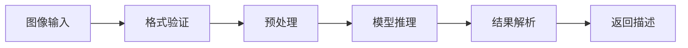

# 第 15 章：媒体理解

> 本章将深入解析 OpenClaw 的媒体理解能力，包括图像识别、语音处理和多模态交互。

---

## 15.1 图像处理

### 15.1.1 图像识别流程



### 15.1.2 视觉模型选择

OpenClaw 支持多种视觉模型：

| 提供商 | 模型 | 特点 | 适用场景 |
|--------|------|------|----------|
| **OpenAI** | GPT-4 Vision | 理解能力强 | 通用图像分析 |
| **Google** | Gemini Pro Vision | 多模态原生 | 复杂场景理解 |
| **Anthropic** | Claude 3 Vision | 细节识别好 | 文档、图表 |
| **本地** | LLaVA | 隐私保护 | 离线场景 |

**配置示例**：

```json
{
  "mediaUnderstanding": {
    "vision": {
      "provider": "openai",
      "model": "gpt-4-vision-preview",
      "maxTokens": 1000,
      "detail": "auto"
    }
  }
}
```

### 15.1.3 图像识别实现

```typescript
// /src/media-understanding/vision.ts

interface ImageAnalysisRequest {
  imageUrl: string;
  prompt?: string;
  detail?: 'low' | 'high' | 'auto';
}

interface ImageAnalysisResult {
  description: string;
  objects: string[];
  text?: string;  // OCR 结果
}

class VisionAnalyzer {
  private provider: VisionProvider;
  
  constructor(provider: VisionProvider) {
    this.provider = provider;
  }
  
  async analyze(
    request: ImageAnalysisRequest
  ): Promise<ImageAnalysisResult> {
    // 下载或验证图像
    const imageData = await this.loadImage(request.imageUrl);
    
    // 调用视觉模型
    const response = await this.provider.analyze({
      image: imageData,
      prompt: request.prompt || 'Describe this image in detail.',
      detail: request.detail || 'auto',
    });
    
    // 解析结果
    return this.parseResponse(response);
  }
  
  private async loadImage(url: string): Promise<Buffer> {
    if (url.startsWith('http')) {
      // 下载远程图像
      const response = await fetch(url);
      return Buffer.from(await response.arrayBuffer());
    } else {
      // 读取本地文件
      return readFile(url);
    }
  }
  
  private parseResponse(response: string): ImageAnalysisResult {
    // 提取关键信息
    const objects = this.extractObjects(response);
    
    return {
      description: response,
      objects,
    };
  }
  
  private extractObjects(text: string): string[] {
    // 简单提取提到的物体
    const commonObjects = [
      'person', 'people', 'car', 'vehicle', 'building',
      'tree', 'dog', 'cat', 'animal', 'food',
      'phone', 'computer', 'book', 'table', 'chair',
    ];
    
    return commonObjects.filter(obj => 
      text.toLowerCase().includes(obj)
    );
  }
}

// OpenAI Vision 实现
class OpenAIVisionProvider implements VisionProvider {
  constructor(private apiKey: string) {}
  
  async analyze(request: VisionRequest): Promise<string> {
    const base64Image = request.image.toString('base64');
    
    const response = await fetch('https://api.openai.com/v1/chat/completions', {
      method: 'POST',
      headers: {
        'Authorization': `Bearer ${this.apiKey}`,
        'Content-Type': 'application/json',
      },
      body: JSON.stringify({
        model: 'gpt-4-vision-preview',
        messages: [
          {
            role: 'user',
            content: [
              { type: 'text', text: request.prompt },
              {
                type: 'image_url',
                image_url: {
                  url: `data:image/jpeg;base64,${base64Image}`,
                  detail: request.detail,
                },
              },
            ],
          },
        ],
        max_tokens: 1000,
      }),
    });
    
    const data = await response.json();
    return data.choices[0].message.content;
  }
}
```

### 15.1.4 OCR 文字识别

```typescript
// /src/media-understanding/ocr.ts

interface OCRRequest {
  imageUrl: string;
  language?: string;
}

interface OCRResult {
  text: string;
  blocks: Array<{
    text: string;
    confidence: number;
    boundingBox: {
      x: number;
      y: number;
      width: number;
      height: number;
    };
  }>;
}

class OCRProcessor {
  async recognize(request: OCRRequest): Promise<OCRResult> {
    // 使用 Google Vision API
    const response = await fetch(
      'https://vision.googleapis.com/v1/images:annotate',
      {
        method: 'POST',
        headers: {
          'Authorization': `Bearer ${this.apiKey}`,
          'Content-Type': 'application/json',
        },
        body: JSON.stringify({
          requests: [{
            image: {
              content: await this.loadImageBase64(request.imageUrl),
            },
            features: [{
              type: 'TEXT_DETECTION',
            }],
            imageContext: {
              languageHints: [request.language || 'en'],
            },
          }],
        }),
      }
    );
    
    const data = await response.json();
    const annotation = data.responses[0].fullTextAnnotation;
    
    return {
      text: annotation.text,
      blocks: annotation.pages[0].blocks.map((block: any) => ({
        text: block.paragraphs.map((p: any) =
          p.words.map((w: any) =
            w.symbols.map((s: any) =
              s.text).join('')
          ).join(' ')
        ).join('\n'),
        confidence: block.confidence,
        boundingBox: this.convertBoundingBox(block.boundingBox),
      })),
    };
  }
  
  private async loadImageBase64(url: string): Promise<string> {
    const buffer = await this.loadImage(url);
    return buffer.toString('base64');
  }
}
```

---

## 15.2 语音处理

### 15.2.1 语音转文字（STT）

支持多种语音识别服务：

| 提供商 | 模型 | 特点 | 语言支持 |
|--------|------|------|----------|
| **OpenAI** | Whisper | 准确率高 | 99+ 语言 |
| **Deepgram** | Nova-2 | 实时性好 | 30+ 语言 |
| **Google** | Cloud Speech | 稳定可靠 | 125+ 语言 |
| **本地** | Whisper.cpp | 隐私保护 | 99+ 语言 |

**配置示例**：

```json
{
  "mediaUnderstanding": {
    "speech": {
      "provider": "openai",
      "model": "whisper-1",
      "language": "zh",
      "responseFormat": "verbose_json"
    }
  }
}
```

### 15.2.2 语音识别实现

```typescript
// /src/media-understanding/speech.ts

interface TranscriptionRequest {
  audioUrl: string;
  language?: string;
  prompt?: string;
}

interface TranscriptionResult {
  text: string;
  segments: Array<{
    start: number;
    end: number;
    text: string;
    confidence: number;
  }>;
  language: string;
}

class SpeechTranscriber {
  private provider: SpeechProvider;
  
  constructor(provider: SpeechProvider) {
    this.provider = provider;
  }
  
  async transcribe(
    request: TranscriptionRequest
  ): Promise<TranscriptionResult> {
    // 下载音频
    const audioBuffer = await this.loadAudio(request.audioUrl);
    
    // 格式验证和转换
    const convertedAudio = await this.convertToSupportedFormat(audioBuffer);
    
    // 调用识别服务
    const result = await this.provider.transcribe({
      audio: convertedAudio,
      language: request.language,
      prompt: request.prompt,
    });
    
    return result;
  }
  
  private async loadAudio(url: string): Promise<Buffer> {
    if (url.startsWith('http')) {
      const response = await fetch(url);
      return Buffer.from(await response.arrayBuffer());
    }
    return readFile(url);
  }
  
  private async convertToSupportedFormat(
    audio: Buffer
  ): Promise<Buffer> {
    // 使用 ffmpeg 转换为 MP3
    const { exec } = require('child_process');
    const { promisify } = require('util');
    const execAsync = promisify(exec);
    
    const inputPath = `/tmp/input_${Date.now()}`;
    const outputPath = `/tmp/output_${Date.now()}.mp3`;
    
    await writeFile(inputPath, audio);
    
    await execAsync(
      `ffmpeg -i ${inputPath} -ar 16000 -ac 1 -c:a libmp3lame ${outputPath}`
    );
    
    const converted = await readFile(outputPath);
    
    // 清理临时文件
    await unlink(inputPath);
    await unlink(outputPath);
    
    return converted;
  }
}

// OpenAI Whisper 实现
class WhisperProvider implements SpeechProvider {
  constructor(private apiKey: string) {}
  
  async transcribe(request: TranscriptionRequest): Promise<TranscriptionResult> {
    const formData = new FormData();
    formData.append('file', new Blob([request.audio]), 'audio.mp3');
    formData.append('model', 'whisper-1');
    
    if (request.language) {
      formData.append('language', request.language);
    }
    
    if (request.prompt) {
      formData.append('prompt', request.prompt);
    }
    
    formData.append('response_format', 'verbose_json');
    
    const response = await fetch('https://api.openai.com/v1/audio/transcriptions', {
      method: 'POST',
      headers: {
        'Authorization': `Bearer ${this.apiKey}`,
      },
      body: formData,
    });
    
    const data = await response.json();
    
    return {
      text: data.text,
      segments: data.segments.map((s: any) => ({
        start: s.start,
        end: s.end,
        text: s.text,
        confidence: s.avg_logprob,
      })),
      language: data.language,
    };
  }
}
```

### 15.2.3 实时语音识别

```typescript
// /src/media-understanding/realtime-speech.ts

class RealtimeTranscriber {
  private ws: WebSocket;
  private audioBuffer: Buffer[] = [];
  private isRecording = false;
  
  constructor(private provider: RealtimeSpeechProvider) {}
  
  async startStream(callback: (text: string) => void): Promise<void> {
    this.isRecording = true;
    
    // 连接 WebSocket
    this.ws = await this.provider.connectStream();
    
    this.ws.on('message', (data: string) => {
      const result = JSON.parse(data);
      if (result.type === 'transcript') {
        callback(result.text);
      }
    });
    
    // 开始发送音频
    this.sendAudioLoop();
  }
  
  async stopStream(): Promise<string> {
    this.isRecording = false;
    
    // 发送结束信号
    this.ws.send(JSON.stringify({ type: 'finalize' }));
    
    // 等待最终结果
    return new Promise((resolve) => {
      this.ws.once('message', (data: string) => {
        const result = JSON.parse(data);
        resolve(result.full_text);
      });
    });
  }
  
  pushAudio(chunk: Buffer): void {
    this.audioBuffer.push(chunk);
  }
  
  private async sendAudioLoop(): Promise<void> {
    while (this.isRecording) {
      if (this.audioBuffer.length > 0) {
        const chunks = this.audioBuffer.splice(0, this.audioBuffer.length);
        const audioData = Buffer.concat(chunks);
        
        this.ws.send(audioData);
      }
      
      await sleep(100);  // 100ms 间隔
    }
  }
}

// Deepgram 实时识别
class DeepgramRealtimeProvider implements RealtimeSpeechProvider {
  async connectStream(): Promise<WebSocket> {
    const ws = new WebSocket(
      'wss://api.deepgram.com/v1/listen',
      {
        headers: {
          'Authorization': `Token ${this.apiKey}`,
        },
      }
    );
    
    return new Promise((resolve, reject) => {
      ws.on('open', () => resolve(ws));
      ws.on('error', reject);
    });
  }
}
```

### 15.2.4 语音合成（TTS）

```typescript
// /src/tts/synthesis.ts

interface TTSRequest {
  text: string;
  voice?: string;
  speed?: number;
}

interface TTSResult {
  audioUrl: string;
  duration: number;
}

class TTSSynthesizer {
  async synthesize(request: TTSRequest): Promise<TTSResult> {
    const response = await fetch('https://api.openai.com/v1/audio/speech', {
      method: 'POST',
      headers: {
        'Authorization': `Bearer ${this.apiKey}`,
        'Content-Type': 'application/json',
      },
      body: JSON.stringify({
        model: 'tts-1',
        input: request.text,
        voice: request.voice || 'alloy',
        speed: request.speed || 1.0,
      }),
    });
    
    const audioBuffer = Buffer.from(await response.arrayBuffer());
    
    // 保存到临时文件
    const outputPath = `/tmp/tts_${Date.now()}.mp3`;
    await writeFile(outputPath, audioBuffer);
    
    // 获取音频时长
    const duration = await this.getAudioDuration(outputPath);
    
    return {
      audioUrl: outputPath,
      duration,
    };
  }
  
  private async getAudioDuration(path: string): Promise<number> {
    const { exec } = require('child_process');
    const { promisify } = require('util');
    const execAsync = promisify(exec);
    
    const { stdout } = await execAsync(
      `ffprobe -v error -show_entries format=duration -of default=noprint_wrappers=1:nokey=1 ${path}`
    );
    
    return parseFloat(stdout.trim());
  }
}
```

---

## 15.3 多模态交互

### 15.3.1 图文混合输入

```typescript
// /src/media-understanding/multimodal.ts

interface MultimodalMessage {
  text: string;
  images?: string[];  // 图像 URL 列表
  audio?: string;     // 音频 URL
}

interface MultimodalResponse {
  text: string;
  generatedImage?: string;
  audioResponse?: string;
}

class MultimodalProcessor {
  private vision: VisionAnalyzer;
  private speech: SpeechTranscriber;
  private llm: LLMClient;
  
  async process(message: MultimodalMessage): Promise<MultimodalResponse> {
    const parts: string[] = [];
    
    // 处理文本
    parts.push(message.text);
    
    // 处理图像
    if (message.images) {
      for (const imageUrl of message.images) {
        const analysis = await this.vision.analyze({
          imageUrl,
          prompt: 'Describe this image concisely.',
        });
        parts.push(`[Image: ${analysis.description}]`);
      }
    }
    
    // 处理音频
    if (message.audio) {
      const transcription = await this.speech.transcribe({
        audioUrl: message.audio,
      });
      parts.push(`[Audio transcription: ${transcription.text}]`);
    }
    
    // 组合成完整提示词
    const combinedPrompt = parts.join('\n\n');
    
    // 调用 LLM
    const response = await this.llm.chat({
      messages: [{ role: 'user', content: combinedPrompt }],
    });
    
    return {
      text: response.content,
    };
  }
}
```

### 15.3.2 视频理解

```typescript
// /src/media-understanding/video.ts

interface VideoAnalysisRequest {
  videoUrl: string;
  sampleRate?: number;  // 每秒采样帧数
}

interface VideoAnalysisResult {
  summary: string;
  keyFrames: Array<{
    timestamp: number;
    description: string;
  }>;
  transcript?: string;
}

class VideoAnalyzer {
  async analyze(request: VideoAnalysisRequest): Promise<VideoAnalysisResult> {
    // 1. 提取关键帧
    const frames = await this.extractKeyFrames(
      request.videoUrl,
      request.sampleRate || 1
    );
    
    // 2. 分析每帧
    const frameDescriptions = await Promise.all(
      frames.map(async (frame) => ({
        timestamp: frame.timestamp,
        description: await this.analyzeFrame(frame.path),
      }))
    );
    
    // 3. 提取音频并转录
    const audioPath = await this.extractAudio(request.videoUrl);
    const transcript = await this.transcribeAudio(audioPath);
    
    // 4. 生成总结
    const summary = await this.generateSummary(
      frameDescriptions,
      transcript
    );
    
    return {
      summary,
      keyFrames: frameDescriptions,
      transcript: transcript?.text,
    };
  }
  
  private async extractKeyFrames(
    videoPath: string,
    sampleRate: number
  ): Promise<Array<{ timestamp: number; path: string }>> {
    const { exec } = require('child_process');
    const { promisify } = require('util');
    const execAsync = promisify(exec);
    
    const outputDir = `/tmp/video_frames_${Date.now()}`;
    await mkdir(outputDir, { recursive: true });
    
    // 使用 ffmpeg 提取帧
    await execAsync(
      `ffmpeg -i ${videoPath} -vf "fps=${sampleRate},scale=480:-1" ${outputDir}/frame_%04d.jpg`
    );
    
    // 读取生成的帧
    const files = await readdir(outputDir);
    return files.map((file, index) => ({
      timestamp: index / sampleRate,
      path: join(outputDir, file),
    }));
  }
  
  private async analyzeFrame(framePath: string): Promise<string> {
    const result = await this.vision.analyze({
      imageUrl: framePath,
      prompt: 'Describe what is happening in this frame.',
    });
    
    return result.description;
  }
  
  private async generateSummary(
    frames: Array<{ timestamp: number; description: string }>,
    transcript?: TranscriptionResult
  ): Promise<string> {
    const prompt = `
Based on the following video frame descriptions and transcript,
provide a concise summary of the video content.

Frame descriptions:
${frames.map(f => `[${f.timestamp}s]: ${f.description}`).join('\n')}

${transcript ? `Transcript:\n${transcript.text}` : ''}

Summary:
`;
    
    const response = await this.llm.chat({
      messages: [{ role: 'user', content: prompt }],
    });
    
    return response.content;
  }
}
```

### 15.3.3 多模态对话

```typescript
// /src/agents/multimodal-conversation.ts

class MultimodalConversation {
  private history: MultimodalMessage[] = [];
  
  async sendMessage(
    message: MultimodalMessage
  ): Promise<MultimodalResponse> {
    // 添加到历史
    this.history.push(message);
    
    // 构建多模态提示词
    const prompt = await this.buildMultimodalPrompt(this.history);
    
    // 调用多模态模型
    const response = await this.callMultimodalModel(prompt);
    
    return response;
  }
  
  private async buildMultimodalPrompt(
    history: MultimodalMessage[]
  ): Promise<any> {
    const messages = [];
    
    for (const msg of history) {
      const content = [];
      
      // 添加文本
      if (msg.text) {
        content.push({ type: 'text', text: msg.text });
      }
      
      // 添加图像
      if (msg.images) {
        for (const imageUrl of msg.images) {
          const imageData = await this.loadImage(imageUrl);
          content.push({
            type: 'image_url',
            image_url: {
              url: `data:image/jpeg;base64,${imageData.toString('base64')}`,
            },
          });
        }
      }
      
      messages.push({ role: 'user', content });
    }
    
    return messages;
  }
}
```

---

## 本章小结

通过本章的学习，你应该掌握了：

1. **图像处理** - 图像识别、OCR、视觉模型选择
2. **语音处理** - STT 语音识别、TTS 语音合成、实时识别
3. **多模态交互** - 图文混合、视频理解、多模态对话

---

*AI Agent 篇至此完成*
