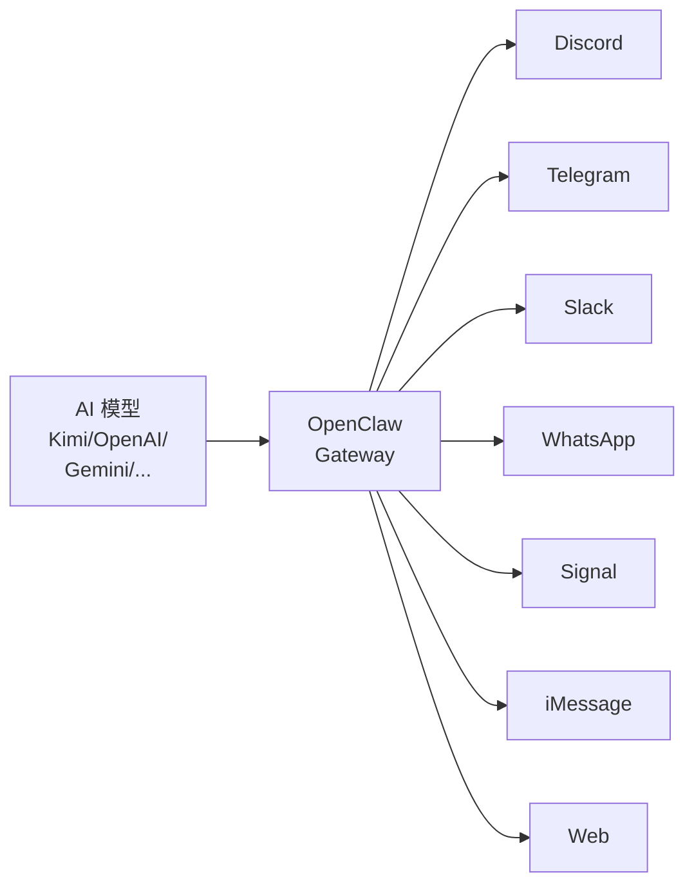
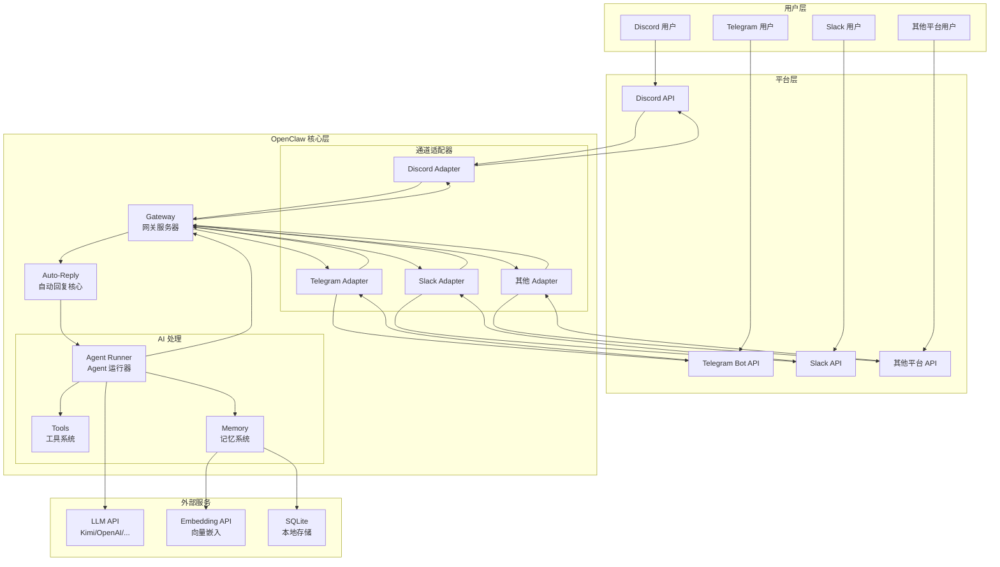
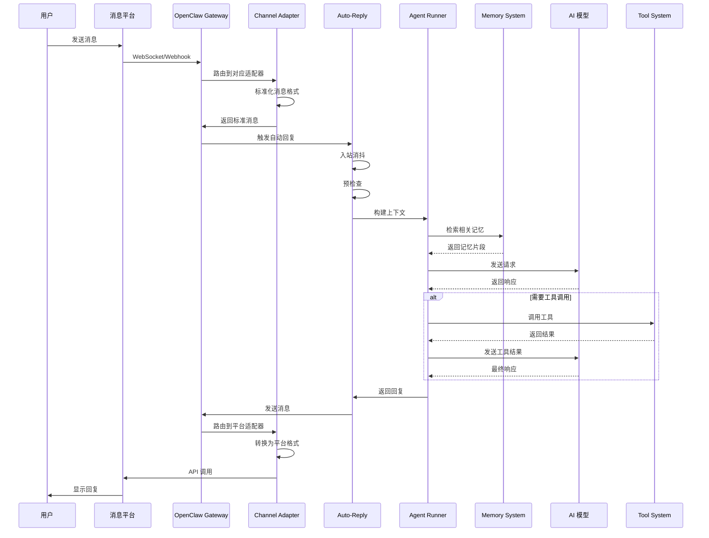

# 第 1 章：OpenClaw 概览

> 本章将带你了解 OpenClaw 是什么、它能做什么，以及它在 AI Agent 领域的定位。

---

## 1.1 什么是 OpenClaw

### 1.1.1 项目背景与诞生故事

**OpenClaw** 是一个开源的 AI Agent 平台，它让你能够在各种消息平台上运行自己的 AI 助手。无论是 Discord、Telegram、Slack 还是 WhatsApp，OpenClaw 都能让你的 AI 助手在这些平台上与用户自然交互。

**名字的含义**：
- "Open" 代表开源、开放
- "Claw"（爪子）象征着 AI 助手像爪子一样触及各个平台，帮助用户完成各种任务

**诞生的初衷**：
在 AI 大模型爆发的时代，开发者们需要一个简单、统一的方式来将 AI 能力集成到日常使用的沟通工具中。OpenClaw 应运而生，它解决了以下痛点：

1. **平台碎片化** - 每个平台都有自己的 Bot API，学习成本高
2. **上下文管理** - AI 需要在多轮对话中保持上下文
3. **记忆持久化** - 跨会话的记忆和知识检索
4. **工具扩展** - 让 AI 能够调用外部工具完成任务

### 1.1.2 核心定位：开源 AI Agent 平台

OpenClaw 的核心定位可以概括为：**"Bring Your Own AI to Any Platform"**



**核心特性**：

| 特性 | 说明 |
|------|------|
| **多平台** | 支持 8+ 个主流消息平台 |
| **多模型** | 支持 Kimi、OpenAI、Gemini 等主流模型 |
| **记忆系统** | 内置 RAG 向量记忆，支持长期记忆 |
| **工具系统** | 可扩展的工具调用机制 |
| **开源免费** | MIT 协议，完全开源 |
| **自托管** | 数据完全由自己掌控 |

### 1.1.3 与同类项目对比

#### OpenClaw vs Claude Desktop

| 对比项 | OpenClaw | Claude Desktop |
|--------|----------|----------------|
| **部署方式** | 自托管服务器 | 本地应用 |
| **平台支持** | 多平台 (Discord/Telegram/...) | 仅桌面端 |
| **模型选择** | 多模型支持 | 仅 Claude |
| **多人使用** | 支持群聊、团队协作 | 个人使用 |
| **扩展性** | 插件系统、自定义工具 | 有限 |
| **开源** | ✅ 完全开源 | ❌ 闭源 |

**适用场景对比**：
- **Claude Desktop**：适合个人日常使用，需要强大的桌面 AI 助手
- **OpenClaw**：适合团队协作、客服场景、需要多平台部署

#### OpenClaw vs AutoGPT

| 对比项 | OpenClaw | AutoGPT |
|--------|----------|---------|
| **交互方式** | 对话式 | 自主代理 |
| **用户控制** | 高（每步可干预） | 低（自主执行） |
| **平台集成** | 原生支持多平台 | 主要通过 API |
| **稳定性** | 高 | 中等（容易陷入循环） |
| **使用门槛** | 低 | 高 |

**适用场景对比**：
- **AutoGPT**：适合研究、探索性任务、自动化工作流
- **OpenClaw**：适合生产环境、客服、日常助手

#### OpenClaw vs LangChain

| 对比项 | OpenClaw | LangChain |
|--------|----------|-----------|
| **定位** | 完整应用平台 | 开发框架 |
| **使用方式** | 配置驱动 | 代码开发 |
| **学习曲线** | 平缓 | 陡峭 |
| **灵活性** | 中等 | 极高 |
| **部署** | 开箱即用 | 需要开发 |

**关系说明**：
OpenClaw 底层实际上使用了类似 LangChain 的理念，但它是一个**开箱即用的产品**，而 LangChain 是一个**开发框架**。如果你需要快速部署一个 AI 助手，选择 OpenClaw；如果你需要深度定制，可以选择 LangChain。

#### OpenClaw vs Dify

| 对比项 | OpenClaw | Dify |
|--------|----------|------|
| **部署** | 轻量级，单二进制 | 需要 Docker，较重 |
| **平台** | 原生多平台支持 | 主要 Web 界面 |
| **界面** |  primarily CLI | 可视化界面 |
| **工作流** | 简单直接 | 复杂工作流编排 |

**适用场景对比**：
- **Dify**：适合构建复杂的 AI 工作流、知识库应用
- **OpenClaw**：适合快速部署多平台 AI 助手

### 1.1.4 适用场景与典型案例

#### 场景一：智能客服

```
用户：你们的产品支持退款吗？
AI：根据我们的退款政策，购买后 30 天内可以申请退款。
     请问您需要了解具体的退款流程吗？

用户：是的
AI：退款流程如下：
     1. 登录账户，进入订单页面
     2. 选择需要退款的订单
     3. 点击"申请退款"按钮
     4. 填写退款原因并提交
     
     退款将在 3-5 个工作日内处理完成。
```

**OpenClaw 优势**：
- 基于知识库回答，准确一致
- 7x24 小时在线
- 无缝转人工
- 多平台统一接入

#### 场景二：团队效率助手

```
用户：@AI助手 总结一下今天的讨论
AI：今天的讨论要点：
    - 确定了下周发布 v2.0 版本
    - 修复了登录页面的 bug
    - 需要补充 API 文档
    
    待办事项：
    1. @张三 完成 API 文档
    2. @李四 准备发布说明
```

**OpenClaw 优势**：
- 实时记录会议
- 自动提取任务
- 集成项目管理工具

#### 场景三：个人 AI 助手

```
用户：提醒我明天下午 3 点开会
AI：已设置提醒：明天（2024-01-15）下午 3:00 开会

用户：查一下北京明天的天气
AI：北京明天（2024-01-15）天气：
    - 晴转多云
    - 温度：-2°C ~ 8°C
    - 空气质量：良
```

**OpenClaw 优势**：
- 定时任务提醒
- 工具调用（天气、日历等）
- 多平台同步

#### 场景四：开发者助手

```
用户：帮我看看这段代码有什么问题
    [粘贴代码]
    
AI：发现以下问题：
    1. 第 15 行：未处理的 Promise rejection
    2. 第 23 行：变量名拼写错误
    3. 第 30 行：建议使用 const 代替 let
    
    修复后的代码：
    [修正后的代码]
```

**OpenClaw 优势**：
- 代码审查
- 技术问答
- 文档查询

---

## 1.2 架构总览

### 1.2.1 系统架构图



### 1.2.2 核心组件介绍

#### Gateway（网关）

Gateway 是 OpenClaw 的核心枢纽，负责：

- **协议转换**：将各平台的 WebSocket/Webhook 转换为内部统一格式
- **会话管理**：维护 WebSocket 连接、管理会话状态
- **API 提供**：对外提供 HTTP API 和 WebSocket 接口
- **认证授权**：处理 Token、密码等认证方式

```
┌─────────────────────────────────────────┐
│              Gateway                    │
├─────────────────────────────────────────┤
│  ┌─────────┐  ┌─────────┐  ┌─────────┐ │
│  │ WebSocket│  │  HTTP   │  │  Hooks  │ │
│  │ Server  │  │  API    │  │ Handler │ │
│  └────┬────┘  └────┬────┘  └────┬────┘ │
│       └─────────────┴─────────────┘     │
│                   │                     │
│            ┌──────┴──────┐              │
│            │  Message    │              │
│            │  Router     │              │
│            └──────┬──────┘              │
└───────────────────┼─────────────────────┘
                    │
        ┌───────────┼───────────┐
        ▼           ▼           ▼
   ┌─────────┐ ┌─────────┐ ┌─────────┐
   │ Discord │ │Telegram │ │  Slack  │
   │ Adapter │ │ Adapter │ │ Adapter │
   └─────────┘ └─────────┘ └─────────┘
```

#### Agent（智能体）

Agent 是实际处理用户消息的 AI 实体：

- **人格定义**：通过 SOUL.md、IDENTITY.md 等文件定义
- **提示词工程**：动态组装系统提示词
- **上下文管理**：维护对话历史、管理上下文窗口
- **工具调用**：决定何时调用工具、处理工具结果

```typescript
// Agent 处理流程简化示意
async function processMessage(message: string, context: Context) {
  // 1. 构建系统提示词
  const systemPrompt = buildSystemPrompt(context);
  
  // 2. 检索相关记忆
  const memories = await searchMemory(message);
  
  // 3. 调用 AI 模型
  const response = await llm.chat({
    system: systemPrompt,
    messages: [...context.history, { role: 'user', content: message }],
    tools: availableTools,
    memories: memories
  });
  
  // 4. 处理响应（可能包含工具调用）
  if (response.hasToolCalls) {
    const results = await executeTools(response.toolCalls);
    return processMessage(results, context);
  }
  
  // 5. 返回最终回复
  return response.content;
}
```

#### Channel（通道）

Channel 是连接具体消息平台的适配器：

- **消息接收**：监听平台的消息事件
- **消息标准化**：将平台特定格式转为统一格式
- **消息发送**：将回复转为平台特定格式发送
- **平台特性**：处理平台特有的功能（如 Discord 的 Embed、Telegram 的键盘）

```typescript
// Channel 接口定义（简化）
interface Channel {
  // 初始化
  initialize(): Promise<void>;
  
  // 接收消息（由平台调用）
  onMessage(handler: MessageHandler): void;
  
  // 发送消息
  sendMessage(target: string, content: string, options?: SendOptions): Promise<void>;
  
  // 平台特定功能
  sendTyping(target: string): Promise<void>;
  replyTo(messageId: string, content: string): Promise<void>;
}
```

#### Memory（记忆系统）

Memory 提供 RAG（检索增强生成）能力：

- **文档存储**：将 Markdown 文件向量化存储
- **语义搜索**：基于向量相似度检索相关内容
- **混合搜索**：结合向量搜索和关键词搜索
- **记忆同步**：文件变更时自动更新索引

```
┌─────────────────────────────────────┐
│           Memory System             │
├─────────────────────────────────────┤
│  ┌──────────┐      ┌─────────────┐ │
│  │  Files   │──────▶│  Chunking   │ │
│  │ (Markdown│      │   & Embed   │ │
│  │  .md)    │      └──────┬──────┘ │
│  └──────────┘             │        │
│                           ▼        │
│  ┌──────────┐      ┌─────────────┐ │
│  │  SQLite  │◀─────│ Vector Store│ │
│  │  +       │      │  (sqlite-vec)│ │
│  │  FTS5    │◀─────┤             │ │
│  └────┬─────┘      └─────────────┘ │
│       │                             │
│       ▼                             │
│  ┌──────────┐                       │
│  │  Search  │◀──── Query            │
│  │  (Hybrid)│────▶ Results          │
│  └──────────┘                       │
└─────────────────────────────────────┘
```

#### Tools（工具系统）

Tools 让 AI 能够调用外部功能：

- **内置工具**：文件读写、代码执行、浏览器控制等
- **技能工具**：通过 Skills 系统扩展的工具
- **自定义工具**：用户开发的专用工具
- **工具权限**：控制哪些工具可以被调用

```typescript
// 工具定义示例
const weatherTool = {
  name: "get_weather",
  description: "获取指定城市的天气信息",
  parameters: {
    type: "object",
    properties: {
      city: {
        type: "string",
        description: "城市名称，如 '北京'"
      }
    },
    required: ["city"]
  },
  async execute({ city }) {
    const response = await fetch(`https://api.weather.com/v1/current?city=${city}`);
    return response.json();
  }
};
```

### 1.2.3 数据流向图



### 1.2.4 技术栈概览

| 层级 | 技术 | 说明 |
|------|------|------|
| **运行时** | Node.js 22+ | JavaScript 运行时 |
| **语言** | TypeScript | 类型安全的 JavaScript |
| **包管理** | pnpm | 高效的包管理器 |
| **网关** | WebSocket + HTTP | 实时通信 |
| **数据库** | SQLite + sqlite-vec | 本地向量数据库 |
| **嵌入模型** | OpenAI/Gemini/Voyage/本地 | 文本向量化 |
| **AI 模型** | Kimi/OpenAI/Gemini/... | 大语言模型 |
| **测试** | Vitest | 单元测试框架 |
| **构建** | tsup | TypeScript 打包 |

---

## 1.3 快速体验

### 1.3.1 在线演示环境

目前 OpenClaw 官方暂未提供在线演示环境，但你可以通过以下方式快速体验：

1. **Docker 一键启动**（约 5 分钟）
```bash
docker run -it --rm \
  -p 18789:18789 \
  -v $(pwd)/openclaw-config:/root/.openclaw \
  openclaw/openclaw:latest
```

2. **npm 快速安装**（约 3 分钟）
```bash
npm install -g openclaw
openclaw wizard
```

### 1.3.2 示例对话展示

以下是一个典型的 OpenClaw 对话示例：

**场景**：用户在 Discord 中询问技术问题

```
┌────────────────────────────────────────────┐
│  #general                                    │
│  ─────────────────────────────────────────   │
│  👤 用户：                                   │
│  @ClawBot 怎么用 Python 读取 JSON 文件？     │
│                                              │
│  🤖 ClawBot 正在输入...                      │
│                                              │
│  🤖 ClawBot：                                │
│  在 Python 中读取 JSON 文件很简单：          │
│                                              │
│  ```python                                   │
│  import json                                 │
│                                              │
│  # 读取 JSON 文件                            │
│  with open('data.json', 'r', encoding='utf-8') as f: │
│      data = json.load(f)                     │
│                                              │
│  print(data)                                 │
│  ```                                         │
│                                              │
│  注意事项：                                  │
│  1. 确保文件存在，否则抛出 FileNotFoundError │
│  2. 指定 encoding='utf-8' 避免中文乱码       │
│  3. 使用 with 语句自动关闭文件               │
│                                              │
│  需要我展示如何处理异常吗？                  │
│                                              │
│  👍 2  💬 回复                                │
└────────────────────────────────────────────┘
```

### 1.3.3 功能特性一览

| 功能类别 | 具体功能 | 状态 |
|----------|----------|------|
| **消息平台** | Discord | ✅ 完整支持 |
| | Telegram | ✅ 完整支持 |
| | Slack | ✅ 完整支持 |
| | WhatsApp | ✅ 完整支持 |
| | Signal | ✅ 完整支持 |
| | iMessage | ✅ macOS 支持 |
| | LINE | ✅ 完整支持 |
| | Web | ✅ 基础支持 |
| **AI 模型** | Kimi | ✅ 支持 |
| | OpenAI | ✅ 支持 |
| | Gemini | ✅ 支持 |
| | Anthropic | ✅ 支持 |
| | 本地模型 | ✅ 支持 |
| **记忆系统** | 向量搜索 | ✅ 支持 |
| | 混合搜索 | ✅ 支持 |
| | 文件监听 | ✅ 支持 |
| | 多记忆源 | ✅ 支持 |
| **工具系统** | 文件操作 | ✅ 支持 |
| | 代码执行 | ✅ 支持 |
| | 浏览器控制 | ✅ 支持 |
| | 自定义工具 | ✅ 支持 |
| **高级功能** | 定时任务 | ✅ 支持 |
| | 插件系统 | ✅ 支持 |
| | 多节点 | ✅ 支持 |
| | 语音交互 | ✅ 支持 |

---

## 本章小结

通过本章的学习，你应该对 OpenClaw 有了整体的认识：

1. **OpenClaw 是什么** - 一个开源的多平台 AI Agent 平台
2. **核心定位** - "Bring Your Own AI to Any Platform"
3. **与同类项目的区别** - 更专注于多平台集成和易用性
4. **适用场景** - 客服、个人助手、团队协作、开发者工具
5. **核心架构** - Gateway + Agent + Channel + Memory + Tools
6. **技术栈** - TypeScript + Node.js + SQLite + WebSocket

**下一步**：进入第 2 章，开始搭建 OpenClaw 运行环境。

---

## 练习与思考

1. **对比分析**：根据你的需求，对比 OpenClaw 和其他 AI 平台，列出选择 OpenClaw 的 3 个理由。

2. **场景设计**：设想一个你想用 OpenClaw 实现的场景，画出简单的架构图。

3. **技术调研**：查看 OpenClaw GitHub 仓库，了解最近的更新和社区活跃度。

---

*下一章：第 2 章 环境搭建与安装*
