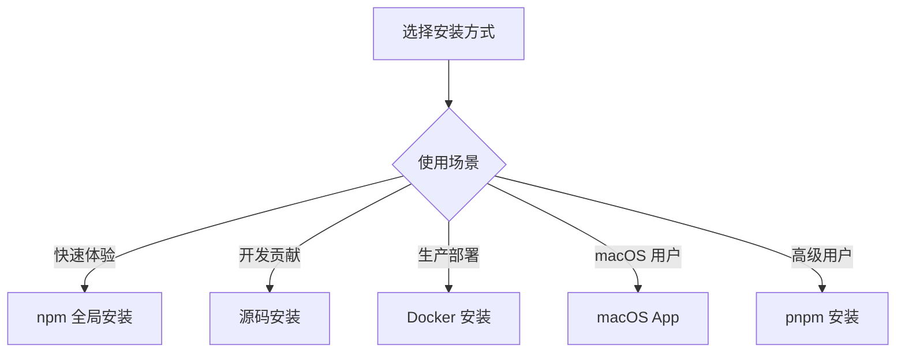

# 第 2 章：环境搭建与安装

> 本章将带你完成 OpenClaw 的安装和初始配置，让你能够快速运行第一个 AI Agent。

---

## 2.1 系统要求

### 2.1.1 硬件要求

OpenClaw 对硬件的要求相对较低，以下是推荐的配置：

| 使用场景 | CPU | 内存 | 存储 | 网络 |
|----------|-----|------|------|------|
| **个人使用** | 2 核+ | 4 GB+ | 1 GB+ | 稳定互联网 |
| **小型团队** | 4 核+ | 8 GB+ | 5 GB+ | 稳定互联网 |
| **企业部署** | 8 核+ | 16 GB+ | 20 GB+ | 高带宽、低延迟 |

**说明**：
- 如果使用**本地嵌入模型**（非 API），需要额外的内存和 CPU
- 如果使用**本地大模型**（如 Ollama），需要 GPU 支持
- 存储空间主要用于 SQLite 数据库和日志文件

### 2.1.2 操作系统支持

OpenClaw 支持以下操作系统：

| 操作系统 | 版本要求 | 支持程度 |
|----------|----------|----------|
| **macOS** | 12+ (Monterey) | ⭐⭐⭐ 完整支持 |
| **Linux** | Ubuntu 20.04+, Debian 11+, CentOS 8+ | ⭐⭐⭐ 完整支持 |
| **Windows** | Windows 10/11 + WSL2 | ⭐⭐☆ 需 WSL |
| **Docker** | 任意支持 Docker 的系统 | ⭐⭐⭐ 推荐 |

**特别提示**：
- **macOS**：有原生 App 版本，体验最佳
- **Windows**：强烈建议使用 WSL2 或 Docker
- **ARM 架构**（如 Apple Silicon、Raspberry Pi）：完全支持

### 2.1.3 Node.js 版本要求

OpenClaw 需要 **Node.js 22 LTS** 或更高版本。

**检查 Node.js 版本**：
```bash
node --version
# 应输出 v22.x.x 或更高
```

**安装/升级 Node.js**：

**macOS (使用 Homebrew)**：
```bash
brew install node@22
```

**Linux (使用 nvm)**：
```bash
# 安装 nvm
curl -o- https://raw.githubusercontent.com/nvm-sh/nvm/v0.40.0/install.sh | bash

# 安装 Node.js 22
nvm install 22
nvm use 22
nvm alias default 22
```

**Windows (使用 nvm-windows)**：
```powershell
# 下载并安装 nvm-windows
# https://github.com/coreybutler/nvm-windows/releases

nvm install 22.0.0
nvm use 22.0.0
```

### 2.1.4 可选依赖

以下依赖是可选的，但建议安装：

| 依赖 | 用途 | 安装命令 |
|------|------|----------|
| **pnpm** | 更快的包管理 | `npm install -g pnpm` |
| **Docker** | 容器化部署 | 参考 Docker 官网 |
| **Git** | 源码安装 | `brew install git` 或 `apt install git` |
| **SQLite** | 数据库工具（调试） | 通常已预装 |

---

## 2.2 安装方式

OpenClaw 提供多种安装方式，你可以根据自己的需求选择：



### 2.2.1 npm 全局安装（推荐新手）

这是最简单的安装方式，适合快速体验：

```bash
# 安装 OpenClaw
npm install -g openclaw

# 验证安装
openclaw --version

# 运行配置向导
openclaw wizard
```

**优点**：
- 简单快捷
- 自动处理依赖
- 全局可用

**缺点**：
- 更新需要重新安装
- 不易切换版本

### 2.2.2 pnpm 安装（推荐开发者）

pnpm 是更高效的包管理器，适合开发使用：

```bash
# 安装 pnpm
npm install -g pnpm

# 安装 OpenClaw
pnpm add -g openclaw

# 验证安装
openclaw --version
```

**优点**：
- 磁盘空间占用小
- 安装速度快
- 严格的依赖管理

### 2.2.3 源码安装（推荐贡献者）

如果你想修改源码或贡献代码，使用源码安装：

```bash
# 克隆仓库
git clone https://github.com/openclaw/openclaw.git
cd openclaw

# 安装依赖
pnpm install

# 构建项目
pnpm build

# 链接到全局（可选）
pnpm link --global

# 或使用本地运行
pnpm dev
```

**开发命令**：
```bash
# 运行测试
pnpm test

# 代码检查
pnpm check

# 格式化代码
pnpm format

# 构建发布版本
pnpm build
```

### 2.2.4 Docker 安装（推荐生产环境）

Docker 安装适合生产部署和隔离环境：

```bash
# 拉取镜像
docker pull openclaw/openclaw:latest

# 运行容器
docker run -it --rm \
  --name openclaw \
  -p 18789:18789 \
  -v $(pwd)/openclaw-data:/root/.openclaw \
  openclaw/openclaw:latest

# 后台运行
docker run -d \
  --name openclaw \
  --restart unless-stopped \
  -p 18789:18789 \
  -v $(pwd)/openclaw-data:/root/.openclaw \
  openclaw/openclaw:latest
```

**使用 Docker Compose**：

创建 `docker-compose.yml`：
```yaml
version: '3.8'

services:
  openclaw:
    image: openclaw/openclaw:latest
    container_name: openclaw
    restart: unless-stopped
    ports:
      - "18789:18789"
    volumes:
      - ./openclaw-data:/root/.openclaw
    environment:
      - NODE_ENV=production
```

启动：
```bash
docker-compose up -d
```

### 2.2.5 macOS App 安装（推荐 Mac 用户）

macOS 用户可以使用原生 App，体验最佳：

1. **下载 App**：
   - 访问 [OpenClaw 官网](https://openclaw.ai)
   - 下载最新版 macOS App

2. **安装**：
   - 打开下载的 `.dmg` 文件
   - 将 OpenClaw 拖到 Applications 文件夹

3. **首次运行**：
   - 在 Launchpad 中打开 OpenClaw
   - 如果提示"无法打开"，前往 系统设置 > 隐私与安全 > 允许

4. **使用**：
   - 点击菜单栏的 OpenClaw 图标
   - 选择"Open Wizard"进行配置

**App 特点**：
- 菜单栏快捷操作
- 自动更新
- 原生通知支持
- 与系统集成更好

---

## 2.3 初始化配置

### 2.3.1 运行向导（Wizard）

安装完成后，运行配置向导进行初始设置：

```bash
openclaw wizard
```

向导会引导你完成以下配置：

```
┌─────────────────────────────────────────┐
│     OpenClaw Configuration Wizard       │
├─────────────────────────────────────────┤
│                                         │
│  1. 选择 AI 模型提供商                   │
│     ○ OpenAI                            │
│     ● Kimi (Moonshot)                   │
│     ○ Gemini                            │
│     ○ 其他                              │
│                                         │
│  2. 输入 API Key                        │
│     [********************************]  │
│                                         │
│  3. 选择要启用的平台                     │
│     ☑ Discord                           │
│     ☐ Telegram                          │
│     ☐ Slack                             │
│                                         │
│  4. 配置 Discord（如启用）               │
│     Bot Token: [**********************] │
│                                         │
│  [ < Back ]    [ Next > ]    [ Finish ] │
└─────────────────────────────────────────┘
```

### 2.3.2 配置文件结构

向导完成后，会在 `~/.openclaw/` 目录生成配置文件：

```
~/.openclaw/
├── config.json          # 主配置文件
├── credentials/         # 凭据存储
│   └── discord.json
├── sessions/            # 会话数据
│   └── sessions.json
├── agents/              # Agent 配置
│   └── default/
│       ├── SOUL.md
│       ├── IDENTITY.md
│       ├── USER.md
│       └── AGENTS.md
└── memory/              # 记忆文件
    └── 2024-01-15.md
```

**主配置文件示例** (`config.json`)：

```json
{
  "agents": {
    "defaults": {
      "model": "kimi-coding/k2p5",
      "provider": "kimi",
      "apiKey": "${KIMI_API_KEY}"
    }
  },
  "channels": {
    "discord": {
      "enabled": true,
      "accounts": {
        "default": {
          "token": "${DISCORD_BOT_TOKEN}"
        }
      }
    }
  },
  "gateway": {
    "mode": "local",
    "port": 18789
  },
  "memory": {
    "enabled": true,
    "provider": "openai",
    "model": "text-embedding-3-small"
  }
}
```

### 2.3.3 环境变量设置

为了安全起见，建议将敏感信息放在环境变量中：

**创建 `.env` 文件**：
```bash
# AI 模型 API Key
KIMI_API_KEY=sk-your-kimi-api-key
OPENAI_API_KEY=sk-your-openai-api-key

# Discord Bot Token
DISCORD_BOT_TOKEN=your-discord-bot-token

# Telegram Bot Token
TELEGRAM_BOT_TOKEN=your-telegram-bot-token
```

**加载环境变量**：

**macOS/Linux**：
```bash
# 临时加载
export $(cat .env | xargs)

# 永久加载（添加到 ~/.zshrc 或 ~/.bashrc）
echo 'export $(cat ~/.openclaw/.env | xargs)' >> ~/.zshrc
```

**Windows (PowerShell)**：
```powershell
# 临时加载
Get-Content .env | ForEach-Object { 
  $name, $value = $_ -split '=', 2
  Set-Item -Path "Env:$name" -Value $value
}
```

**在配置中引用环境变量**：
```json
{
  "apiKey": "${KIMI_API_KEY}"
}
```

### 2.3.4 验证安装

完成配置后，验证 OpenClaw 是否正常工作：

```bash
# 检查版本
openclaw --version

# 检查配置
openclaw config get

# 检查网关状态
openclaw gateway status

# 检查通道状态
openclaw channels status
```

**预期输出**：
```
$ openclaw --version
openclaw 1.0.0

$ openclaw gateway status
Gateway: running
Mode: local
Port: 18789
Uptime: 0h 5m 32s

$ openclaw channels status
Discord: connected (1 account)
  - default: online
```

---

## 2.4 第一个连接测试

### 2.4.1 使用 CLI 测试

在配置 Discord 等平台之前，可以先使用 CLI 测试 AI 功能：

```bash
# 启动交互式对话
openclaw agent --interactive

# 或单条消息测试
openclaw agent --message "你好，请介绍一下自己"
```

**交互式对话示例**：
```
$ openclaw agent --interactive

🦀 OpenClaw Agent
输入 'exit' 或按 Ctrl+C 退出

> 你好！
你好！我是你的 AI 助手，很高兴见到你。有什么我可以帮助你的吗？

> 今天天气怎么样？
我无法直接获取实时天气信息，但我可以帮你查询。你可以使用天气工具，或者告诉我你所在的城市，我可以提供一些一般性的天气建议。

> exit
再见！👋
```

### 2.4.2 查看日志输出

如果遇到问题，可以查看详细日志：

```bash
# 前台运行，查看实时日志
openclaw gateway run --verbose

# 或使用调试模式
DEBUG=* openclaw gateway run

# 查看日志文件
tail -f ~/.openclaw/logs/gateway.log
```

**日志级别**：
- `error` - 错误信息
- `warn` - 警告信息
- `info` - 一般信息
- `verbose` - 详细信息
- `debug` - 调试信息

### 2.4.3 常见问题排查

#### 问题 1：命令未找到 (command not found)

**症状**：
```bash
$ openclaw --version
zsh: command not found: openclaw
```

**解决方案**：
```bash
# 检查 npm 全局安装路径
npm config get prefix

# 添加到 PATH
echo 'export PATH="$PATH:$(npm config get prefix)/bin"' >> ~/.zshrc
source ~/.zshrc
```

#### 问题 2：权限不足 (EACCES)

**症状**：
```bash
npm ERR! Error: EACCES: permission denied
```

**解决方案**：
```bash
# 使用 npx 运行
npx openclaw --version

# 或修改 npm 权限
sudo chown -R $(whoami) $(npm config get prefix)/{lib/node_modules,bin,share}
```

#### 问题 3：Node.js 版本不兼容

**症状**：
```bash
Error: OpenClaw requires Node.js >= 22.0.0
```

**解决方案**：
```bash
# 使用 nvm 切换版本
nvm install 22
nvm use 22

# 验证
node --version  # 应显示 v22.x.x
```

#### 问题 4：端口被占用

**症状**：
```bash
Error: Port 18789 is already in use
```

**解决方案**：
```bash
# 查找占用进程
lsof -i :18789

# 终止进程
kill -9 <PID>

# 或更换端口
openclaw config set gateway.port 18790
```

#### 问题 5：API Key 无效

**症状**：
```
Error: Invalid API key
```

**解决方案**：
```bash
# 检查环境变量
echo $KIMI_API_KEY

# 验证 API Key 有效性
curl https://api.moonshot.cn/v1/models \
  -H "Authorization: Bearer $KIMI_API_KEY"

# 重新配置
openclaw wizard
```

---

## 本章小结

通过本章的学习，你应该已经：

1. **了解了系统要求** - 硬件、操作系统、Node.js 版本
2. **选择了安装方式** - npm、pnpm、源码、Docker 或 macOS App
3. **完成了初始配置** - 运行向导、配置文件结构、环境变量
4. **验证了安装** - CLI 测试、日志查看、问题排查

**下一步**：进入第 3 章，创建你的第一个 Agent 配置文件。

---

## 练习与思考

1. **安装实践**：选择一种安装方式，在你的机器上安装 OpenClaw。

2. **配置探索**：查看生成的配置文件，理解每个配置项的作用。

3. **故障模拟**：故意制造一个错误（如错误的 API Key），观察错误日志，然后修复它。

4. **多环境配置**：尝试配置多个 AI 模型提供商，并切换使用。

---

*下一章：第 3 章 第一个 Agent*
