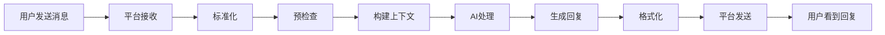
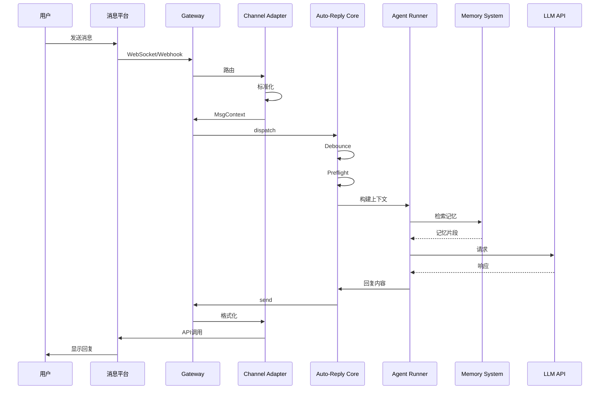
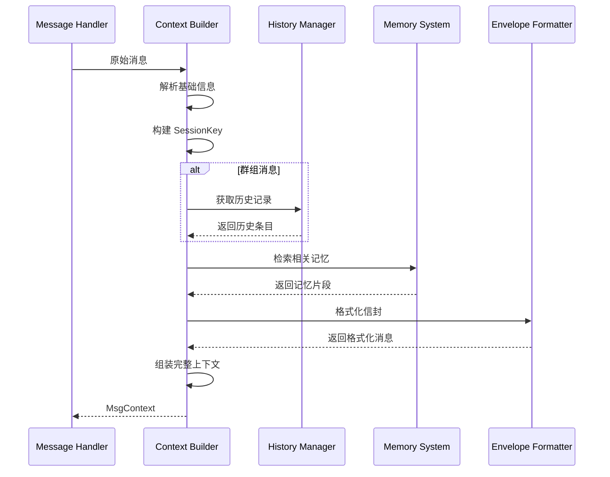

# 第 4 章：消息传输流程

> 本章将深入解析 OpenClaw 中消息从接收到回复的完整传输流程，帮助你理解系统的核心工作机制。

---

## 4.1 整体流程概览

### 4.1.1 消息生命周期

一条消息在 OpenClaw 中的完整生命周期：



**各阶段耗时**（参考）：

| 阶段 | 典型耗时 | 说明 |
|------|----------|------|
| 平台接收 | 50-200ms | WebSocket/Webhook 延迟 |
| 标准化 | 10-50ms | 格式转换 |
| 预检查 | 5-20ms | 白名单、权限检查 |
| 构建上下文 | 20-100ms | 读取历史、记忆检索 |
| AI处理 | 1-10s | 模型推理（主要耗时） |
| 生成回复 | 10-50ms | 后处理 |
| 平台发送 | 100-500ms | API 调用 |
| **总计** | **1.2-12s** | 取决于模型和网络 |

### 4.1.2 核心组件交互



### 4.1.3 数据转换过程

消息在不同阶段的数据格式：

```
┌─────────────────────────────────────────────────────────────┐
│  阶段          │  数据格式                                    │
├─────────────────────────────────────────────────────────────┤
│  平台原始      │  Discord Message 对象                        │
│                │  {id, content, author, channel_id, ...}      │
├─────────────────────────────────────────────────────────────┤
│  标准化        │  内部统一格式                                │
│                │  {body, from, to, platform, ...}             │
├─────────────────────────────────────────────────────────────┤
│  上下文构建    │  MsgContext                                  │
│                │  {Body, From, To, SessionKey, History, ...}  │
├─────────────────────────────────────────────────────────────┤
│  AI 输入       │  提示词组装                                  │
│                │  System + History + User Message             │
├─────────────────────────────────────────────────────────────┤
│  AI 输出       │  原始回复                                    │
│                │  文本或工具调用                              │
├─────────────────────────────────────────────────────────────┤
│  平台发送      │  平台特定格式                                │
│                │  Discord: {content, embeds, ...}             │
└─────────────────────────────────────────────────────────────┘
```

---

## 4.2 消息流入 (Inbound)

### 4.2.1 平台 WebSocket/Webhook 接收

不同平台的连接方式：

| 平台 | 连接方式 | 特点 |
|------|----------|------|
| **Discord** | WebSocket (Gateway) | 实时、持久连接 |
| **Telegram** | Long Polling / Webhook | 灵活、可切换 |
| **Slack** | WebSocket (Socket Mode) | 企业友好 |
| **WhatsApp** | Web 扫描 + WebSocket | 模拟用户行为 |
| **Signal** | 本地监听 | 需要桌面客户端 |

**Discord WebSocket 示例**：

```typescript
// /src/discord/monitor/provider.ts (简化)
class DiscordGateway {
  private ws: WebSocket;
  
  async connect() {
    // 1. 获取 Gateway 地址
    const { url } = await this.getGatewayUrl();
    
    // 2. 建立 WebSocket 连接
    this.ws = new WebSocket(`${url}/?v=10`);
    
    // 3. 处理消息
    this.ws.on('message', (data) => {
      const payload = JSON.parse(data);
      this.handlePayload(payload);
    });
  }
  
  handlePayload(payload: GatewayPayload) {
    switch (payload.t) {
      case 'MESSAGE_CREATE':
        // 触发消息处理器
        this.emit('message', payload.d);
        break;
      // ... 其他事件
    }
  }
}
```

### 4.2.2 消息标准化

将平台特定格式转为内部统一格式：

```typescript
// /src/discord/monitor/message-utils.ts (简化)
function normalizeDiscordMessage(message: DiscordMessage): StandardMessage {
  return {
    // 基础信息
    id: message.id,
    content: message.content,
    
    // 发送者
    from: {
      id: message.author.id,
      name: message.author.username,
      displayName: message.author.global_name,
    },
    
    // 目标
    to: {
      channelId: message.channel_id,
      guildId: message.guild_id,
    },
    
    // 平台标识
    platform: 'discord',
    
    // 消息类型
    type: message.guild_id ? 'guild' : 'dm',
    
    // 引用
    replyTo: message.referenced_message?.id,
    
    // 媒体
    attachments: message.attachments.map(att => ({
      url: att.url,
      type: att.content_type,
      size: att.size,
    })),
    
    // 时间戳
    timestamp: message.timestamp,
  };
}
```

### 4.2.3 入站消抖 (Debouncer)

**为什么需要消抖？**

用户可能快速发送多条消息，我们希望合并处理：

```
用户输入：
[10:00:00] "你好"
[10:00:01] "在吗"
[10:00:02] "有个问题"

不消抖：触发 3 次 AI 调用
消抖后：合并为 "你好\n在吗\n有个问题"，触发 1 次 AI 调用
```

**实现原理**：

```typescript
// /src/auto-reply/inbound-debounce.ts (简化)
class InboundDebouncer {
  private pending = new Map<string, PendingEntry[]>();
  private timers = new Map<string, NodeJS.Timeout>();
  
  constructor(private options: {
    debounceMs: number;  // 默认 300ms
    onFlush: (entries: PendingEntry[]) => void;
  }) {}
  
  async enqueue(entry: PendingEntry) {
    const key = this.buildKey(entry);
    
    // 添加到待处理队列
    if (!this.pending.has(key)) {
      this.pending.set(key, []);
    }
    this.pending.get(key)!.push(entry);
    
    // 重置定时器
    this.resetTimer(key);
  }
  
  private resetTimer(key: string) {
    // 清除旧定时器
    if (this.timers.has(key)) {
      clearTimeout(this.timers.get(key)!);
    }
    
    // 设置新定时器
    const timer = setTimeout(() => {
      this.flush(key);
    }, this.options.debounceMs);
    
    this.timers.set(key, timer);
  }
  
  private flush(key: string) {
    const entries = this.pending.get(key);
    if (!entries || entries.length === 0) return;
    
    // 清空队列
    this.pending.delete(key);
    this.timers.delete(key);
    
    // 触发回调
    this.options.onFlush(entries);
  }
  
  private buildKey(entry: PendingEntry): string {
    // 按平台+频道+用户分组
    return `${entry.platform}:${entry.channelId}:${entry.userId}`;
  }
}
```

**消抖策略**：

| 情况 | 处理 |
|------|------|
| 单条消息 | 正常处理 |
| 多条文本 | 合并为一条，用换行分隔 |
| 含附件 | 不合并，立即处理 |
| 控制命令 | 不合并，立即处理 |
| 超过最大等待时间 | 强制刷新 |

### 4.2.4 预检查 (Preflight)

在正式处理前进行一系列检查：

```mermaid
flowchart TD
    A[消息到达] --> B{白名单检查}
    B -->|拒绝| C[丢弃消息]
    B -->|通过| D{是否需要@提及}
    D -->|是且未提及| C
    D -->|否或通过| E{命令检测}
    E -->|控制命令| F[命令处理]
    E -->|普通消息| G{频率限制}
    G -->|超限| H[限流提示]
    G -->|通过| I[继续处理]
```

**具体检查项**：

```typescript
// /src/discord/monitor/message-handler.preflight.ts (简化)
interface PreflightCheck {
  name: string;
  check: (ctx: Context) => boolean | Promise<boolean>;
  onFail?: (ctx: Context) => void;
}

const preflightChecks: PreflightCheck[] = [
  {
    name: 'allowlist',
    check: (ctx) => {
      // 检查用户/频道是否在白名单
      return isInAllowlist(ctx.userId, ctx.channelId);
    },
    onFail: () => logger.debug('User not in allowlist'),
  },
  {
    name: 'mention',
    check: (ctx) => {
      // 群组中是否需要@提及
      if (ctx.isDM) return true;
      if (!ctx.requireMention) return true;
      return ctx.wasMentioned;
    },
    onFail: () => logger.debug('Mention required but not found'),
  },
  {
    name: 'rateLimit',
    check: (ctx) => {
      // 检查频率限制
      return rateLimiter.check(ctx.userId);
    },
    onFail: (ctx) => {
      ctx.send('发送太频繁了，请稍后再试');
    },
  },
  {
    name: 'duplicate',
    check: (ctx) => {
      // 检查重复消息
      return !isDuplicate(ctx.messageId);
    },
  },
];
```

---

## 4.3 消息处理 (Processing)

### 4.3.1 上下文构建

构建完整的对话上下文是消息处理的核心：

```typescript
// /src/auto-reply/templating.ts (简化)
interface MsgContext {
  // 消息内容
  Body: string;                    // 完整消息体（含信封格式）
  BodyForAgent: string;            // 给 AI 的纯净内容
  RawBody: string;                 // 原始消息内容
  CommandBody?: string;            // 命令部分（如果有）
  
  // 路由信息
  From: string;                    // 发送者标识
  To: string;                      // 接收者标识
  SessionKey: string;              // 会话唯一键
  AccountId: string;               // 账号 ID
  
  // 会话信息
  ChatType: 'direct' | 'channel';  // 聊天类型
  ConversationLabel: string;       // 会话标签
  
  // 群组信息
  GroupSubject?: string;           // 群组主题
  GroupChannel?: string;           // 群组频道
  GroupSpace?: string;             // 群组空间
  
  // 发送者信息
  SenderName: string;              // 发送者名称
  SenderId: string;                // 发送者 ID
  SenderUsername: string;          // 用户名
  SenderTag?: string;              // 标签（如 Discord discriminator）
  
  // 回复上下文
  ReplyToId?: string;              // 回复的消息 ID
  ReplyToBody?: string;            // 回复的消息内容
  ReplyToSender?: string;          // 回复的消息发送者
  
  // 线程信息
  ThreadStarterBody?: string;      // 线程起始消息
  ThreadLabel?: string;            // 线程标签
  ParentSessionKey?: string;       // 父会话键
  
  // 媒体
  MediaUrl?: string;               // 媒体 URL
  MediaContentType?: string;       // 媒体类型
  MediaCaption?: string;           // 媒体说明
  
  // 元数据
  Provider: string;                // 提供商（discord/telegram/...）
  Surface: string;                 // 表面（同 Provider）
  WasMentioned: boolean;           // 是否被@提及
  Timestamp: number;               // 时间戳
  
  // 命令相关
  CommandAuthorized?: boolean;     // 命令是否授权
  CommandSource?: 'text' | 'native'; // 命令来源
  
  // 其他
  UntrustedContext?: unknown[];    // 不可信上下文
  GroupSystemPrompt?: string;      // 群组系统提示词
  OwnerAllowFrom?: string[];       // 允许的发送者
}
```

**构建流程**：



### 4.3.2 会话标签生成

会话标签用于标识和区分不同对话：

```typescript
// /src/channels/conversation-label.ts
function resolveConversationLabel(ctx: MsgContext): string {
  // 1. 检查显式标签
  if (ctx.ConversationLabel) {
    return ctx.ConversationLabel;
  }
  
  // 2. 检查线程标签
  if (ctx.ThreadLabel) {
    return ctx.ThreadLabel;
  }
  
  // 3. 根据聊天类型构建
  if (ctx.ChatType === 'direct') {
    // 私聊: "用户名 user id:123456"
    return `${ctx.SenderName} user id:${ctx.SenderId}`;
  }
  
  // 群组: "Guild名 #频道 channel id:789"
  const base = ctx.GroupChannel || ctx.GroupSubject || 'Group';
  return `${base} channel id:${ctx.To.split(':').pop()}`;
}
```

**标签示例**：

| 场景 | 标签格式 | 示例 |
|------|----------|------|
| Discord 私聊 | `{用户名} user id:{ID}` | `jq1117 user id:1094076488640376883` |
| Discord 频道 | `{Guild} #{频道} channel id:{ID}` | `MyServer #general channel id:1470398904750178481` |
| Telegram 私聊 | `{用户名} user id:{ID}` | `john_doe user id:123456789` |
| Telegram 群组 | `{群组名} group id:{ID}` | `TechChat group id:-987654321` |

### 4.3.3 系统提示词组装

将各种配置组合成完整的系统提示词：

```
┌─────────────────────────────────────────────────────────────┐
│                    系统提示词结构                            │
├─────────────────────────────────────────────────────────────┤
│  1. 基础身份                                                │
│     "你是 OpenClaw 的一个实例..."                           │
├─────────────────────────────────────────────────────────────┤
│  2. SOUL.md 内容                                            │
│     [核心价值观、行为准则、个性]                             │
├─────────────────────────────────────────────────────────────┤
│  3. IDENTITY.md 内容                                        │
│     [名字、形象、Emoji]                                     │
├─────────────────────────────────────────────────────────────┤
│  4. 当前上下文                                              │
│     - 会话标签                                              │
│     - 聊天类型                                              │
│     - 群组信息（如果是群组）                                 │
├─────────────────────────────────────────────────────────────┤
│  5. 可用工具列表                                            │
│     [工具名称、描述、参数]                                   │
├─────────────────────────────────────────────────────────────┤
│  6. 相关记忆（RAG 检索结果）                                 │
│     [记忆片段 1]                                            │
│     [记忆片段 2]                                            │
├─────────────────────────────────────────────────────────────┤
│  7. 历史对话（最近 N 条）                                    │
│     User: ...                                               │
│     Assistant: ...                                          │
├─────────────────────────────────────────────────────────────┤
│  8. 当前消息                                                │
│     [信封格式]                                              │
│     From: ...                                               │
│     Body: ...                                               │
└─────────────────────────────────────────────────────────────┘
```

**代码示例**：

```typescript
// /src/agents/pi-embedded-runner/run/params.ts (简化)
function buildSystemPrompt(ctx: MsgContext): string {
  const parts: string[] = [];
  
  // 1. 基础身份
  parts.push(`You are ${ctx.AgentName}, an AI assistant.`);
  
  // 2. SOUL.md
  parts.push(readFile('SOUL.md'));
  
  // 3. IDENTITY.md
  parts.push(readFile('IDENTITY.md'));
  
  // 4. 当前上下文
  parts.push(`Current conversation: ${ctx.ConversationLabel}`);
  parts.push(`Chat type: ${ctx.ChatType}`);
  
  if (ctx.ChatType === 'channel') {
    parts.push(`Group: ${ctx.GroupSubject || 'Unknown'}`);
  }
  
  // 5. 可用工具
  if (ctx.AvailableTools.length > 0) {
    parts.push('Available tools:');
    for (const tool of ctx.AvailableTools) {
      parts.push(`- ${tool.name}: ${tool.description}`);
    }
  }
  
  // 6. 相关记忆
  if (ctx.RelevantMemories.length > 0) {
    parts.push('Relevant memories:');
    for (const memory of ctx.RelevantMemories) {
      parts.push(`- ${memory.snippet}`);
    }
  }
  
  // 7. 历史对话
  if (ctx.History.length > 0) {
    parts.push('Recent conversation:');
    for (const entry of ctx.History) {
      parts.push(`${entry.role}: ${entry.content}`);
    }
  }
  
  return parts.join('\n\n');
}
```

### 4.3.4 AI 模型调用

调用 AI 模型进行推理：

```typescript
// /src/agents/pi-embedded-runner/run/params.ts (简化)
async function callAI(params: {
  systemPrompt: string;
  messages: Message[];
  tools?: Tool[];
  model: string;
}): Promise<AIResponse> {
  const client = createClient(params.model);
  
  const response = await client.chat.completions.create({
    model: params.model,
    messages: [
      { role: 'system', content: params.systemPrompt },
      ...params.messages,
    ],
    tools: params.tools,
    tool_choice: params.tools ? 'auto' : undefined,
    temperature: 0.7,
    max_tokens: 2000,
  });
  
  return {
    content: response.choices[0].message.content,
    toolCalls: response.choices[0].message.tool_calls,
  };
}
```

---

## 4.4 消息流出 (Outbound)

### 4.4.1 回复生成

AI 生成的回复可能需要后处理：

```typescript
// /src/auto-reply/reply/dispatch-from-config.ts (简化)
function processAIResponse(response: AIResponse): ProcessedReply {
  let content = response.content;
  
  // 1. 清理思考过程（如果有）
  content = removeThinkingTags(content);
  
  // 2. 处理工具调用
  if (response.toolCalls) {
    return {
      type: 'tool_calls',
      toolCalls: response.toolCalls,
    };
  }
  
  // 3. 提取回复标签
  const replyTag = extractReplyTag(content);
  if (replyTag) {
    content = removeReplyTag(content);
  }
  
  // 4. 处理特殊标记
  content = processSpecialMarkers(content);
  
  // 5. 平台特定处理
  content = platformSpecificProcessing(content);
  
  return {
    type: 'text',
    content,
    replyTag,
  };
}
```

### 4.4.2 消息分块

当回复超过平台限制时，需要分块发送：

```typescript
// /src/auto-reply/chunk.ts (简化)
function chunkMessage(
  content: string,
  options: {
    maxLength: number;      // 平台限制（如 Discord 2000）
    mode: 'paragraph' | 'line' | 'code';
  }
): string[] {
  const chunks: string[] = [];
  
  if (content.length <= options.maxLength) {
    return [content];
  }
  
  switch (options.mode) {
    case 'paragraph':
      // 按段落分割，保持段落完整
      const paragraphs = content.split('\n\n');
      let currentChunk = '';
      
      for (const para of paragraphs) {
        if ((currentChunk + para).length > options.maxLength) {
          if (currentChunk) chunks.push(currentChunk.trim());
          currentChunk = para;
        } else {
          currentChunk += '\n\n' + para;
        }
      }
      
      if (currentChunk) chunks.push(currentChunk.trim());
      break;
      
    case 'line':
      // 按行分割
      const lines = content.split('\n');
      let currentLines: string[] = [];
      
      for (const line of lines) {
        const testChunk = currentLines.join('\n') + '\n' + line;
        if (testChunk.length > options.maxLength) {
          chunks.push(currentLines.join('\n'));
          currentLines = [line];
        } else {
          currentLines.push(line);
        }
      }
      
      if (currentLines.length > 0) {
        chunks.push(currentLines.join('\n'));
      }
      break;
      
    case 'code':
      // 保护代码块完整性
      chunks.push(...chunkWithCodeBlocks(content, options.maxLength));
      break;
  }
  
  return chunks;
}
```

**各平台消息限制**：

| 平台 | 文本限制 | 处理方式 |
|------|----------|----------|
| Discord | 2000 字符 | 分块发送 |
| Telegram | 4096 字符 | 分块发送 |
| Slack | 4000 字符 | 分块或使用附件 |
| WhatsApp | 4096 字符 | 分块发送 |

### 4.4.3 平台 API 发送

将格式化后的消息发送到平台：

```typescript
// /src/discord/send.outbound.ts (简化)
async function sendDiscordMessage(params: {
  channelId: string;
  content: string;
  replyToId?: string;
  token: string;
}): Promise<void> {
  const url = `https://discord.com/api/v10/channels/${params.channelId}/messages`;
  
  const body: DiscordMessageBody = {
    content: params.content,
  };
  
  if (params.replyToId) {
    body.message_reference = {
      message_id: params.replyToId,
    };
  }
  
  const response = await fetch(url, {
    method: 'POST',
    headers: {
      'Authorization': `Bot ${params.token}`,
      'Content-Type': 'application/json',
    },
    body: JSON.stringify(body),
  });
  
  if (!response.ok) {
    throw new Error(`Discord API error: ${response.status}`);
  }
}
```

### 4.4.4 发送确认与错误处理

```typescript
// 发送流程
async function deliverReply(params: DeliverParams): Promise<Result> {
  try {
    // 1. 发送消息
    const messageId = await sendMessage(params);
    
    // 2. 记录发送历史
    await recordOutboundHistory({
      messageId,
      content: params.content,
      timestamp: Date.now(),
    });
    
    // 3. 更新打字状态
    await stopTyping(params.channelId);
    
    return { success: true, messageId };
    
  } catch (error) {
    // 错误处理
    logger.error('Failed to send message:', error);
    
    // 重试策略
    if (isRetryableError(error) && params.retryCount < 3) {
      await delay(1000 * Math.pow(2, params.retryCount));
      return deliverReply({
        ...params,
        retryCount: params.retryCount + 1,
      });
    }
    
    // 通知用户
    await sendErrorNotification(params.channelId);
    
    return { success: false, error };
  }
}
```

---

## 4.5 源码深度解析

### 4.5.1 关键文件索引

| 功能 | 文件路径 |
|------|----------|
| 消息分发入口 | `/src/auto-reply/dispatch.ts` |
| 回复分发 | `/src/auto-reply/reply/dispatch-from-config.ts` |
| 回复调度器 | `/src/auto-reply/reply/reply-dispatcher.ts` |
| 入站消抖 | `/src/auto-reply/inbound-debounce.ts` |
| 消息模板 | `/src/auto-reply/templating.ts` |
| 信封格式 | `/src/auto-reply/envelope.ts` |
| 消息分块 | `/src/auto-reply/chunk.ts` |
| 会话标签 | `/src/channels/conversation-label.ts` |
| 历史记录 | `/src/auto-reply/reply/history.ts` |
| Discord 发送 | `/src/discord/send.outbound.ts` |
| Discord 处理 | `/src/discord/monitor/message-handler.process.ts` |

### 4.5.2 调试技巧

**查看消息流转**：

```bash
# 启用详细日志
DEBUG=openclaw:auto-reply openclaw gateway run

# 查看特定模块
DEBUG=openclaw:discord:* openclaw gateway run

# 查看提示词
DEBUG=openclaw:prompt openclaw agent --message "test"
```

**添加自定义日志**：

```typescript
// 在关键位置添加日志
import { logVerbose } from '../globals.js';

logVerbose(`Processing message: ${messageId}`);
logVerbose(`Context built: ${JSON.stringify(context)}`);
```

### 4.5.3 性能优化建议

1. **减少上下文长度**
   - 限制历史记录条数
   - 优化记忆检索数量
   - 精简系统提示词

2. **缓存常用数据**
   - 用户配置缓存
   - 频道信息缓存
   - 工具定义缓存

3. **异步处理**
   - 记忆检索异步化
   - 日志记录异步化
   - 指标上报异步化

---

## 本章小结

通过本章的学习，你应该深入理解了：

1. **消息生命周期** - 从接收到回复的完整流程
2. **消息流入** - WebSocket 接收、标准化、消抖、预检查
3. **消息处理** - 上下文构建、会话标签、提示词组装、AI 调用
4. **消息流出** - 回复生成、分块、平台发送、错误处理
5. **源码结构** - 关键文件位置和调试技巧

**核心要点**：
- 消抖机制合并快速连续消息
- 会话标签确保上下文隔离
- 提示词组装决定 AI 行为
- 分块策略处理长消息

**下一步**：进入第 5 章，深入了解网关架构。

---

## 练习与思考

1. **流程追踪**：在源码中添加日志，追踪一条消息从接收到回复的完整路径。

2. **消抖实验**：快速发送 3 条消息，观察它们是否被合并处理。

3. **提示词分析**：使用 `--show-system-prompt` 查看实际发送给 AI 的提示词。

4. **分块测试**：让 AI 生成一段超过 2000 字符的回复，观察分块效果。

5. **性能测量**：测量各环节耗时，找出性能瓶颈。

---

*下一章：第 5 章 网关架构*
