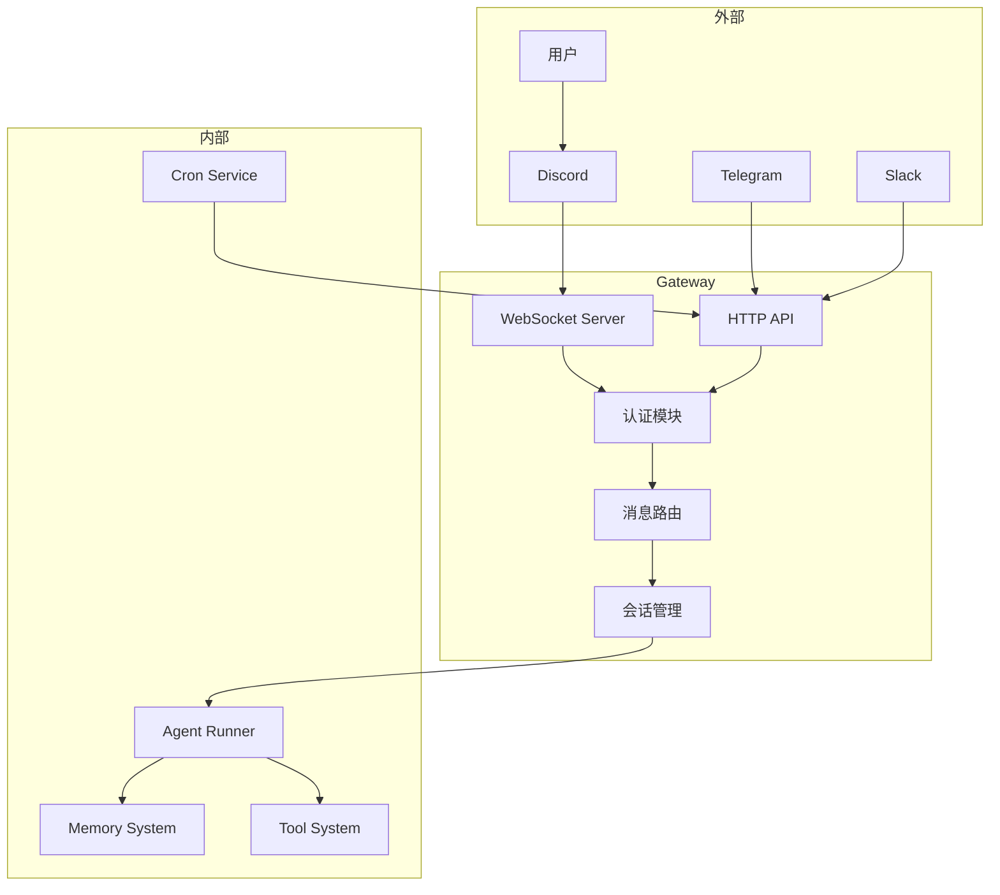
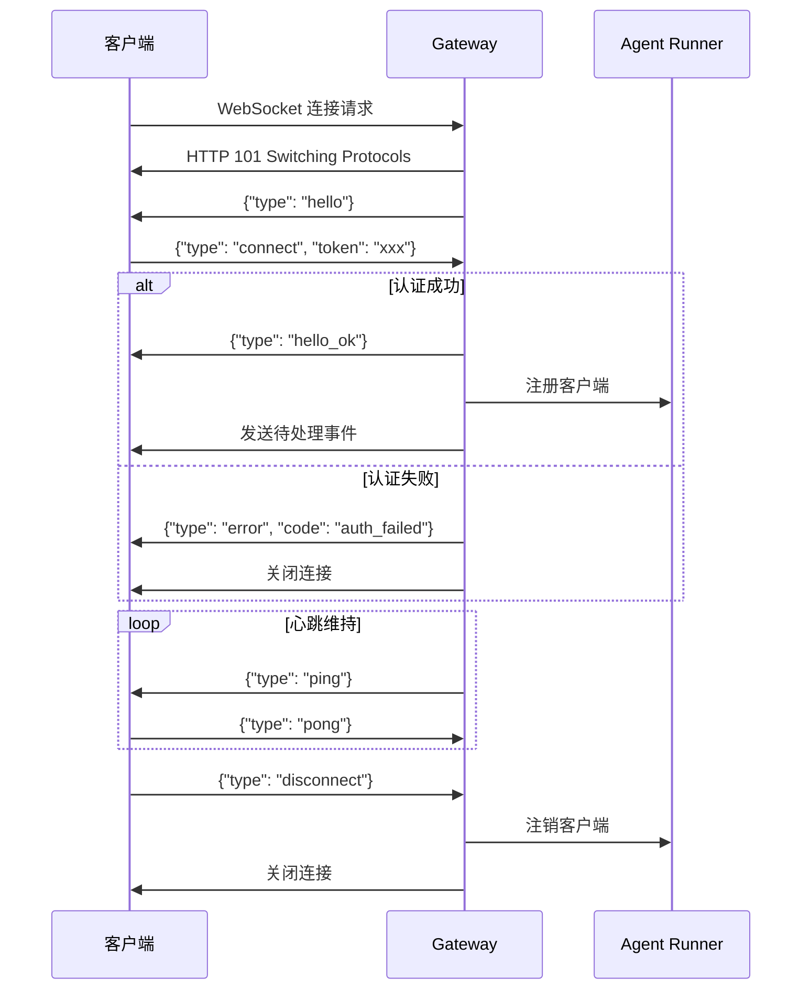

# 第 5 章：网关架构

> 本章将深入解析 OpenClaw Gateway 的设计与实现，它是整个系统的核心枢纽。

---

## 5.1 Gateway 概述

### 5.1.1 Gateway 的核心作用

Gateway 是 OpenClaw 的**中央枢纽**，负责连接所有组件：



**核心职责**：

| 职责 | 说明 |
|------|------|
| **协议转换** | WebSocket ↔ 内部事件 |
| **认证授权** | Token、密码、IP 白名单 |
| **消息路由** | 将消息分发到正确的处理器 |
| **会话管理** | WebSocket 连接生命周期 |
| **API 提供** | HTTP API 供外部调用 |

### 5.1.2 Gateway 与 Agent 的关系

```
┌─────────────────────────────────────────────────────────────┐
│                      Gateway                                │
│  ┌─────────────┐    ┌─────────────┐    ┌─────────────┐     │
│  │  WebSocket  │    │   HTTP API  │    │   Hooks     │     │
│  │   Server    │◄──►│   Server    │◄──►│  Handler    │     │
│  └──────┬──────┘    └──────┬──────┘    └──────┬──────┘     │
│         └───────────────────┼───────────────────┘           │
│                             ▼                               │
│                    ┌─────────────────┐                      │
│                    │  Message Router │                      │
│                    └────────┬────────┘                      │
└─────────────────────────────┼───────────────────────────────┘
                              │
                              │ HTTP/WebSocket
                              ▼
┌─────────────────────────────────────────────────────────────┐
│                      Agent Runner                           │
│  ┌─────────────┐    ┌─────────────┐    ┌─────────────┐     │
│  │   Prompt    │    │    LLM      │    │   Tools     │     │
│  │   Builder   │───►│   Client    │◄──►│   Runner    │     │
│  └─────────────┘    └─────────────┘    └─────────────┘     │
└─────────────────────────────────────────────────────────────┘
```

**关系说明**：
- Gateway 是**基础设施层**，负责通信和路由
- Agent 是**业务逻辑层**，负责 AI 处理
- 一个 Gateway 可以服务多个 Agent
- Agent 通过 Gateway 与外部世界通信

### 5.1.3 网关模式选择

OpenClaw 支持两种网关模式：

| 模式 | 适用场景 | 特点 |
|------|----------|------|
| **Local** | 单用户、开发测试 | 简单、无需认证、本地运行 |
| **Remote** | 多用户、生产部署 | 完整认证、可远程访问 |

**模式对比**：

```
┌─────────────────────────────────────────────────────────────┐
│  Local 模式                                                  │
├─────────────────────────────────────────────────────────────┤
│  • 绑定 localhost:18789                                     │
│  • 可选简单密码保护                                          │
│  • 适合个人使用                                              │
│  • 配置简单                                                  │
└─────────────────────────────────────────────────────────────┘

┌─────────────────────────────────────────────────────────────┐
│  Remote 模式                                                 │
├─────────────────────────────────────────────────────────────┤
│  • 可绑定任意地址                                            │
│  • 完整认证机制（Token + 密码）                               │
│  • 支持 Tailscale 集成                                       │
│  • 适合团队协作                                              │
│  • 配置较复杂                                                │
└─────────────────────────────────────────────────────────────┘
```

**配置示例**：

```json
{
  "gateway": {
    "mode": "local",           // 或 "remote"
    "host": "127.0.0.1",       // local 模式
    "port": 18789,
    
    // remote 模式额外配置
    "auth": {
      "tokens": ["${GATEWAY_TOKEN}"],
      "password": "${GATEWAY_PASSWORD}"
    },
    "allowTailscale": true
  }
}
```

---

## 5.2 WebSocket 协议

### 5.2.1 连接建立流程

WebSocket 连接的生命周期：



### 5.2.2 Hello 握手

**Hello 消息**（服务端发送）：

```json
{
  "type": "hello",
  "protocol_version": "1.0",
  "capabilities": ["chat", "tools", "memory"],
  "session_timeout_ms": 300000
}
```

**Connect 消息**（客户端发送）：

```json
{
  "type": "connect",
  "token": "sk-gateway-token",
  "client_info": {
    "name": "openclaw-cli",
    "version": "1.0.0"
  },
  "desired_capabilities": ["chat", "tools"]
}
```

**HelloOk 消息**（认证成功）：

```json
{
  "type": "hello_ok",
  "session_id": "sess_abc123",
  "assigned_capabilities": ["chat", "tools"],
  "server_time": "2024-01-15T10:30:00Z"
}
```

### 5.2.3 消息帧格式

WebSocket 消息采用 JSON 格式，统一包装：

```typescript
// 基础帧结构
interface GatewayFrame {
  type: 'request' | 'response' | 'event' | 'ping' | 'pong';
  id?: string;           // 请求/响应配对用
  timestamp: number;     // 发送时间戳
  payload: unknown;      // 实际载荷
}

// 请求帧（客户端 → 服务端）
interface RequestFrame extends GatewayFrame {
  type: 'request';
  id: string;
  method: string;        // 方法名
  params: unknown;       // 参数
}

// 响应帧（服务端 → 客户端）
interface ResponseFrame extends GatewayFrame {
  type: 'response';
  id: string;
  result?: unknown;      // 成功结果
  error?: {              // 错误信息
    code: string;
    message: string;
  };
}

// 事件帧（服务端 → 客户端）
interface EventFrame extends GatewayFrame {
  type: 'event';
  event: string;         // 事件类型
  data: unknown;         // 事件数据
}
```

**示例对话**：

```json
// 客户端发送请求
{
  "type": "request",
  "id": "req_001",
  "timestamp": 1705312200000,
  "method": "chat.send",
  "params": {
    "message": "你好",
    "session_key": "discord:user:123"
  }
}

// 服务端响应
{
  "type": "response",
  "id": "req_001",
  "timestamp": 1705312201500,
  "result": {
    "message_id": "msg_abc",
    "status": "sent"
  }
}

// 服务端推送事件
{
  "type": "event",
  "timestamp": 1705312202000,
  "event": "message.received",
  "data": {
    "from": "user:123",
    "content": "你好！",
    "platform": "discord"
  }
}
```

### 5.2.4 心跳机制

保持连接活跃的机制：

```typescript
// /src/gateway/server/ws-connection/heartbeat.ts (简化)
class HeartbeatManager {
  private interval: NodeJS.Timeout;
  private lastPong: number;
  
  constructor(
    private ws: WebSocket,
    private options: {
      intervalMs: number;      // 默认 30000ms
      timeoutMs: number;       // 默认 60000ms
    }
  ) {}
  
  start() {
    this.interval = setInterval(() => {
      // 发送 ping
      this.ws.send(JSON.stringify({ type: 'ping' }));
      
      // 检查上次 pong 时间
      if (Date.now() - this.lastPong > this.options.timeoutMs) {
        this.handleTimeout();
      }
    }, this.options.intervalMs);
  }
  
  onPong() {
    this.lastPong = Date.now();
  }
  
  private handleTimeout() {
    console.log('Heartbeat timeout, closing connection');
    this.ws.close(1001, 'Heartbeat timeout');
  }
  
  stop() {
    clearInterval(this.interval);
  }
}
```

### 5.2.5 断线重连

客户端断线重连策略：

```typescript
// 重连管理器 (简化)
class ReconnectionManager {
  private attempts = 0;
  private maxAttempts = 5;
  private baseDelay = 1000;
  
  async connect() {
    try {
      await this.tryConnect();
      this.attempts = 0;  // 重置计数
    } catch (error) {
      this.attempts++;
      
      if (this.attempts > this.maxAttempts) {
        throw new Error('Max reconnection attempts reached');
      }
      
      // 指数退避
      const delay = this.baseDelay * Math.pow(2, this.attempts);
      console.log(`Reconnecting in ${delay}ms... (attempt ${this.attempts})`);
      
      await sleep(delay);
      await this.connect();  // 递归重试
    }
  }
  
  private async tryConnect() {
    const ws = new WebSocket('ws://localhost:18789');
    
    return new Promise((resolve, reject) => {
      ws.on('open', () => {
        // 发送认证
        ws.send(JSON.stringify({
          type: 'connect',
          token: this.token
        }));
      });
      
      ws.on('message', (data) => {
        const msg = JSON.parse(data.toString());
        if (msg.type === 'hello_ok') {
          resolve(ws);
        }
      });
      
      ws.on('error', reject);
      ws.on('close', () => reject(new Error('Connection closed')));
    });
  }
}
```

---

## 5.3 HTTP API

### 5.3.1 RESTful API 设计

Gateway 提供的 HTTP API：

| 方法 | 路径 | 说明 |
|------|------|------|
| GET | `/health` | 健康检查 |
| GET | `/status` | 服务状态 |
| POST | `/v1/chat` | 发送消息 |
| POST | `/v1/tools/invoke` | 调用工具 |
| GET | `/v1/sessions` | 列出会话 |
| POST | `/v1/sessions/:id/send` | 向会话发送消息 |
| GET | `/v1/agents` | 列出 Agent |
| POST | `/v1/agents/:id/run` | 运行 Agent |

**API 响应格式**：

```json
{
  "success": true,
  "data": { ... },
  "meta": {
    "request_id": "req_abc",
    "timestamp": "2024-01-15T10:30:00Z"
  }
}
```

### 5.3.2 OpenAI 兼容 API

OpenClaw 提供与 OpenAI 兼容的 API：

```typescript
// /src/gateway/openai-http.ts (简化)

// POST /v1/chat/completions
async function handleChatCompletion(req: Request, res: Response) {
  const body = await req.json();
  
  // 转换为内部格式
  const internalRequest = {
    model: body.model,
    messages: body.messages,
    tools: body.tools,
    temperature: body.temperature,
    stream: body.stream,
  };
  
  // 调用 Agent
  const result = await agentRunner.chat(internalRequest);
  
  // 转换为 OpenAI 格式
  const openaiResponse = {
    id: `chatcmpl-${generateId()}`,
    object: 'chat.completion',
    created: Math.floor(Date.now() / 1000),
    model: body.model,
    choices: [{
      index: 0,
      message: {
        role: 'assistant',
        content: result.content,
        tool_calls: result.toolCalls,
      },
      finish_reason: result.finishReason,
    }],
    usage: {
      prompt_tokens: result.usage.prompt,
      completion_tokens: result.usage.completion,
      total_tokens: result.usage.total,
    },
  };
  
  res.json(openaiResponse);
}
```

**使用示例**：

```bash
# 使用 OpenAI SDK 调用 OpenClaw
curl http://localhost:18789/v1/chat/completions \
  -H "Authorization: Bearer ${GATEWAY_TOKEN}" \
  -H "Content-Type: application/json" \
  -d '{
    "model": "kimi-coding/k2p5",
    "messages": [
      {"role": "user", "content": "你好"}
    ]
  }'
```

### 5.3.3 OpenResponses API

OpenClaw 实现了 OpenResponses 标准 API：

```typescript
// /src/gateway/openresponses-http.ts (简化)

// POST /v1/responses
async function handleResponses(req: Request, res: Response) {
  const body: CreateResponseBody = await req.json();
  
  // 解析输入
  const input = extractTextContent(body.input);
  
  // 提取工具定义
  const tools = extractClientTools(body);
  
  // 应用工具选择策略
  const { tools: activeTools, extraSystemPrompt } = applyToolChoice({
    tools,
    toolChoice: body.tool_choice,
  });
  
  // 调用 Agent
  const result = await agentRunner.run({
    message: input,
    tools: activeTools,
    extraSystemPrompt,
    model: body.model,
  });
  
  // 构建响应
  const response: ResponseResource = {
    id: `resp_${generateId()}`,
    object: 'response',
    created_at: Math.floor(Date.now() / 1000),
    status: 'completed',
    model: body.model,
    output: buildOutputItems(result),
    usage: calculateUsage(result),
  };
  
  res.json(response);
}
```

### 5.3.4 工具调用 API

直接调用工具的 API：

```bash
# 调用工具
POST /v1/tools/invoke
{
  "tool": "web_search",
  "params": {
    "query": "OpenClaw GitHub"
  }
}

# 响应
{
  "success": true,
  "result": {
    "results": [
      {"title": "openclaw/openclaw", "url": "https://github.com/openclaw/openclaw"}
    ]
  }
}
```

---

## 5.4 认证与授权

### 5.4.1 Token 认证

基于 Token 的认证机制：

```typescript
// /src/gateway/auth.ts (简化)
interface AuthConfig {
  tokens: string[];           // 允许的 Token 列表
  password?: string;          // 可选密码
  allowTailscale?: boolean;   // 允许 Tailscale 连接
}

async function authorizeGatewayConnect(params: {
  auth: AuthConfig;
  connectAuth: { token?: string; password?: string };
  req: IncomingMessage;
  trustedProxies: string[];
}): Promise<AuthResult> {
  const { token, password } = params.connectAuth;
  
  // 1. 检查 Token
  if (token) {
    if (params.auth.tokens.includes(token)) {
      return { ok: true, method: 'token' };
    }
  }
  
  // 2. 检查密码
  if (password && params.auth.password) {
    if (await comparePassword(password, params.auth.password)) {
      return { ok: true, method: 'password' };
    }
  }
  
  // 3. 检查 Tailscale
  if (params.auth.allowTailscale) {
    if (isTailscaleConnection(params.req)) {
      return { ok: true, method: 'tailscale' };
    }
  }
  
  return { ok: false, reason: 'invalid_credentials' };
}
```

**Token 生成**：

```bash
# 生成随机 Token
openssl rand -hex 32

# 或使用 OpenClaw CLI
openclaw config generate-token
```

### 5.4.2 密码认证

简单的密码保护（Local 模式）：

```json
{
  "gateway": {
    "mode": "local",
    "auth": {
      "password": "${GATEWAY_PASSWORD}"
    }
  }
}
```

**使用密码连接**：

```bash
# CLI 连接
openclaw agent --password "your-password"

# 或环境变量
export GATEWAY_PASSWORD="your-password"
openclaw agent --interactive
```

### 5.4.3 IP 白名单

限制允许连接的 IP 地址：

```json
{
  "gateway": {
    "allowedIps": [
      "127.0.0.1",
      "10.0.0.0/8",
      "192.168.1.0/24"
    ]
  }
}
```

### 5.4.4 Tailscale 集成

通过 Tailscale 实现安全远程访问：

```json
{
  "gateway": {
    "mode": "remote",
    "host": "0.0.0.0",
    "port": 18789,
    "allowTailscale": true
  }
}
```

**Tailscale 优势**：
- 无需公网 IP
- 自动加密
- 基于身份的访问控制
- 跨网络访问

---

## 5.5 会话管理

### 5.5.1 Session 概念

在 Gateway 中，Session 代表一个客户端连接：

```typescript
// /src/gateway/server/ws-types.ts (简化)
interface GatewayWsClient {
  id: string;                    // 会话 ID
  socket: WebSocket;             // WebSocket 连接
  
  // 认证信息
  authenticated: boolean;
  authMethod?: 'token' | 'password' | 'tailscale';
  
  // 连接信息
  clientIp?: string;
  userAgent?: string;
  connectedAt: Date;
  
  // 能力协商
  capabilities: string[];
  
  // 心跳
  lastPingAt?: Date;
  lastPongAt?: Date;
  
  // 元数据
  metadata: Record<string, unknown>;
}
```

### 5.5.2 Session Key 生成

唯一标识一个对话会话：

```typescript
// /src/routing/resolve-route.ts (简化)
function buildAgentSessionKey(params: {
  agentId: string;
  channel: string;
  peer: { kind: 'user' | 'channel'; id: string };
}): string {
  return `${agentId}:${channel}:${peer.kind}:${peer.id}`;
}

// 示例
const sessionKey = buildAgentSessionKey({
  agentId: 'default',
  channel: 'discord',
  peer: { kind: 'user', id: '1094076488640376883' }
});
// 结果: "default:discord:user:1094076488640376883"
```

### 5.5.3 会话隔离

确保不同会话之间的隔离：

```typescript
// 会话隔离机制
class SessionManager {
  private sessions = new Map<string, Session>();
  
  createSession(key: string, context: SessionContext): Session {
    // 每个会话独立的历史记录
    const history: Message[] = [];
    
    // 每个会话独立的记忆上下文
    const memory = new MemoryContext();
    
    const session: Session = {
      key,
      context,
      history,
      memory,
      createdAt: new Date(),
    };
    
    this.sessions.set(key, session);
    return session;
  }
  
  getSession(key: string): Session | undefined {
    return this.sessions.get(key);
  }
  
  // 会话间数据隔离
  async processMessage(sessionKey: string, message: string) {
    const session = this.getSession(sessionKey);
    if (!session) throw new Error('Session not found');
    
    // 只能访问本会话的历史
    const history = session.history;
    
    // 只能访问本会话相关的记忆
    const memories = await session.memory.search(message);
    
    // 处理消息...
  }
}
```

### 5.5.4 跨会话通信

在保持隔离的同时，支持有限的跨会话通信：

```typescript
// 会话间消息传递
interface CrossSessionMessage {
  from: string;           // 源会话
  to: string;             // 目标会话
  type: 'notification' | 'command' | 'data';
  payload: unknown;
}

// 实现
class CrossSessionBus {
  private listeners = new Map<string, Set<MessageHandler>>();
  
  subscribe(sessionKey: string, handler: MessageHandler) {
    if (!this.listeners.has(sessionKey)) {
      this.listeners.set(sessionKey, new Set());
    }
    this.listeners.get(sessionKey)!.add(handler);
  }
  
  publish(message: CrossSessionMessage) {
    const handlers = this.listeners.get(message.to);
    if (handlers) {
      for (const handler of handlers) {
        handler(message);
      }
    }
  }
}
```

---

## 本章小结

通过本章的学习，你应该深入理解了：

1. **Gateway 的核心作用** - 协议转换、认证授权、消息路由、会话管理
2. **WebSocket 协议** - 连接建立、消息帧格式、心跳机制、断线重连
3. **HTTP API** - RESTful API、OpenAI 兼容 API、OpenResponses API
4. **认证与授权** - Token、密码、IP 白名单、Tailscale 集成
5. **会话管理** - Session 概念、Session Key、会话隔离、跨会话通信

**核心要点**：
- Gateway 是系统的中央枢纽
- WebSocket 提供实时双向通信
- 多种认证方式满足不同场景
- 会话隔离确保数据安全

**下一步**：进入第 6 章，深入了解通道抽象层。

---

## 练习与思考

1. **协议分析**：使用 Wireshark 或浏览器开发者工具，分析 WebSocket 通信过程。

2. **API 测试**：使用 curl 或 Postman，测试 Gateway 的各种 API。

3. **认证实验**：配置不同的认证方式（Token、密码、Tailscale），测试连接。

4. **会话追踪**：查看会话存储，理解 Session Key 的生成和使用。

5. **性能测试**：使用工具（如 autocannon）测试 Gateway 的性能。

---

*下一章：第 6 章 通道抽象层*
