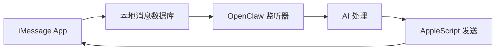

# 第 11 章：iMessage 集成深度解析

> 本章将深入解析 OpenClaw 与 iMessage 的集成，这是 macOS 平台特有的消息集成方式。

---

## 11.1 iMessage 集成概述

### 11.1.1 iMessage 集成的特点

iMessage 集成与其他平台有显著不同：

| 特性 | iMessage | Discord/Telegram |
|------|----------|------------------|
| **API** | 无官方 API | 完善的 Bot API |
| **集成方式** | 本地监听 | 远程 WebSocket/Webhook |
| **平台限制** | 仅 macOS | 跨平台 |
| **消息获取** | 读取本地数据库 | 服务器推送 |
| **发送消息** | 模拟用户操作 | API 调用 |
| **隐私** | 需要完全磁盘访问权限 | 标准权限 |

**工作原理**：



### 11.1.2 系统要求

**必需条件**：

1. **macOS 系统**
   - macOS 12.0+ (Monterey)
   - 已登录 Apple ID
   - iMessage 已启用

2. **权限配置**
   - 完全磁盘访问权限（Full Disk Access）
   - 辅助功能权限（Accessibility）
   - 自动化权限

3. **硬件要求**
   - 任何支持 macOS 12+ 的 Mac
   - 建议 8GB+ 内存

### 11.1.3 权限配置

**开启完全磁盘访问权限**：

```
系统设置 → 隐私与安全 → 完全磁盘访问权限
├── 点击 + 按钮
├── 前往 /Applications
├── 选择终端（Terminal）或 OpenClaw
└── 勾选启用
```

**开启辅助功能权限**：

```
系统设置 → 隐私与安全 → 辅助功能
├── 点击 + 按钮
├── 选择终端或 OpenClaw
└── 勾选启用
```

**权限说明**：

| 权限 | 用途 | 必需 |
|------|------|------|
| 完全磁盘访问 | 读取 iMessage 数据库 | ✅ 是 |
| 辅助功能 | 控制 Messages 应用发送消息 | ✅ 是 |
| 自动化 | 执行 AppleScript | ✅ 是 |

---

## 11.2 消息监听实现

### 11.2.1 数据库监听

iMessage 消息存储在本地 SQLite 数据库中：

```typescript
// /src/imessage/monitor/database-watcher.ts

import { Database } from 'better-sqlite3';
import { watch } from 'chokidar';
import { homedir } from 'os';
import { join } from 'path';

const IMESSAGE_DB_PATH = join(
  homedir(),
  'Library/Messages/chat.db'
);

class iMessageDatabaseWatcher {
  private db: Database;
  private lastRowId: number = 0;
  private checkInterval: NodeJS.Timeout | null = null;
  
  constructor() {
    // 打开 iMessage 数据库（只读模式）
    this.db = new Database(IMESSAGE_DB_PATH, { readonly: true });
    
    // 获取最后一条消息的 ID
    this.lastRowId = this.getLastRowId();
  }
  
  start(callback: (message: iMessage) => void) {
    // 方式1：轮询检查新消息
    this.checkInterval = setInterval(() => {
      this.checkNewMessages(callback);
    }, 1000); // 每秒检查一次
    
    // 方式2：文件系统监听（辅助）
    this.watchDatabaseFile();
  }
  
  private getLastRowId(): number {
    const result = this.db.prepare(
      'SELECT MAX(ROWID) as max_id FROM message'
    ).get();
    return result?.max_id || 0;
  }
  
  private checkNewMessages(callback: (message: iMessage) => void) {
    const messages = this.db.prepare(
      `SELECT 
        m.ROWID,
        m.text,
        m.date,
        m.date_delivered,
        m.date_read,
        m.is_from_me,
        m.service,
        h.id as handle_id,
        h.service as handle_service,
        c.display_name as chat_name,
        c.room_name as group_name
      FROM message m
      LEFT JOIN handle h ON m.handle_id = h.ROWID
      LEFT JOIN chat_message_join cmj ON m.ROWID = cmj.message_id
      LEFT JOIN chat c ON cmj.chat_id = c.ROWID
      WHERE m.ROWID > ?
        AND m.service = 'iMessage'
      ORDER BY m.ROWID ASC`
    ).all(this.lastRowId);
    
    for (const row of messages) {
      this.lastRowId = Math.max(this.lastRowId, row.ROWID);
      
      const message = this.parseMessage(row);
      callback(message);
    }
  }
  
  private watchDatabaseFile() {
    // 监听数据库文件变化
    watch(IMESSAGE_DB_PATH, { persistent: true })
      .on('change', () => {
        // 文件变化时立即检查
        this.checkNewMessages(() => {});
      });
  }
  
  private parseMessage(row: any): iMessage {
    // 转换 Apple 的日期格式（从 2001-01-01 开始的纳秒数）
    const appleEpoch = new Date('2001-01-01').getTime();
    const timestamp = Math.floor(row.date / 1_000_000) + appleEpoch;
    
    return {
      id: row.ROWID.toString(),
      text: row.text || '',
      timestamp: new Date(timestamp),
      isFromMe: row.is_from_me === 1,
      sender: {
        id: row.handle_id || 'me',
        service: row.handle_service || 'iMessage',
      },
      chat: {
        name: row.chat_name || row.group_name || 'Unknown',
        isGroup: !!row.group_name,
      },
    };
  }
  
  stop() {
    if (this.checkInterval) {
      clearInterval(this.checkInterval);
    }
    this.db.close();
  }
}
```

### 11.2.2 数据库结构

iMessage 数据库主要表结构：

```sql
-- 消息表
CREATE TABLE message (
    ROWID INTEGER PRIMARY KEY AUTOINCREMENT,
    text TEXT,
    date INTEGER,              -- Apple 日期格式
    date_delivered INTEGER,
    date_read INTEGER,
    is_from_me INTEGER,        -- 0=接收, 1=发送
    handle_id INTEGER,         -- 发送者ID
    service TEXT,              -- 'iMessage' 或 'SMS'
    -- ... 其他字段
);

-- 联系人表
CREATE TABLE handle (
    ROWID INTEGER PRIMARY KEY AUTOINCREMENT,
    id TEXT,                   -- 手机号或邮箱
    service TEXT,              -- 'iMessage' 或 'SMS'
    country TEXT,
    -- ...
);

-- 聊天表
CREATE TABLE chat (
    ROWID INTEGER PRIMARY KEY AUTOINCREMENT,
    chat_identifier TEXT,
    display_name TEXT,         -- 聊天名称
    room_name TEXT,            -- 群组名称
    group_id TEXT,
    -- ...
);

-- 消息-聊天关联表
CREATE TABLE chat_message_join (
    chat_id INTEGER,
    message_id INTEGER,
    PRIMARY KEY (chat_id, message_id)
);

-- 附件表
CREATE TABLE attachment (
    ROWID INTEGER PRIMARY KEY AUTOINCREMENT,
    filename TEXT,
    mime_type TEXT,
    transfer_name TEXT,
    -- ...
);

-- 消息-附件关联表
CREATE TABLE message_attachment_join (
    message_id INTEGER,
    attachment_id INTEGER
);
```

### 11.2.3 附件处理

处理 iMessage 中的图片、视频等附件：

```typescript
// /src/imessage/monitor/attachments.ts

import { join } from 'path';
import { homedir } from 'os';
import { copyFile, mkdir } from 'fs/promises';

const ATTACHMENT_BASE_PATH = join(
  homedir(),
  'Library/Messages/Attachments'
);

async function getMessageAttachments(
  messageId: number,
  db: Database
): Promise<Attachment[]> {
  const attachments = db.prepare(
    `SELECT 
      a.ROWID,
      a.filename,
      a.mime_type,
      a.transfer_name
    FROM attachment a
    JOIN message_attachment_join maj ON a.ROWID = maj.attachment_id
    WHERE maj.message_id = ?`
  ).all(messageId);
  
  return attachments.map(row => ({
    id: row.ROWID,
    filename: row.filename,
    mimeType: row.mime_type,
    name: row.transfer_name,
    // 实际文件路径需要解析 filename 字段
    path: resolveAttachmentPath(row.filename),
  }));
}

function resolveAttachmentPath(filename: string): string {
  // filename 格式: ~/Library/Messages/Attachments/xx/xx/xx/xx/filename.ext
  // 需要展开 ~ 为实际 home 目录
  return filename.replace(/^~/, homedir());
}

async function copyAttachmentToWorkspace(
  attachment: Attachment,
  workspacePath: string
): Promise<string> {
  const destDir = join(workspacePath, 'imessage_attachments');
  await mkdir(destDir, { recursive: true });
  
  const destPath = join(destDir, `${attachment.id}_${attachment.name}`);
  await copyFile(attachment.path, destPath);
  
  return destPath;
}
```

---

## 11.3 消息发送

### 11.3.1 AppleScript 发送

使用 AppleScript 控制 Messages 应用发送消息：

```typescript
// /src/imessage/sender/applescript.ts

import { exec } from 'child_process';
import { promisify } from 'util';

const execAsync = promisify(exec);

// 发送消息到指定联系人
async function sendMessage(
  recipient: string,  // 手机号或邮箱
  message: string
): Promise<void> {
  const script = `
    tell application "Messages"
      set targetService to 1st service whose service type = iMessage
      set targetBuddy to buddy "${recipient}" of targetService
      send "${escapeAppleScript(message)}" to targetBuddy
    end tell
  `;
  
  await execAsync(`osascript -e '${script}'`);
}

// 发送消息到群组
async function sendGroupMessage(
  chatId: string,
  message: string
): Promise<void> {
  const script = `
    tell application "Messages"
      set targetChat to chat id "${chatId}"
      send "${escapeAppleScript(message)}" to targetChat
    end tell
  `;
  
  await execAsync(`osascript -e '${script}'`);
}

// 转义 AppleScript 字符串
function escapeAppleScript(str: string): string {
  return str
    .replace(/\\/g, '\\\\')
    .replace(/"/g, '\\"')
    .replace(/'/g, "\\'")
    .replace(/\n/g, '\\n');
}

// 检查 Messages 应用是否运行
async function isMessagesRunning(): Promise<boolean> {
  try {
    const { stdout } = await execAsync(
      'pgrep -x Messages'
    );
    return !!stdout.trim();
  } catch {
    return false;
  }
}

// 启动 Messages 应用
async function launchMessages(): Promise<void> {
  await execAsync('open -a Messages');
  // 等待应用启动
  await sleep(2000);
}
```

### 11.3.2 发送优化

处理发送延迟和错误：

```typescript
// /src/imessage/sender/optimized-sender.ts

class OptimizediMessageSender {
  private sendQueue: Array<{
    recipient: string;
    message: string;
    resolve: () => void;
    reject: (error: Error) => void;
  }> = [];
  private isProcessing = false;
  private lastSendTime = 0;
  private readonly MIN_INTERVAL = 500; // 最小发送间隔 500ms
  
  async send(
    recipient: string,
    message: string
  ): Promise<void> {
    return new Promise((resolve, reject) => {
      this.sendQueue.push({
        recipient,
        message,
        resolve,
        reject,
      });
      
      this.processQueue();
    });
  }
  
  private async processQueue() {
    if (this.isProcessing || this.sendQueue.length === 0) {
      return;
    }
    
    this.isProcessing = true;
    
    while (this.sendQueue.length > 0) {
      const item = this.sendQueue.shift()!;
      
      try {
        // 确保最小发送间隔
        const waitTime = this.MIN_INTERVAL - (Date.now() - this.lastSendTime);
        if (waitTime > 0) {
          await sleep(waitTime);
        }
        
        // 确保 Messages 应用运行
        if (!await isMessagesRunning()) {
          await launchMessages();
        }
        
        // 发送消息
        await sendMessage(item.recipient, item.message);
        
        this.lastSendTime = Date.now();
        item.resolve();
        
      } catch (error) {
        item.reject(error as Error);
      }
    }
    
    this.isProcessing = false;
  }
}

// 分块发送长消息
async function sendLongMessage(
  recipient: string,
  message: string,
  maxLength: number = 2000
): Promise<void> {
  const chunks = splitMessage(message, maxLength);
  
  for (const chunk of chunks) {
    await sender.send(recipient, chunk);
    await sleep(300); // 块间延迟
  }
}

function splitMessage(message: string, maxLength: number): string[] {
  const chunks: string[] = [];
  
  while (message.length > maxLength) {
    // 在句子边界分割
    let splitIndex = message.lastIndexOf('.', maxLength);
    if (splitIndex === -1) {
      splitIndex = message.lastIndexOf(' ', maxLength);
    }
    if (splitIndex === -1) {
      splitIndex = maxLength;
    }
    
    chunks.push(message.slice(0, splitIndex + 1).trim());
    message = message.slice(splitIndex + 1).trim();
  }
  
  if (message.length > 0) {
    chunks.push(message);
  }
  
  return chunks;
}
```

### 11.3.3 发送状态确认

由于 iMessage 没有发送回执 API，需要通过其他方式确认：

```typescript
// /src/imessage/sender/delivery-confirmation.ts

class DeliveryConfirmation {
  private pendingMessages = new Map<
    string,
    {
      recipient: string;
      text: string;
      sentAt: number;
      resolve: (delivered: boolean) => void;
    }
  >();
  
  constructor(private db: Database) {
    // 监听数据库变化检查发送状态
    this.startMonitoring();
  }
  
  async waitForDelivery(
    messageId: string,
    recipient: string,
    text: string,
    timeout: number = 30000
  ): Promise<boolean> {
    return new Promise((resolve) => {
      this.pendingMessages.set(messageId, {
        recipient,
        text,
        sentAt: Date.now(),
        resolve,
      });
      
      // 超时处理
      setTimeout(() => {
        if (this.pendingMessages.has(messageId)) {
          this.pendingMessages.delete(messageId);
          resolve(false);
        }
      }, timeout);
    });
  }
  
  private startMonitoring() {
    setInterval(() => {
      this.checkDeliveryStatus();
    }, 1000);
  }
  
  private checkDeliveryStatus() {
    for (const [id, pending] of this.pendingMessages) {
      // 查询数据库检查是否已送达
      const result = this.db.prepare(
        `SELECT date_delivered 
         FROM message 
         WHERE text = ? 
           AND handle_id = (
             SELECT ROWID FROM handle WHERE id = ?
           )
           AND date > ?
         ORDER BY date DESC
         LIMIT 1`
      ).get(
        pending.text,
        pending.recipient,
        pending.sentAt * 1000000 // 转换为 Apple 时间格式
      );
      
      if (result?.date_delivered) {
        pending.resolve(true);
        this.pendingMessages.delete(id);
      }
    }
  }
}
```

---

## 11.4 高级功能

### 11.4.1 消息反应（Tapback）

处理 iMessage 的消息反应：

```typescript
// iMessage 反应类型
enum TapbackType {
  LOVE = 0,      // ❤️
  LIKE = 1,      // 👍
  DISLIKE = 2,   // 👎
  LAUGH = 3,     // 😂
  EMPHASIZE = 4, // !!
  QUESTION = 5,  // ?
}

// 监听反应变化
async function watchTapbacks(
  db: Database,
  callback: (tapback: Tapback) => void
) {
  // 反应存储在 message 表的 associated_message_xxx 字段中
  const checkTapbacks = () => {
    const tapbacks = db.prepare(
      `SELECT 
        m.ROWID,
        m.associated_message_guid,
        m.associated_message_type,
        m.date
      FROM message m
      WHERE m.associated_message_type BETWEEN 2000 AND 2005
        AND m.date > ?`
    ).all(lastCheckTime);
    
    for (const row of tapbacks) {
      callback({
        messageGuid: row.associated_message_guid,
        type: row.associated_message_type - 2000,
        timestamp: convertAppleDate(row.date),
      });
    }
  };
  
  setInterval(checkTapbacks, 1000);
}
```

### 11.4.2 群组管理

```typescript
// 获取群组信息
function getGroupInfo(
  chatId: string,
  db: Database
): GroupInfo {
  const chat = db.prepare(
    `SELECT 
      c.display_name,
      c.room_name,
      c.group_id,
      GROUP_CONCAT(h.id) as members
    FROM chat c
    LEFT JOIN chat_handle_join chj ON c.ROWID = chj.chat_id
    LEFT JOIN handle h ON chj.handle_id = h.ROWID
    WHERE c.ROWID = ?
    GROUP BY c.ROWID`
  ).get(chatId);
  
  return {
    name: chat.display_name || chat.room_name,
    isGroup: !!chat.group_id,
    members: chat.members?.split(',') || [],
  };
}

// 获取群组消息
function getGroupMessages(
  chatId: string,
  limit: number = 100,
  db: Database
): iMessage[] {
  return db.prepare(
    `SELECT 
      m.*,
      h.id as sender_id
    FROM message m
    JOIN chat_message_join cmj ON m.ROWID = cmj.message_id
    LEFT JOIN handle h ON m.handle_id = h.ROWID
    WHERE cmj.chat_id = ?
      AND m.service = 'iMessage'
    ORDER BY m.date DESC
    LIMIT ?`
  ).all(chatId, limit);
}
```

### 11.4.3 历史消息导入

```typescript
// 导入历史消息到记忆系统
async function importHistoryToMemory(
  contact: string,
  days: number = 30,
  db: Database
): Promise<void> {
  const cutoffDate = Date.now() - days * 24 * 60 * 60 * 1000;
  const appleCutoff = (cutoffDate - new Date('2001-01-01').getTime()) * 1000000;
  
  const messages = db.prepare(
    `SELECT 
      m.text,
      m.date,
      m.is_from_me,
      h.id as sender
    FROM message m
    LEFT JOIN handle h ON m.handle_id = h.ROWID
    WHERE (h.id = ? OR m.is_from_me = 1)
      AND m.service = 'iMessage'
      AND m.date > ?
      AND m.text IS NOT NULL
    ORDER BY m.date ASC`
  ).all(contact, appleCutoff);
  
  // 格式化为对话
  const conversation = messages.map(m => ({
    role: m.is_from_me ? 'assistant' : 'user',
    content: m.text,
    timestamp: convertAppleDate(m.date),
  }));
  
  // 保存到记忆文件
  await saveToMemoryFile(contact, conversation);
}
```

---

## 11.5 最佳实践

### 11.5.1 错误处理

```typescript
// iMessage 特定的错误处理
class iMessageErrorHandler {
  async handleSendError(error: Error, retryCount: number = 0): Promise<boolean> {
    const errorMessage = error.message;
    
    // Messages 应用未运行
    if (errorMessage.includes('Messages is not running')) {
      await launchMessages();
      return retryCount < 3;
    }
    
    // 联系人不存在
    if (errorMessage.includes('buddy not found')) {
      console.error('Recipient not found in Messages');
      return false;
    }
    
    // 发送失败，可能是网络问题
    if (errorMessage.includes('send failed')) {
      await sleep(5000);
      return retryCount < 3;
    }
    
    // 权限问题
    if (errorMessage.includes('not allowed')) {
      console.error('Permission denied. Check Accessibility permissions.');
      return false;
    }
    
    return false;
  }
}
```

### 11.5.2 性能优化

```typescript
// 数据库连接池
class DatabasePool {
  private connections: Database[] = [];
  private maxConnections = 3;
  
  async getConnection(): Promise<Database> {
    // 返回可用连接或创建新连接
    const conn = this.connections.find(c => !c.isBusy);
    if (conn) return conn;
    
    if (this.connections.length < this.maxConnections) {
      const newConn = new Database(IMESSAGE_DB_PATH, { readonly: true });
      this.connections.push(newConn);
      return newConn;
    }
    
    // 等待可用连接
    await sleep(10);
    return this.getConnection();
  }
}

// 消息缓存
class MessageCache {
  private cache = new Map<string, iMessage>();
  private maxSize = 1000;
  
  get(messageId: string): iMessage | undefined {
    return this.cache.get(messageId);
  }
  
  set(messageId: string, message: iMessage) {
    if (this.cache.size >= this.maxSize) {
      // LRU 淘汰
      const firstKey = this.cache.keys().next().value;
      this.cache.delete(firstKey);
    }
    this.cache.set(messageId, message);
  }
}
```

### 11.5.3 隐私与安全

```typescript
// 隐私保护措施
class PrivacyGuard {
  // 敏感信息过滤
  filterSensitiveInfo(text: string): string {
    return text
      // 过滤手机号
      .replace(/\b1[3-9]\d{9}\b/g, '[PHONE]')
      // 过滤邮箱
      .replace(/\b[A-Za-z0-9._%+-]+@[A-Za-z0-9.-]+\.[A-Z|a-z]{2,}\b/g, '[EMAIL]')
      // 过滤身份证号
      .replace(/\b\d{17}[\dXx]\b/g, '[ID]')
      // 过滤银行卡号
      .replace(/\b\d{16,19}\b/g, '[CARD]');
  }
  
  // 检查是否应该记录消息
  shouldLogMessage(message: iMessage): boolean {
    // 不记录敏感聊天
    const sensitiveKeywords = ['密码', '验证码', 'secret'];
    return !sensitiveKeywords.some(kw => 
      message.text.includes(kw)
    );
  }
}
```

---

## 本章小结

通过本章的学习，你应该掌握了：

1. **iMessage 集成特点** - 与其他平台的差异、系统要求
2. **消息监听** - 数据库监听、附件处理
3. **消息发送** - AppleScript、发送优化、状态确认
4. **高级功能** - 消息反应、群组管理、历史导入
5. **最佳实践** - 错误处理、性能优化、隐私保护

**iMessage 集成的限制**：
- 仅支持 macOS
- 需要较多系统权限
- 发送速度受限于 AppleScript
- 无官方 API，依赖数据库结构

**适用场景**：
- 个人 Mac 用户
- 需要集成 iMessage 的企业
- 家庭/小团队使用

---

*平台集成篇至此完成*
