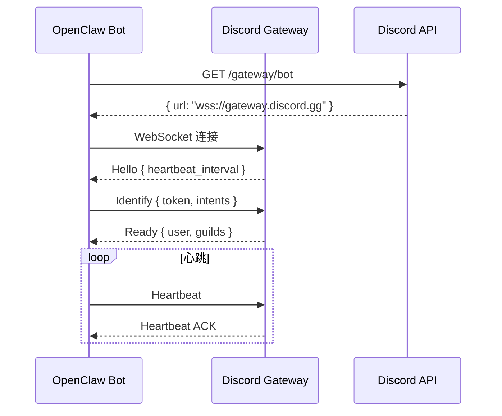

# 第 7 章：Discord 集成深度解析

> 本章将深入解析 OpenClaw 与 Discord 的集成，包括 Bot 创建、消息处理、斜杠命令、交互组件等。

---

## 7.1 Discord Bot 基础

### 7.1.1 Bot 创建流程

**步骤 1：访问 Discord 开发者门户**

1. 访问 https://discord.com/developers/applications
2. 点击 "New Application" 按钮
3. 输入应用名称，点击创建

**步骤 2：配置 Bot**

在 Bot 页面：
- 设置 Username
- 上传 Avatar
- 获取 Token（点击 Reset Token）

**步骤 3：设置 Privileged Intents**

启用以下 Intents：
- PRESENCE INTENT
- SERVER MEMBERS INTENT
- MESSAGE CONTENT INTENT

**步骤 4：获取 Token**

复制生成的 Token，保存到环境变量：

```bash
export DISCORD_BOT_TOKEN="your-token-here"
```

### 7.1.2 Token 配置

```json
{
  "channels": {
    "discord": {
      "enabled": true,
      "accounts": {
        "default": {
          "token": "${DISCORD_BOT_TOKEN}"
        }
      }
    }
  }
}
```

### 7.1.3 权限配置

**OAuth2 URL 生成器**：

```
Scopes:
☑ bot
☑ applications.commands

Bot Permissions:
☑ Send Messages
☑ Read Message History
☑ Use Slash Commands
```

### 7.1.4 Intent 设置

```typescript
const DEFAULT_INTENTS = {
  guilds: true,
  guildMessages: true,
  guildMessageReactions: true,
  directMessages: true,
  directMessageReactions: true,
  messageContent: true,
};
```

---

## 7.2 消息监听

### 7.2.1 Gateway 连接

Discord Gateway 连接流程：



### 7.2.2 消息事件处理

```typescript
class DiscordMessageHandler {
  async handleMessage(message: DiscordMessage, client: Client) {
    // 1. 忽略自己的消息
    if (message.author.id === client.user.id) return;
    
    // 2. 检查白名单
    if (!this.isAllowed(message)) return;
    
    // 3. 检查提及
    const wasMentioned = this.checkMention(message, client.user.id);
    
    // 4. 构建上下文
    const context = await this.buildContext(message, client);
    
    // 5. 发送到 OpenClaw
    await this.dispatchToOpenClaw(context);
  }
}
```

### 7.2.3 线程消息处理

```typescript
async function resolveThreadContext(message: DiscordMessage, client: Client) {
  const channel = await client.channels.fetch(message.channel_id);
  
  if (!channel.isThread()) return null;
  
  return {
    threadId: channel.id,
    threadName: channel.name,
    parentId: channel.parentId,
  };
}
```

### 7.2.4 私信处理

```typescript
function isDMAllowed(message: DiscordMessage, config: DMConfig): boolean {
  switch (config.policy) {
    case 'open': return true;
    case 'pairing': return pairingStore.isPaired(message.author.id);
    case 'allowlist': return config.allowFrom?.includes(message.author.id);
    default: return false;
  }
}
```

---

## 7.3 斜杠命令

### 7.3.1 命令注册

```typescript
const commands: SlashCommand[] = [
  {
    name: 'ask',
    description: '向 AI 助手提问',
    options: [
      {
        name: 'question',
        description: '你的问题',
        type: 3, // STRING
        required: true,
      },
    ],
  },
];

async function registerCommands(client: Client, commands: SlashCommand[]) {
  await client.rest.put(
    `/applications/${client.application.id}/commands`,
    { body: commands }
  );
}
```

### 7.3.2 命令参数处理

```typescript
async function handleAskCommand(interaction: Interaction, client: Client) {
  const question = interaction.data.options?.find(
    o => o.name === 'question'
  )?.value;
  
  // 发送"正在思考"
  await client.rest.post(
    `/interactions/${interaction.id}/${interaction.token}/callback`,
    { body: { type: 5 } } // DEFERRED
  );
  
  // 调用 AI
  const response = await openclawAgent.ask({ message: question });
  
  // 更新回复
  await client.rest.patch(
    `/webhooks/${client.application.id}/${interaction.token}/messages/@original`,
    { body: { content: response.content } }
  );
}
```

### 7.3.3 子命令

```typescript
{
  name: 'config',
  description: '配置设置',
  options: [
    {
      name: 'set',
      description: '设置配置项',
      type: 1, // SUB_COMMAND
      options: [
        { name: 'key', type: 3, required: true },
        { name: 'value', type: 3, required: true },
      ],
    },
    {
      name: 'get',
      description: '获取配置项',
      type: 1, // SUB_COMMAND
      options: [{ name: 'key', type: 3, required: true }],
    },
  ],
}
```

### 7.3.4 命令权限

```typescript
const adminCommand: SlashCommand = {
  name: 'admin',
  description: '管理员命令',
  default_member_permissions: '8', // ADMINISTRATOR
};
```

---

## 7.4 交互组件

### 7.4.1 按钮

```typescript
function createConfirmButtons() {
  return new ActionRowBuilder<ButtonBuilder>()
    .addComponents(
      new ButtonBuilder()
        .setCustomId('confirm_yes')
        .setLabel('确认')
        .setStyle(ButtonStyle.Success),
      new ButtonBuilder()
        .setCustomId('confirm_no')
        .setLabel('取消')
        .setStyle(ButtonStyle.Danger)
    );
}
```

### 7.4.2 选择菜单

```typescript
function createModelSelectMenu() {
  return new StringSelectMenuBuilder()
    .setCustomId('select_model')
    .setPlaceholder('选择 AI 模型')
    .addOptions(
      new StringSelectMenuOptionBuilder()
        .setLabel('Kimi K2.5')
        .setValue('kimi-coding/k2p5'),
      new StringSelectMenuOptionBuilder()
        .setLabel('GPT-4')
        .setValue('gpt-4')
    );
}
```

### 7.4.3 模态框

```typescript
function createFeedbackModal() {
  return new ModalBuilder()
    .setCustomId('feedback_modal')
    .setTitle('提交反馈')
    .addComponents(
      new ActionRowBuilder<TextInputBuilder>()
        .addComponents(
          new TextInputBuilder()
            .setCustomId('feedback_title')
            .setLabel('标题')
            .setStyle(TextInputStyle.Short)
        )
    );
}
```

---

## 7.5 高级功能

### 7.5.1 嵌入式消息

```typescript
function createStatusEmbed(status: SystemStatus) {
  return new EmbedBuilder()
    .setTitle('🦀 OpenClaw 状态')
    .setColor(0x00FF00)
    .addFields(
      { name: 'Gateway', value: '在线', inline: true },
      { name: 'AI 模型', value: status.model, inline: true }
    );
}
```

### 7.5.2 反应表情

```typescript
async function addReaction(channelId: string, messageId: string, emoji: string) {
  await client.rest.put(
    `/channels/${channelId}/messages/${messageId}/reactions/${emoji}/@me`
  );
}
```

### 7.5.3 线程管理

```typescript
// 创建线程
async function createThread(channelId: string, name: string) {
  return await client.rest.post(`/channels/${channelId}/threads`, {
    body: { name, type: 11 }, // PUBLIC_THREAD
  });
}
```

### 7.5.4 角色权限

```typescript
// 检查用户是否有特定角色
function hasRole(member: GuildMember, roleId: string): boolean {
  return member.roles.includes(roleId);
}
```

---

## 本章小结

通过本章的学习，你应该掌握了：

1. **Discord Bot 创建** - 应用设置、Token 获取、权限配置
2. **消息监听** - Gateway 连接、事件处理、线程和私信
3. **斜杠命令** - 命令注册、参数处理、子命令、权限
4. **交互组件** - 按钮、选择菜单、模态框、上下文菜单
5. **高级功能** - Embed、反应、线程管理、角色权限

---

*下一章：第 8 章 Telegram 集成深度解析*
