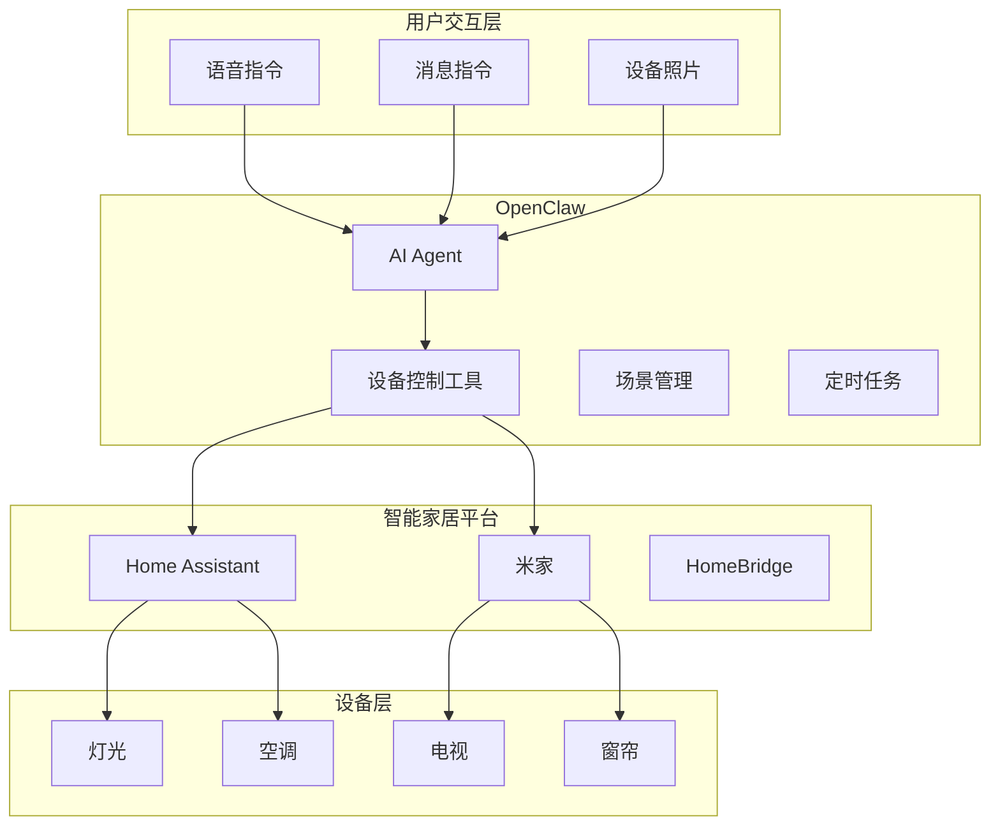
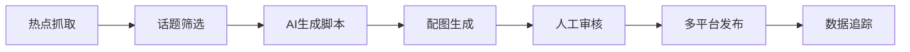

# 第 22 章：进阶级项目

> 本章将完成两个进阶级实践项目：智能家居控制中心和 AI 内容创作助手。

---

## 22.1 项目一：智能家居控制中心

### 22.1.1 项目概述

**目标**：打造统一的智能家居控制中心，通过自然语言控制家中设备。

**核心功能**：
- 语音/消息控制家电
- 场景联动（回家模式、睡眠模式、观影模式）
- 设备状态监控与自动化
- 图像识别辅助控制

**技术栈**：
- OpenClaw 核心 + 多平台接入
- Home Assistant API / 米家 API
- 语音转文字（Whisper）
- 定时任务（Cron）
- 视觉模型（图像理解）

### 22.1.2 系统架构



### 22.1.3 实现步骤

**步骤1：配置 Home Assistant 集成**

```yaml
# config/home-assistant.yaml
home_assistant:
  url: "http://homeassistant.local:8123"
  token: ${HA_TOKEN}
  
  devices:
    living_room_light:
      entity_id: light.living_room
      name: "客厅灯"
      type: light
      
    bedroom_ac:
      entity_id: climate.bedroom
      name: "卧室空调"
      type: climate
      
    curtain:
      entity_id: cover.living_room_curtain
      name: "客厅窗帘"
      type: cover
```

**步骤2：创建设备控制工具**

```typescript
// tools/home-assistant.ts

interface HADevice {
  entityId: string;
  name: string;
  type: 'light' | 'climate' | 'cover' | 'switch';
  state?: string;
}

export function createHomeAssistantTools(config: HAConfig): Tool[] {
  const api = new HomeAssistantAPI(config.url, config.token);
  
  return [
    // 控制设备
    {
      name: 'control_device',
      description: '控制智能家居设备',
      parameters: {
        type: 'object',
        properties: {
          device: {
            type: 'string',
            description: '设备名称，如"客厅灯"、"卧室空调"',
          },
          action: {
            type: 'string',
            enum: ['on', 'off', 'toggle', 'set'],
            description: '操作：开启/关闭/切换/设置',
          },
          value: {
            type: 'string',
            description: '设置值（如亮度、温度），可选',
          },
        },
        required: ['device', 'action'],
      },
      
      async execute(params) {
        // 查找设备
        const device = config.devices.find(
          d => d.name.includes(params.device) || 
               d.entity_id.includes(params.device)
        );
        
        if (!device) {
          return { error: `未找到设备：${params.device}` };
        }
        
        // 执行控制
        switch (device.type) {
          case 'light':
            await api.callService('light', params.action, {
              entity_id: device.entityId,
              brightness_pct: params.value,
            });
            break;
            
          case 'climate':
            if (params.action === 'set') {
              await api.callService('climate', 'set_temperature', {
                entity_id: device.entityId,
                temperature: parseFloat(params.value),
              });
            } else {
              await api.callService('climate', params.action, {
                entity_id: device.entityId,
              });
            }
            break;
            
          case 'cover':
            await api.callService('cover', 
              params.action === 'on' ? 'open' : 
              params.action === 'off' ? 'close' : params.action,
              { entity_id: device.entityId }
            );
            break;
        }
        
        return {
          success: true,
          device: device.name,
          action: params.action,
          state: await api.getState(device.entityId),
        };
      },
    },
    
    // 查询设备状态
    {
      name: 'get_device_status',
      description: '获取设备当前状态',
      parameters: {
        type: 'object',
        properties: {
          device: {
            type: 'string',
            description: '设备名称',
          },
        },
        required: ['device'],
      },
      
      async execute(params) {
        const states = await api.getStates();
        
        // 查找匹配的设备
        const matches = states.filter(s =>
          s.attributes.friendly_name?.includes(params.device) ||
          s.entity_id.includes(params.device)
        );
        
        return {
          devices: matches.map(m => ({
            name: m.attributes.friendly_name,
            state: m.state,
            entityId: m.entity_id,
          })),
        };
      },
    },
    
    // 执行场景
    {
      name: 'activate_scene',
      description: '激活预设场景',
      parameters: {
        type: 'object',
        properties: {
          scene: {
            type: 'string',
            enum: ['home', 'away', 'sleep', 'movie', 'morning'],
            description: '场景名称',
          },
        },
        required: ['scene'],
      },
      
      async execute(params) {
        const scenes: Record<string, () => Promise<void>> = {
          home: async () => {
            await api.callService('light', 'turn_on', {
              entity_id: 'light.living_room',
              brightness_pct: 80,
            });
            await api.callService('climate', 'set_temperature', {
              entity_id: 'climate.living_room',
              temperature: 24,
            });
          },
          
          away: async () => {
            await api.callService('light', 'turn_off', {
              entity_id: 'group.all_lights',
            });
            await api.callService('climate', 'turn_off', {
              entity_id: 'group.all_climate',
            });
          },
          
          sleep: async () => {
            await api.callService('light', 'turn_off', {
              entity_id: 'group.all_lights',
            });
            await api.callService('cover', 'close', {
              entity_id: 'cover.bedroom_curtain',
            });
            await api.callService('climate', 'set_temperature', {
              entity_id: 'climate.bedroom',
              temperature: 26,
            });
          },
          
          movie: async () => {
            await api.callService('light', 'turn_on', {
              entity_id: 'light.living_room',
              brightness_pct: 20,
              color_name: 'blue',
            });
            await api.callService('cover', 'close', {
              entity_id: 'cover.living_room_curtain',
            });
          },
          
          morning: async () => {
            await api.callService('cover', 'open', {
              entity_id: 'group.all_covers',
            });
            await api.callService('light', 'turn_on', {
              entity_id: 'light.bedroom',
              brightness_pct: 30,
              transition: 300,
            });
          },
        };
        
        const sceneFn = scenes[params.scene];
        if (!sceneFn) {
          return { error: `未知场景：${params.scene}` };
        }
        
        await sceneFn();
        
        return {
          success: true,
          scene: params.scene,
          message: `已激活${params.scene}场景`,
        };
      },
    },
  ];
}
```

**步骤3：图像识别辅助控制**

```typescript
// tools/image-device-recognition.ts

export function imageDeviceRecognitionTool(): Tool {
  return {
    name: 'recognize_device_from_image',
    description: '从照片中识别设备并给出控制建议',
    parameters: {
      type: 'object',
      properties: {
        image_path: {
          type: 'string',
          description: '照片文件路径',
        },
      },
      required: ['image_path'],
    },
    
    async execute(params) {
      // 读取图片
      const imageBuffer = await readFile(params.image_path);
      
      // 调用视觉模型分析
      const analysis = await vision.analyze({
        image: imageBuffer,
        prompt: `识别这张照片中的智能家居设备。
        1. 有什么设备？
        2. 设备当前状态（开/关/异常）
        3. 是否需要控制建议？`,
      });
      
      // 解析结果
      const devices = this.parseDevices(analysis.description);
      
      return {
        recognized: devices,
        suggestions: devices.map(d => ({
          device: d.name,
          currentState: d.state,
          suggestion: d.state === 'off' ? '是否打开？' : 
                     d.state === 'on' ? '是否关闭？' : 
                     '状态异常，建议检查',
        })),
      };
    },
    
    parseDevices(description: string): Array<{
      name: string;
      state: string;
    }> {
      // 解析视觉模型返回的描述
      const devices = [];
      
      if (description.includes('灯') || description.includes('light')) {
        const state = description.includes('亮') || description.includes('on') 
          ? 'on' : 'off';
        devices.push({ name: '灯', state });
      }
      
      if (description.includes('空调') || description.includes('AC')) {
        devices.push({ name: '空调', state: 'unknown' });
      }
      
      if (description.includes('窗帘') || description.includes('curtain')) {
        const state = description.includes('开') || description.includes('open')
          ? 'open' : 'closed';
        devices.push({ name: '窗帘', state });
      }
      
      return devices;
    },
  };
}
```

**步骤4：配置 Agent 角色**

```markdown
<!-- SOUL.md -->

你是智能家居管家 "小居"，帮助主人控制家中设备。

## 能力
1. 控制各类智能设备（灯光、空调、窗帘等）
2. 执行预设场景（回家、离家、睡眠、观影、起床）
3. 通过照片识别设备状态
4. 根据时间、天气自动调整

## 交互方式
- "打开客厅灯" → control_device
- "我要睡觉了" → activate_scene sleep
- "家里现在怎么样" → get_device_status
- 发送房间照片 → recognize_device_from_image

## 场景说明
- **回家模式**：开灯、空调24度、播放音乐
- **离家模式**：关闭所有设备
- **睡眠模式**：关灯、关窗帘、空调26度
- **观影模式**：灯光调暗蓝色、关窗帘
- **起床模式**：开窗帘、灯光渐亮

## 回复风格
- 简洁明了，确认执行结果
- 主动建议节能方案
- 异常情况及时提醒
```

**步骤5：定时自动化任务**

```json
{
  "cron": {
    "jobs": [
      {
        "name": "morning-routine",
        "schedule": { "kind": "cron", "expr": "0 7 * * *" },
        "type": "agentTurn",
        "payload": {
          "message": "执行起床场景，并报告今日天气"
        }
      },
      {
        "name": "night-check",
        "schedule": { "kind": "cron", "expr": "0 23 * * *" },
        "type": "agentTurn",
        "payload": {
          "message": "检查家中设备状态，提醒未关闭的设备"
        }
      }
    ]
  }
}
```

### 22.1.4 运行效果

```
主人：我回家了

小居：欢迎回家！🎉
已为您：
✓ 打开客厅灯（亮度80%）
✓ 空调调至24度
✓ 播放轻音乐

---

主人：[发送客厅照片]

小居：识别到：
• 客厅灯 - 已开启
• 窗帘 - 关闭
• 空调 - 运行中（24度）

当前状态良好，需要调整吗？

---

主人：晚安

小居：晚安！😴
已切换到睡眠模式：
✓ 关闭所有灯光
✓ 关闭卧室窗帘
✓ 空调调至26度（睡眠模式）

明早7点自动开启起床模式。
```

---

## 22.2 项目二：AI 内容创作助手

### 22.2.1 项目概述

**目标**：自动化内容创作流程，从热点抓取到多平台发布。

**核心功能**：
- 定时抓取热点话题
- AI 生成脚本和文案
- 自动配图（图像生成）
- 一键发布到多平台

**技术栈**：
- 定时任务（Cron）
- 网络搜索工具
- 图像生成 API
- 多平台发布工具
- 记忆系统（存储创作历史）

### 22.2.2 系统架构



### 22.2.3 实现步骤

**步骤1：热点抓取工具**

```typescript
// tools/trending-topics.ts

export function trendingTopicsTool(): Tool {
  return {
    name: 'fetch_trending_topics',
    description: '抓取当前热点话题',
    parameters: {
      type: 'object',
      properties: {
        platform: {
          type: 'string',
          enum: ['weibo', 'zhihu', 'douyin', 'xiaohongshu'],
          description: '平台',
        },
        limit: {
          type: 'number',
          default: 10,
        },
      },
      required: ['platform'],
    },
    
    async execute(params) {
      // 调用各平台 API 或爬虫
      const fetchers: Record<string, () => Promise<Topic[]>> = {
        weibo: async () => {
          // 微博热搜 API
          const res = await fetch('https://weibo.com/ajax/side/hotSearch');
          const data = await res.json();
          return data.data.realtime.map((t: any) => ({
            title: t.note,
            heat: t.num,
            category: t.category,
          }));
        },
        
        zhihu: async () => {
          // 知乎热榜
          const res = await fetch('https://www.zhihu.com/api/v3/feed/topstory/hot-lists/total');
          const data = await res.json();
          return data.data.map((t: any) => ({
            title: t.target.title,
            heat: t.detail_text,
            category: 'general',
          }));
        },
        
        // ... 其他平台
      };
      
      const fetcher = fetchers[params.platform];
      if (!fetcher) {
        return { error: `不支持平台：${params.platform}` };
      }
      
      const topics = await fetcher();
      
      return {
        platform: params.platform,
        topics: topics.slice(0, params.limit),
        fetchedAt: new Date().toISOString(),
      };
    },
  };
}
```

**步骤2：内容生成工具**

```typescript
// tools/content-generator.ts

export function contentGeneratorTool(): Tool {
  return {
    name: 'generate_content',
    description: '基于话题生成内容脚本',
    parameters: {
      type: 'object',
      properties: {
        topic: {
          type: 'string',
          description: '话题标题',
        },
        platform: {
          type: 'string',
          enum: ['douyin', 'xiaohongshu', 'weibo'],
          description: '目标平台',
        },
        style: {
          type: 'string',
          enum: ['funny', 'professional', 'emotional'],
          default: 'funny',
        },
      },
      required: ['topic', 'platform'],
    },
    
    async execute(params) {
      // 搜索相关背景信息
      const searchResults = await webSearch({
        query: params.topic,
        count: 5,
      });
      
      // 构建提示词
      const prompts: Record<string, string> = {
        douyin: `为抖音创作一个15秒短视频脚本。
话题：${params.topic}
风格：${params.style}
参考信息：${searchResults.results.map(r => r.snippet).join('\n')}

请提供：
1. 视频标题（吸引点击）
2. 脚本内容（分镜+台词）
3. 背景音乐建议
4. 标签建议（#话题）`,

        xiaohongshu: `为小红书创作一篇图文笔记。
话题：${params.topic}
风格：${params.style}

请提供：
1. 标题（带emoji）
2. 正文（分段，口语化）
3. 图片建议（场景描述）
4. 标签`,

        weibo: `为微博创作一条短内容。
话题：${params.topic}
风格：${params.style}

请提供：
1. 文案（140字内）
2. 配图建议
3. 话题标签`,
      };
      
      const prompt = prompts[params.platform];
      
      // 调用 LLM 生成
      const content = await llm.generate({
        prompt,
        model: 'kimi-coding/k2p5',
      });
      
      return {
        topic: params.topic,
        platform: params.platform,
        content: content.text,
        generatedAt: new Date().toISOString(),
      };
    },
  };
}
```

**步骤3：图像生成工具**

```typescript
// tools/image-generator.ts

export function imageGeneratorTool(apiKey: string): Tool {
  return {
    name: 'generate_image',
    description: '为内容生成配图',
    parameters: {
      type: 'object',
      properties: {
        description: {
          type: 'string',
          description: '图片描述',
        },
        style: {
          type: 'string',
          enum: ['realistic', 'anime', 'illustration', 'photo'],
          default: 'realistic',
        },
        count: {
          type: 'number',
          default: 1,
          maximum: 4,
        },
      },
      required: ['description'],
    },
    
    async execute(params) {
      // 调用 DALL-E 或 Stable Diffusion
      const response = await fetch('https://api.openai.com/v1/images/generations', {
        method: 'POST',
        headers: {
          'Authorization': `Bearer ${apiKey}`,
          'Content-Type': 'application/json',
        },
        body: JSON.stringify({
          prompt: params.description,
          n: params.count,
          size: '1024x1024',
          style: params.style === 'photo' ? 'vivid' : 'natural',
        }),
      });
      
      const data = await response.json();
      
      // 下载图片到本地
      const images = await Promise.all(
        data.data.map(async (img: any, i: number) => {
          const imageRes = await fetch(img.url);
          const buffer = Buffer.from(await imageRes.arrayBuffer());
          const filename = `content_${Date.now()}_${i}.png`;
          await writeFile(`./assets/${filename}`, buffer);
          return filename;
        })
      );
      
      return {
        images,
        style: params.style,
        savedTo: './assets/',
      };
    },
  };
}
```

**步骤4：多平台发布工具**

```typescript
// tools/publish-content.ts

export function publishContentTool(): Tool {
  return {
    name: 'publish_content',
    description: '将内容发布到多个平台',
    parameters: {
      type: 'object',
      properties: {
        content: {
          type: 'string',
          description: '内容文案',
        },
        images: {
          type: 'array',
          items: { type: 'string' },
          description: '图片文件路径',
        },
        platforms: {
          type: 'array',
          items: {
            type: 'string',
            enum: ['douyin', 'xiaohongshu', 'weibo'],
          },
          description: '目标平台',
        },
      },
      required: ['content', 'platforms'],
    },
    
    async execute(params) {
      const results = [];
      
      for (const platform of params.platforms) {
        try {
          switch (platform) {
            case 'xiaohongshu':
              await this.publishToXiaohongshu(params.content, params.images);
              results.push({ platform, status: 'success' });
              break;
              
            case 'weibo':
              await this.publishToWeibo(params.content, params.images);
              results.push({ platform, status: 'success' });
              break;
              
            case 'douyin':
              // 抖音需要视频，这里只保存脚本
              await this.saveDouyinScript(params.content);
              results.push({ 
                platform, 
                status: 'pending',
                note: '脚本已保存，需手动制作视频' 
              });
              break;
          }
        } catch (error) {
          results.push({ 
            platform, 
            status: 'failed',
            error: (error as Error).message 
          });
        }
      }
      
      return {
        published: results.filter(r => r.status === 'success').length,
        failed: results.filter(r => r.status === 'failed').length,
        details: results,
      };
    },
    
    async publishToXiaohongshu(content: string, images?: string[]) {
      // 调用小红书 API 或模拟发布
      // 实际实现需要接入小红书开放平台
    },
    
    async publishToWeibo(content: string, images?: string[]) {
      // 调用微博 API
    },
    
    async saveDouyinScript(content: string) {
      const filename = `douyin_script_${Date.now()}.txt`;
      await writeFile(`./scripts/${filename}`, content);
    },
  };
}
```

**步骤5：配置定时任务**

```json
{
  "cron": {
    "jobs": [
      {
        "name": "morning-trending",
        "schedule": { "kind": "cron", "expr": "0 8 * * *" },
        "type": "agentTurn",
        "payload": {
          "message": "抓取今日热点，生成3个内容创意，等待审核"
        },
        "delivery": {
          "mode": "announce",
          "channel": "telegram"
        }
      }
    ]
  }
}
```

### 22.2.4 运行效果

```
[每天早上8:00自动推送]
🔥 今日热点创意

话题1：春节档电影票房破纪录
• 平台：抖音
• 脚本：已生成（15秒）
• 配图：4张已生成
[查看详情] [一键发布]

话题2：AI助手新功能
• 平台：小红书
• 笔记：已生成
• 配图：3张已生成
[查看详情] [一键发布]

---

用户：生成关于"智能家居"的小红书笔记

创作助手：已生成！📱

标题：🏠 智能家居让我每天多睡1小时！懒人必看

正文：
姐妹们！自从装了智能家居，
生活质量直接起飞✈️
...
（完整笔记内容）

配图建议：
1. 客厅全景（温馨灯光）
2. 手机控制界面
3. 早晨自动窗帘打开

标签：#智能家居 #懒人福音 #科技改变生活

[生成配图] [发布到小红书]
```

---

## 本章小结

本章完成了两个进阶级项目：

1. **智能家居控制中心**
   - Home Assistant 集成
   - 设备控制工具
   - 图像识别辅助
   - 场景自动化

2. **AI 内容创作助手**
   - 热点抓取
   - 内容生成
   - 图像生成
   - 多平台发布

**关键技能**：
- 外部 API 集成
- 定时任务配置
- 多模态应用（文本+图像）
- 工作流自动化

---

*下一章：第 23 章 高级项目（智能会议纪要、多模态客服）*
