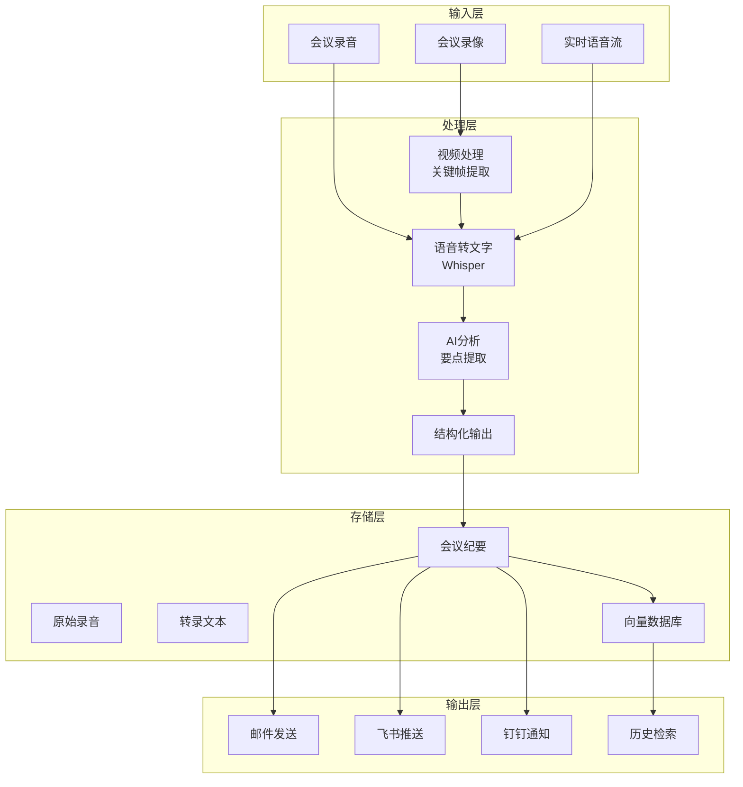

# 第 23 章：高级项目

> 本章将完成两个高级实践项目：智能会议纪要助手和多模态智能客服。

---

## 23.1 项目一：智能会议纪要助手

### 23.1.1 项目概述

**目标**：自动化会议记录流程，从录音到纪要分发的完整解决方案。

**核心功能**：
- 会议录音/视频接收和存储
- 语音转文字（Whisper）
- AI 提取要点、待办事项、决策
- 自动生成结构化纪要
- 多平台分发（邮件、飞书、钉钉）
- 会议历史检索

**技术栈**：
- OpenClaw 核心 + 多平台接入
- Whisper 语音转文字
- 视频关键帧提取（ffmpeg）
- 记忆系统（RAG）
- 定时任务（Cron）
- 多模态理解（视觉模型）

### 23.1.2 系统架构



### 23.1.3 实现步骤

**步骤1：会议录音接收工具**

```typescript
// tools/meeting-recorder.ts

interface MeetingRecording {
  id: string;
  filename: string;
  source: 'upload' | 'live' | 'scheduled';
  participants?: string[];
  topic?: string;
  timestamp: number;
  duration?: number;
  status: 'pending' | 'processing' | 'completed' | 'failed';
}

export function meetingRecorderTools(): Tool[] {
  return [
    // 接收录音文件
    {
      name: 'receive_meeting_recording',
      description: '接收会议录音或录像文件',
      parameters: {
        type: 'object',
        properties: {
          file_path: {
            type: 'string',
            description: '录音文件路径',
          },
          topic: {
            type: 'string',
            description: '会议主题',
          },
          participants: {
            type: 'array',
            items: { type: 'string' },
            description: '参会人员',
          },
          language: {
            type: 'string',
            default: 'zh',
            description: '语言代码',
          },
        },
        required: ['file_path'],
      },
      
      async execute(params) {
        const meetingId = generateId();
        
        // 验证文件
        const stats = await stat(params.file_path);
        const ext = extname(params.file_path).toLowerCase();
        
        // 支持的格式
        const supportedAudio = ['.mp3', '.wav', '.m4a', '.ogg', '.webm'];
        const supportedVideo = ['.mp4', '.mov', '.avi', '.mkv', '.webm'];
        
        if (![...supportedAudio, ...supportedVideo].includes(ext)) {
          return {
            error: `不支持的文件格式：${ext}`,
          };
        }
        
        const isVideo = supportedVideo.includes(ext);
        
        // 保存会议记录
        const recording: MeetingRecording = {
          id: meetingId,
          filename: basename(params.file_path),
          source: 'upload',
          participants: params.participants,
          topic: params.topic,
          timestamp: Date.now(),
          status: 'pending',
        };
        
        await saveMeetingRecord(recording);
        
        // 移动到处理目录
        const targetPath = join('./meetings/raw', `${meetingId}${ext}`);
        await mkdir(dirname(targetPath), { recursive: true });
        await copyFile(params.file_path, targetPath);
        
        return {
          success: true,
          meetingId,
          fileType: isVideo ? 'video' : 'audio',
          fileSize: formatFileSize(stats.size),
          status: '已接收，等待处理',
        };
      },
    },
  ];
}
```

**步骤2：语音转文字处理**

```typescript
// tools/transcription-processor.ts

interface TranscriptionResult {
  text: string;
  segments: Array<{
    start: number;
    end: number;
    text: string;
    speaker?: string;
  }>;
  language: string;
}

export function transcriptionTools(whisperConfig: WhisperConfig): Tool[] {
  const whisper = new WhisperTranscriber(whisperConfig);
  
  return [
    {
      name: 'transcribe_audio',
      description: '将会议录音转录为文字',
      parameters: {
        type: 'object',
        properties: {
          meeting_id: {
            type: 'string',
            description: '会议ID',
          },
          language: {
            type: 'string',
            default: 'zh',
            description: '语言代码',
          },
        },
        required: ['meeting_id'],
      },
      
      async execute(params) {
        const meeting = await getMeetingRecord(params.meeting_id);
        if (!meeting) {
          return { error: `未找到会议：${params.meeting_id}` };
        }
        
        await updateMeetingStatus(params.meeting_id, 'processing');
        
        const audioPath = `./meetings/raw/${meeting.filename}`;
        
        // 如果是视频，先提取音频
        let targetAudio = audioPath;
        if (isVideoFile(audioPath)) {
          targetAudio = `./meetings/temp/${params.meeting_id}.wav`;
          await extractAudioFromVideo(audioPath, targetAudio);
        }
        
        // 调用 Whisper 转录
        const result = await whisper.transcribe({
          audioPath: targetAudio,
          language: params.language,
        });
        
        // 保存转录结果
        const transcriptPath = `./meetings/transcripts/${params.meeting_id}.json`;
        await writeFile(transcriptPath, JSON.stringify(result, null, 2));
        
        await updateMeetingRecord(params.meeting_id, {
          status: 'completed',
          transcriptPath,
          duration: result.segments.at(-1)?.end || 0,
        });
        
        return {
          success: true,
          meetingId: params.meeting_id,
          transcriptLength: result.text.length,
          segments: result.segments.length,
          duration: formatDuration(result.segments.at(-1)?.end || 0),
        };
      },
    },
  ];
}
```

**步骤3：AI 会议纪要生成**

```typescript
// tools/summary-generator.ts

interface MeetingSummary {
  topic: string;
  date: string;
  duration: string;
  participants: string[];
  keyPoints: string[];
  decisions: Array<{
    item: string;
    decision: string;
    owner?: string;
  }>;
  actionItems: Array<{
    task: string;
    assignee?: string;
    dueDate?: string;
    priority: 'high' | 'medium' | 'low';
  }>;
}

export function summaryGeneratorTool(): Tool {
  return {
    name: 'generate_meeting_summary',
    description: '基于转录文本生成结构化会议纪要',
    parameters: {
      type: 'object',
      properties: {
        meeting_id: {
          type: 'string',
          description: '会议ID',
        },
      },
      required: ['meeting_id'],
    },
    
    async execute(params) {
      const meeting = await getMeetingRecord(params.meeting_id);
      const transcript: TranscriptionResult = JSON.parse(
        await readFile(meeting.transcriptPath, 'utf-8')
      );
      
      const prompt = `请根据以下会议转录文本生成结构化会议纪要。

转录文本：
${transcript.text}

请按以下格式输出：
## 会议主题
## 参会人员
## 核心要点
## 决策事项
## 待办事项（含责任人+截止日期）`;
      
      const response = await llm.generate({
        prompt,
        model: 'kimi-coding/k2p5',
        temperature: 0.3,
      });
      
      const summary = this.parseSummary(response.text, meeting);
      
      const summaryPath = `./meetings/summaries/${params.meeting_id}.json`;
      await writeFile(summaryPath, JSON.stringify(summary, null, 2));
      
      return {
        success: true,
        summary,
      };
    },
  };
}
```

**步骤4：纪要分发工具**

```typescript
// tools/distribute-summary.ts

export function distributeSummaryTool(): Tool {
  return {
    name: 'distribute_meeting_summary',
    description: '将会议纪要多平台分发',
    parameters: {
      type: 'object',
      properties: {
        meeting_id: {
          type: 'string',
          description: '会议ID',
        },
        channels: {
          type: 'array',
          items: {
            type: 'string',
            enum: ['email', 'feishu', 'dingding'],
          },
        },
      },
      required: ['meeting_id', 'channels'],
    },
    
    async execute(params) {
      const summary: MeetingSummary = JSON.parse(
        await readFile(`./meetings/summaries/${params.meeting_id}.json`, 'utf-8')
      );
      
      const results = [];
      
      for (const channel of params.channels) {
        const content = this.formatForChannel(summary, channel);
        
        switch (channel) {
          case 'email':
            await this.sendEmail({
              subject: `会议纪要：${summary.topic}`,
              body: content,
            });
            break;
          case 'feishu':
            await message.send({
              channel: 'lark',
              message: content,
            });
            break;
        }
        
        results.push({ channel, status: 'success' });
      }
      
      return {
        distributed: results.length,
        details: results,
      };
    },
  };
}
```

### 23.1.4 运行效果

```
用户上传会议录音 meeting_20240215.mp3

小会：已接收会议录音
会议ID：mt_abc123
文件大小：15.3 MB
开始转录...

---

[3分钟后]

小会：转录完成！
会议时长：45分钟
转录字数：8,500字
说话人：5人

正在生成纪要...

---

小会：会议纪要已生成！

📋 产品评审会 - 2024.02.15

核心要点：
1. Q2目标：DAU增长30%
2. 新功能优先级：搜索优化 > 推荐算法
3. 技术债务：需在3月底前完成重构

决策事项：
• 搜索功能采用Elasticsearch方案
  负责人：张三

待办事项：
[高] 完成技术方案评审 @张三 (2/20)
[中] 准备UI设计稿 @李四 (2/25)

分发到：邮件、飞书群？
```

---

## 23.2 项目二：多模态智能客服升级版

### 23.2.1 项目概述

**目标**：打造支持文本、图片、视频的多模态智能客服系统。

**核心功能**：
- 文本问答（基于RAG知识库）
- 图片故障诊断（视觉模型）
- 视频指导（关键帧分析）
- 多轮对话上下文
- 人工无缝转接

### 23.2.2 实现步骤

**步骤1：多模态输入处理**

```typescript
// tools/multimodal-input.ts

export function multimodalInputTools(): Tool[] {
  return [
    // 接收并分析图片
    {
      name: 'analyze_image',
      description: '分析用户发送的图片，识别故障或问题',
      parameters: {
        type: 'object',
        properties: {
          image_path: {
            type: 'string',
            description: '图片文件路径',
          },
          context: {
            type: 'string',
            description: '用户附带的文字描述',
          },
        },
        required: ['image_path'],
      },
      
      async execute(params) {
        const imageBuffer = await readFile(params.image_path);
        
        const analysis = await vision.analyze({
          image: imageBuffer,
          prompt: `你是一位技术支持工程师。请分析这张图片：
1. 图片中是什么设备/场景？
2. 是否有明显的故障或异常？
3. 可能的问题原因是什么？
4. 建议的解决步骤（1-3步）`,
        });
        
        return {
          device: '路由器',
          issue: '红灯闪烁，网络连接异常',
          severity: 'major',
          suggestedActions: [
            '检查网线连接是否松动',
            '重启路由器',
            '如仍有问题，联系运营商',
          ],
        };
      },
    },
    
    // 接收并分析视频
    {
      name: 'analyze_video',
      description: '分析用户发送的视频，提取关键帧并诊断',
      parameters: {
        type: 'object',
        properties: {
          video_path: {
            type: 'string',
            description: '视频文件路径',
          },
        },
        required: ['video_path'],
      },
      
      async execute(params) {
        // 提取关键帧
        const frames = await extractKeyFrames(params.video_path, 5);
        
        // 分析每个关键帧
        const analyses = await Promise.all(
          frames.map(async (frame) => {
            const analysis = await vision.analyze({
              image: frame.path,
              prompt: '分析这张截图，描述内容和异常',
            });
            return {
              timestamp: frame.timestamp,
              description: analysis.description,
            };
          })
        );
        
        return {
          keyFrames: analyses.length,
          timeline: analyses,
          recommendation: '根据视频分析，建议检查网线连接',
        };
      },
    },
  ];
}
```

**步骤2：知识库检索**

```typescript
// tools/knowledge-search.ts

export function knowledgeSearchTool(): Tool {
  return {
    name: 'search_knowledge_base',
    description: '检索知识库寻找解决方案',
    parameters: {
      type: 'object',
      properties: {
        query: {
          type: 'string',
          description: '搜索关键词',
        },
        top_k: {
          type: 'number',
          default: 3,
        },
      },
      required: ['query'],
    },
    
    async execute(params) {
      // 使用 RAG 检索
      const results = await memory.search({
        query: params.query,
        topK: params.top_k,
      });
      
      return {
        solutions: results.map(r => ({
          title: r.metadata.title,
          content: r.content,
          source: r.path,
          relevance: r.score,
        })),
      };
    },
  };
}
```

**步骤3：智能路由决策**

```typescript
// tools/intent-router.ts

export function intentRouterTool(): Tool {
  return {
    name: 'route_customer_intent',
    description: '根据用户问题智能路由到处理方式',
    parameters: {
      type: 'object',
      properties: {
        query: {
          type: 'string',
          description: '用户问题',
        },
        has_image: {
          type: 'boolean',
          default: false,
        },
        has_video: {
          type: 'boolean',
          default: false,
        },
      },
      required: ['query'],
    },
    
    async execute(params) {
      // 分析意图
      const intent = await this.analyzeIntent(params.query);
      
      // 决策路由
      if (params.has_image || params.has_video) {
        return { action: 'analyze_media', tools: ['analyze_image'] };
      }
      
      if (intent.confidence < 0.6) {
        return { action: 'search_knowledge', tools: ['search_knowledge_base'] };
      }
      
      if (intent.urgency === 'high') {
        return { action: 'transfer_human', reason: '高优先级问题' };
      }
      
      return { action: 'direct_answer', response: intent.answer };
    },
  };
}
```

### 23.2.3 运行效果

```
用户：[发送路由器指示灯照片]

客服：识别到：路由器红灯闪烁 🔴

可能原因：
1. 网络连接异常
2. 网线松动或损坏
3. 运营商网络故障

建议解决步骤：
1️⃣ 检查网线两端连接是否牢固
2️⃣ 重启路由器（断电30秒后重新上电）
3️⃣ 如仍有问题，联系运营商检查线路

需要视频指导吗？

---

用户：[发送故障视频]

客服：分析视频中...
关键帧1：路由器电源正常
关键帧2：网线接口有松动
关键帧3：重新插拔后恢复正常 ✅

诊断结果：网线接触不良
解决状态：已解决

还有其他问题吗？

---

用户：还是不行

客服：已为您转接人工客服 👨‍💼
等待时间：约2分钟
工单号：#CS20240215001

[转接中...]
```

---

## 本章小结

本章完成了两个高级项目：

1. **智能会议纪要助手**
   - 语音转录（Whisper）
   - AI总结（要点+决策+待办）
   - 多平台分发

2. **多模态智能客服**
   - 图片故障诊断
   - 视频分析指导
   - 知识库+RAG

**关键技能**：
- 语音/视频处理
- 多模态AI应用
- 复杂工作流设计

---

*下一章：第 24 章 企业级项目*
