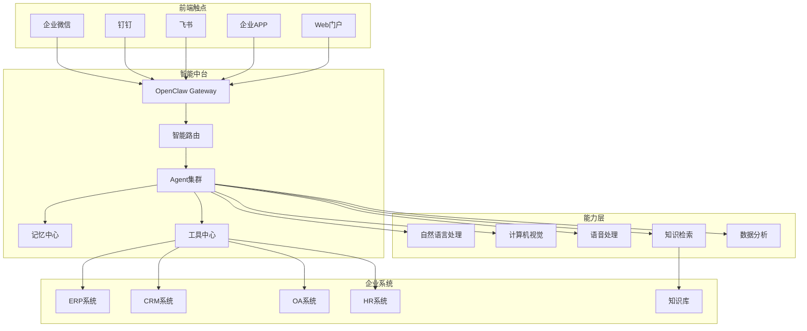

# 第 24 章：企业智能中台

> 本章将构建一个企业级智能中台，整合 OpenClaw 的所有核心能力，提供统一的 AI 服务入口。

---

## 24.1 项目概述

### 24.1.1 什么是企业智能中台

企业智能中台是将 AI 能力集中化、服务化、平台化的解决方案：



### 24.1.2 核心功能

| 功能模块 | 说明 | 技术实现 |
|---------|------|---------|
| **统一接入** | 多平台消息统一处理 | Gateway + Channel Adapter |
| **智能路由** | 根据意图分配 Agent | Intent Classification |
| **Agent集群** | 多节点负载均衡 | Multi-Node Deployment |
| **记忆中心** | 企业级知识库 | RAG + Vector DB |
| **工具中心** | 企业系统集成 | Plugin System |
| **权限管控** | 企业级安全 | RBAC + Audit |

### 24.1.3 技术架构

```
┌─────────────────────────────────────────────────────────┐
│                      接入层                               │
│  ┌─────────┐ ┌─────────┐ ┌─────────┐ ┌─────────┐       │
│  │ 企业微信 │ │  钉钉   │ │  飞书   │ │  Web    │       │
│  └────┬────┘ └────┬────┘ └────┬────┘ └────┬────┘       │
└───────┼───────────┼───────────┼───────────┼─────────────┘
        │           │           │           │
        └───────────┴─────┬─────┴───────────┘
                          ▼
┌─────────────────────────────────────────────────────────┐
│                      网关层                               │
│  ┌─────────────────────────────────────────────────┐   │
│  │              OpenClaw Gateway                    │   │
│  │  ┌─────────┐ ┌─────────┐ ┌─────────┐          │   │
│  │  │ 消息路由 │ │ 负载均衡 │ │ 限流熔断 │          │   │
│  │  └─────────┘ └─────────┘ └─────────┘          │   │
│  └─────────────────────────────────────────────────┘   │
└─────────────────────────────────────────────────────────┘
                          ▼
┌─────────────────────────────────────────────────────────┐
│                      服务层                               │
│  ┌─────────┐ ┌─────────┐ ┌─────────┐ ┌─────────┐       │
│  │ 客服Agent│ │ 办公Agent│ │ 数据Agent│ │ 开发Agent│       │
│  └────┬────┘ └────┬────┘ └────┬────┘ └────┬────┘       │
└───────┼───────────┼───────────┼───────────┼─────────────┘
        │           │           │           │
        └───────────┴─────┬─────┴───────────┘
                          ▼
┌─────────────────────────────────────────────────────────┐
│                      能力层                               │
│  ┌─────────┐ ┌─────────┐ ┌─────────┐ ┌─────────┐       │
│  │  LLM    │ │  RAG    │ │  Vision │ │  Voice  │       │
│  └─────────┘ └─────────┘ └─────────┘ └─────────┘       │
└─────────────────────────────────────────────────────────┘
                          ▼
┌─────────────────────────────────────────────────────────┐
│                      数据层                               │
│  ┌─────────┐ ┌─────────┐ ┌─────────┐ ┌─────────┐       │
│  │ 向量数据库│ │ 关系数据库│ │  缓存   │ │ 对象存储 │       │
│  └─────────┘ └─────────┘ └─────────┘ └─────────┘       │
└─────────────────────────────────────────────────────────┘
```

---

## 24.2 核心模块实现

### 24.2.1 统一接入网关

```typescript
// src/gateway/enterprise-gateway.ts

interface EnterpriseGatewayConfig {
  channels: ChannelConfig[];
  agents: AgentConfig[];
  routing: RoutingConfig;
  security: SecurityConfig;
}

class EnterpriseGateway {
  private router: IntentRouter;
  private agentPool: AgentPool;
  private memoryCenter: MemoryCenter;
  private toolCenter: ToolCenter;
  
  constructor(private config: EnterpriseGatewayConfig) {
    this.router = new IntentRouter(config.routing);
    this.agentPool = new AgentPool(config.agents);
    this.memoryCenter = new MemoryCenter();
    this.toolCenter = new ToolCenter();
  }
  
  async initialize(): Promise<void> {
    // 初始化所有渠道
    for (const channel of this.config.channels) {
      await this.initializeChannel(channel);
    }
    
    // 初始化 Agent 池
    await this.agentPool.initialize();
    
    // 初始化记忆中心
    await this.memoryCenter.initialize();
    
    console.log('Enterprise Gateway initialized');
  }
  
  async handleMessage(message: InboundMessage): Promise<void> {
    // 1. 身份验证
    const user = await this.authenticate(message);
    if (!user) {
      await this.sendReply(message, '身份验证失败，请联系管理员');
      return;
    }
    
    // 2. 意图识别
    const intent = await this.router.classifyIntent(message.content);
    
    // 3. 路由到对应 Agent
    const agent = this.agentPool.getAgent(intent.agentType);
    
    // 4. 构建上下文
    const context = await this.buildContext(user, message, intent);
    
    // 5. 执行 Agent
    const response = await agent.execute(context);
    
    // 6. 发送回复
    await this.sendReply(message, response);
    
    // 7. 记录日志
    await this.auditLog(message, intent, response);
  }
  
  private async buildContext(
    user: User,
    message: InboundMessage,
    intent: Intent
  ): Promise<AgentContext> {
    // 获取用户历史对话
    const history = await this.memoryCenter.getConversationHistory(
      user.id,
      10
    );
    
    // 获取企业知识
    const knowledge = await this.memoryCenter.searchEnterpriseKnowledge(
      message.content,
      5
    );
    
    // 获取用户权限
    const permissions = await this.getUserPermissions(user);
    
    return {
      user,
      message,
      intent,
      history,
      knowledge,
      permissions,
      tools: this.toolCenter.getToolsForIntent(intent),
    };
  }
}
```

### 24.2.2 智能路由系统

```typescript
// src/routing/intent-router.ts

interface Intent {
  type: string;
  agentType: string;
  confidence: number;
  entities: Record<string, string>;
  urgency: 'low' | 'medium' | 'high';
}

class IntentRouter {
  private classifiers: Map<string, IntentClassifier>;
  
  constructor(config: RoutingConfig) {
    this.classifiers = new Map();
    
    // 初始化分类器
    for (const [type, classifierConfig] of Object.entries(config.classifiers)) {
      this.classifiers.set(type, new IntentClassifier(classifierConfig));
    }
  }
  
  async classifyIntent(content: string): Promise<Intent> {
    // 使用 LLM 进行意图识别
    const prompt = `分析以下用户请求，识别意图类型：

请求："${content}"

可选意图类型：
- customer_service: 客服咨询、问题反馈
- office_automation: 办公审批、流程申请
- data_query: 数据查询、报表生成
- development: 开发支持、技术咨询
- general: 一般对话

请以 JSON 格式返回：
{
  "type": "意图类型",
  "confidence": 0.95,
  "entities": { "关键实体": "值" },
  "urgency": "high/medium/low"
}`;

    const response = await llm.generate({
      prompt,
      model: 'kimi-coding/k2p5',
      temperature: 0.1,
    });
    
    const result = JSON.parse(response.text);
    
    // 映射到 Agent 类型
    const agentMapping: Record<string, string> = {
      customer_service: 'cs-agent',
      office_automation: 'oa-agent',
      data_query: 'data-agent',
      development: 'dev-agent',
      general: 'general-agent',
    };
    
    return {
      type: result.type,
      agentType: agentMapping[result.type] || 'general-agent',
      confidence: result.confidence,
      entities: result.entities,
      urgency: result.urgency,
    };
  }
  
  // 规则路由（兜底）
  ruleBasedRoute(content: string): Intent {
    const rules = [
      { pattern: /报销|请假|审批|申请/, type: 'office_automation', agent: 'oa-agent' },
      { pattern: /投诉|问题|故障|售后/, type: 'customer_service', agent: 'cs-agent' },
      { pattern: /数据|报表|统计|分析/, type: 'data_query', agent: 'data-agent' },
      { pattern: /代码|bug|开发|部署/, type: 'development', agent: 'dev-agent' },
    ];
    
    for (const rule of rules) {
      if (rule.pattern.test(content)) {
        return {
          type: rule.type,
          agentType: rule.agent,
          confidence: 0.7,
          entities: {},
          urgency: 'medium',
        };
      }
    }
    
    return {
      type: 'general',
      agentType: 'general-agent',
      confidence: 0.5,
      entities: {},
      urgency: 'low',
    };
  }
}
```

### 24.2.3 Agent 池管理

```typescript
// src/agents/agent-pool.ts

interface AgentConfig {
  id: string;
  type: string;
  name: string;
  description: string;
  capabilities: string[];
  maxInstances: number;
  model: string;
}

class AgentPool {
  private agents = new Map<string, AgentInstance[]>();
  private configs: Map<string, AgentConfig>;
  
  constructor(configs: AgentConfig[]) {
    this.configs = new Map(configs.map(c => [c.type, c]));
  }
  
  async initialize(): Promise<void> {
    // 预创建常用 Agent 实例
    for (const [type, config] of this.configs) {
      const instances: AgentInstance[] = [];
      for (let i = 0; i < Math.min(2, config.maxInstances); i++) {
        instances.push(await this.createAgent(config));
      }
      this.agents.set(type, instances);
    }
  }
  
  getAgent(type: string): AgentInstance {
    const pool = this.agents.get(type);
    if (!pool || pool.length === 0) {
      throw new Error(`No available agent for type: ${type}`);
    }
    
    // 选择负载最低的 Agent
    return pool.sort((a, b) => a.load - b.load)[0];
  }
  
  private async createAgent(config: AgentConfig): Promise<AgentInstance> {
    const agent = new AgentInstance(config);
    await agent.initialize();
    return agent;
  }
}

class AgentInstance {
  private tools: Tool[];
  load = 0;
  
  constructor(private config: AgentConfig) {}
  
  async initialize(): Promise<void> {
    // 加载 Agent 配置
    this.tools = await this.loadTools();
  }
  
  async execute(context: AgentContext): Promise<string> {
    this.load++;
    
    try {
      // 构建系统提示词
      const systemPrompt = this.buildSystemPrompt();
      
      // 构建消息历史
      const messages = this.buildMessages(context);
      
      // 调用 LLM
      const response = await llm.chat({
        model: this.config.model,
        system: systemPrompt,
        messages,
        tools: this.tools,
      });
      
      return response.content;
    } finally {
      this.load--;
    }
  }
  
  private buildSystemPrompt(): string {
    return `你是 ${this.config.name}，${this.config.description}

## 能力范围
${this.config.capabilities.map(c => `- ${c}`).join('\n')}

## 回复规则
- 专业、简洁、准确
- 不确定时承认并建议转人工
- 涉及敏感操作需确认身份`;
  }
}
```

### 24.2.4 记忆中心

```typescript
// src/memory/memory-center.ts

class MemoryCenter {
  private vectorStore: VectorStore;
  private cache: Cache;
  
  async initialize(): Promise<void> {
    // 初始化向量数据库
    this.vectorStore = new VectorStore({
      provider: 'sqlite-vec',
      path: './data/enterprise-memory.db',
    });
    
    // 初始化缓存
    this.cache = new Cache({
      maxSize: 10000,
      ttl: 3600000,
    });
    
    // 加载企业知识库
    await this.loadEnterpriseKnowledge();
  }
  
  // 获取用户对话历史
  async getConversationHistory(
    userId: string,
    limit: number
  ): Promise<ConversationMessage[]> {
    const cacheKey = `history:${userId}`;
    let history = this.cache.get(cacheKey);
    
    if (!history) {
      history = await this.vectorStore.query({
        filter: { userId, type: 'conversation' },
        orderBy: 'timestamp DESC',
        limit,
      });
      
      this.cache.set(cacheKey, history, 300000);
    }
    
    return history;
  }
  
  // 搜索企业知识
  async searchEnterpriseKnowledge(
    query: string,
    topK: number
  ): Promise<KnowledgeItem[]> {
    // 混合检索
    const [vectorResults, keywordResults] = await Promise.all([
      this.vectorStore.similaritySearch(query, topK),
      this.keywordSearch(query, topK),
    ]);
    
    // 合并去重
    const merged = this.mergeResults(vectorResults, keywordResults);
    
    return merged.slice(0, topK);
  }
  
  // 保存对话记录
  async saveConversation(
    userId: string,
    message: string,
    response: string
  ): Promise<void> {
    const embedding = await this.generateEmbedding(message);
    
    await this.vectorStore.upsert({
      id: generateId(),
      userId,
      type: 'conversation',
      content: message,
      response,
      embedding,
      timestamp: Date.now(),
    });
    
    // 清除缓存
    this.cache.delete(`history:${userId}`);
  }
  
  private async loadEnterpriseKnowledge(): Promise<void> {
    // 加载企业文档
    const docs = await loadDocuments('./knowledge/enterprise');
    
    for (const doc of docs) {
      const chunks = chunkDocument(doc);
      
      for (const chunk of chunks) {
        const embedding = await this.generateEmbedding(chunk.text);
        
        await this.vectorStore.upsert({
          id: generateId(),
          type: 'knowledge',
          source: doc.path,
          content: chunk.text,
          embedding,
          metadata: doc.metadata,
        });
      }
    }
  }
}
```

### 24.2.5 工具中心

```typescript
// src/tools/tool-center.ts

class ToolCenter {
  private tools = new Map<string, Tool[]>();
  private plugins = new Map<string, Plugin>();
  
  async initialize(): Promise<void> {
    // 注册内置工具
    this.registerBuiltinTools();
    
    // 加载插件
    await this.loadPlugins();
  }
  
  getToolsForIntent(intent: Intent): Tool[] {
    const toolMapping: Record<string, string[]> = {
      'cs-agent': ['query_order', 'create_ticket', 'search_knowledge'],
      'oa-agent': ['submit_approval', 'query_leave', 'book_meeting'],
      'data-agent': ['query_database', 'generate_report', 'export_data'],
      'dev-agent': ['search_code', 'deploy_app', 'check_logs'],
      'general-agent': ['search_knowledge', 'send_message'],
    };
    
    const toolNames = toolMapping[intent.agentType] || [];
    
    return toolNames
      .map(name => this.getTool(name))
      .filter((t): t is Tool => !!t);
  }
  
  private registerBuiltinTools(): void {
    // 企业系统集成工具
    this.registerTool(createERPQueryTool());
    this.registerTool(createCRMQueryTool());
    this.registerTool(createOATool());
    this.registerTool(createHRQueryTool());
    
    // 通用工具
    this.registerTool(createEmailTool());
    this.registerTool(createCalendarTool());
    this.registerTool(createDocumentTool());
  }
  
  private async loadPlugins(): Promise<void> {
    const pluginDir = './plugins';
    const entries = await readdir(pluginDir, { withFileTypes: true });
    
    for (const entry of entries) {
      if (entry.isDirectory()) {
        try {
          const plugin = await this.loadPlugin(join(pluginDir, entry.name));
          this.plugins.set(plugin.name, plugin);
          
          // 注册插件工具
          for (const tool of plugin.tools) {
            this.registerTool(tool);
          }
        } catch (error) {
          console.error(`Failed to load plugin ${entry.name}:`, error);
        }
      }
    }
  }
}
```

---

## 24.3 企业系统集成

### 24.3.1 ERP 系统对接

```typescript
// tools/erp-integration.ts

export function createERPQueryTool(): Tool {
  return {
    name: 'query_erp',
    description: '查询ERP系统数据',
    parameters: {
      type: 'object',
      properties: {
        module: {
          type: 'string',
          enum: ['inventory', 'sales', 'purchase', 'finance'],
          description: 'ERP模块',
        },
        query: {
          type: 'string',
          description: '查询条件',
        },
      },
      required: ['module', 'query'],
    },
    
    async execute(params) {
      const erp = new ERPClient({
        baseUrl: process.env.ERP_API_URL,
        apiKey: process.env.ERP_API_KEY,
      });
      
      const result = await erp.query(params.module, params.query);
      
      return {
        data: result,
        module: params.module,
        timestamp: new Date().toISOString(),
      };
    },
  };
}
```

### 24.3.2 CRM 系统对接

```typescript
// tools/crm-integration.ts

export function createCRMQueryTool(): Tool {
  return {
    name: 'query_crm',
    description: '查询客户信息和销售数据',
    parameters: {
      type: 'object',
      properties: {
        type: {
          type: 'string',
          enum: ['customer', 'opportunity', 'order'],
          description: '查询类型',
        },
        keyword: {
          type: 'string',
          description: '搜索关键词',
        },
      },
      required: ['type', 'keyword'],
    },
    
    async execute(params) {
      const crm = new CRMClient({
        baseUrl: process.env.CRM_API_URL,
        apiKey: process.env.CRM_API_KEY,
      });
      
      const result = await crm.search(params.type, params.keyword);
      
      return {
        results: result.items,
        total: result.total,
        type: params.type,
      };
    },
  };
}
```

### 24.3.3 OA 系统对接

```typescript
// tools/oa-integration.ts

export function createOATool(): Tool {
  return {
    name: 'oa_operations',
    description: 'OA系统操作：提交审批、查询流程',
    parameters: {
      type: 'object',
      properties: {
        action: {
          type: 'string',
          enum: ['submit_approval', 'query_status', 'approve', 'reject'],
          description: '操作类型',
        },
        formType: {
          type: 'string',
          enum: ['leave', 'expense', 'purchase', 'general'],
          description: '表单类型',
        },
        data: {
          type: 'object',
          description: '表单数据',
        },
      },
      required: ['action', 'formType'],
    },
    
    async execute(params) {
      const oa = new OAClient({
        baseUrl: process.env.OA_API_URL,
        token: process.env.OA_TOKEN,
      });
      
      switch (params.action) {
        case 'submit_approval':
          return await oa.submitApproval(params.formType, params.data);
        case 'query_status':
          return await oa.queryApprovalStatus(params.data?.flowId);
        case 'approve':
          return await oa.approve(params.data?.flowId, params.data?.comment);
        case 'reject':
          return await oa.reject(params.data?.flowId, params.data?.comment);
      }
    },
  };
}
```

---

## 24.4 部署与运维

### 24.4.1 Docker 部署

```yaml
# docker-compose.yml
version: '3.8'

services:
  gateway:
    image: openclaw/enterprise-gateway:latest
    ports:
      - "8080:8080"
    environment:
      - NODE_ENV=production
      - DATABASE_URL=postgres://user:pass@db:5432/openclaw
      - REDIS_URL=redis://redis:6379
    volumes:
      - ./config:/app/config
      - ./data:/app/data
    depends_on:
      - db
      - redis
      - vector-db
    deploy:
      replicas: 3
      resources:
        limits:
          cpus: '2'
          memory: 4G

  agent-pool:
    image: openclaw/agent-pool:latest
    environment:
      - GATEWAY_URL=http://gateway:8080
      - MODEL_PROVIDER=moonshot
    deploy:
      replicas: 5
      resources:
        limits:
          cpus: '4'
          memory: 8G

  db:
    image: postgres:15
    environment:
      - POSTGRES_USER=openclaw
      - POSTGRES_PASSWORD=${DB_PASSWORD}
      - POSTGRES_DB=openclaw
    volumes:
      - postgres_data:/var/lib/postgresql/data

  redis:
    image: redis:7-alpine
    volumes:
      - redis_data:/data

  vector-db:
    image: ankane/pgvector:latest
    environment:
      - POSTGRES_USER=openclaw
      - POSTGRES_PASSWORD=${VECTOR_DB_PASSWORD}
    volumes:
      - vector_data:/var/lib/postgresql/data

volumes:
  postgres_data:
  redis_data:
  vector_data:
```

### 24.4.2 Kubernetes 部署

```yaml
# k8s-deployment.yaml
apiVersion: apps/v1
kind: Deployment
metadata:
  name: openclaw-gateway
spec:
  replicas: 3
  selector:
    matchLabels:
      app: openclaw-gateway
  template:
    metadata:
      labels:
        app: openclaw-gateway
    spec:
      containers:
      - name: gateway
        image: openclaw/enterprise-gateway:latest
        ports:
        - containerPort: 8080
        env:
        - name: DATABASE_URL
          valueFrom:
            secretKeyRef:
              name: openclaw-secrets
              key: database-url
        resources:
          requests:
            memory: "2Gi"
            cpu: "1000m"
          limits:
            memory: "4Gi"
            cpu: "2000m"
        livenessProbe:
          httpGet:
            path: /health
            port: 8080
          initialDelaySeconds: 30
          periodSeconds: 10
        readinessProbe:
          httpGet:
            path: /ready
            port: 8080
          initialDelaySeconds: 5
          periodSeconds: 5
---
apiVersion: v1
kind: Service
metadata:
  name: openclaw-gateway
spec:
  selector:
    app: openclaw-gateway
  ports:
  - port: 80
    targetPort: 8080
  type: LoadBalancer
```

### 24.4.3 监控告警

```typescript
// src/monitoring/metrics.ts

import { PrometheusExporter } from '@opentelemetry/exporter-prometheus';
import { MeterProvider } from '@opentelemetry/sdk-metrics';

const meterProvider = new MeterProvider({
  readers: [new PrometheusExporter({ port: 9090 })],
});

const meter = meterProvider.getMeter('openclaw-enterprise');

// 定义指标
const requestCounter = meter.createCounter('openclaw_requests_total', {
  description: 'Total number of requests',
});

const responseTimeHistogram = meter.createHistogram('openclaw_response_time', {
  description: 'Response time in milliseconds',
  unit: 'ms',
});

const agentLoadGauge = meter.createObservableGauge('openclaw_agent_load', {
  description: 'Current load of agents',
});

// 记录指标
export function recordMetrics(context: RequestContext): void {
  requestCounter.add(1, {
    agent: context.agentType,
    channel: context.channel,
    status: context.responseStatus,
  });
  
  responseTimeHistogram.record(context.duration, {
    agent: context.agentType,
  });
}
```

---

## 24.5 运行效果

```
员工A（企业微信）：帮我查一下上个月的销售额

智能中台：
├─ 识别意图：数据查询（data-agent）
├─ 权限验证：✓ 有销售数据查看权限
├─ 调用工具：query_erp
├─ 生成回复：
│   "2024年1月销售额：
│    • 总销售额：¥1,250,000
│    • 同比增长：+15%
│    •  top3产品：A产品(30%)、B产品(25%)、C产品(20%)
│    
│    需要详细报表吗？"
└─ 记录日志：✓

---

员工B（钉钉）：我要请假3天

智能中台：
├─ 识别意图：办公审批（oa-agent）
├─ 权限验证：✓ 有请假权限
├─ 剩余年假：12天
├─ 调用工具：oa_operations submit_approval
├─ 生成回复：
│   "已为您提交请假申请：
│    • 请假时间：2024-02-20 至 2024-02-22
│    • 请假类型：年假
│    • 审批人：部门经理 张三
│    • 审批状态：待审批
│    
│    审批链接：[查看详情]"
└─ 通知审批人：✓

---

员工C（飞书）：这个客户投诉怎么处理？

智能中台：
├─ 识别意图：客服咨询（cs-agent）
├─ 查询CRM：客户历史订单、投诉记录
├─ 搜索知识库：相似投诉处理方案
├─ 生成回复：
│   "客户投诉分析：
│    • 客户等级：VIP
│    • 投诉类型：产品质量
│    • 建议方案：
│      1. 道歉并解释原因
│      2. 提供免费换货
│      3. 赠送优惠券补偿
│    • 处理时效：24小时内
│    
│    需要我帮您创建工单吗？"
└─ 推荐方案置信度：92%
```

---

## 本章小结

本章完成了企业智能中台的构建：

1. **统一接入网关** - 多平台消息统一处理
2. **智能路由系统** - 意图识别 + Agent分配
3. **Agent池管理** - 多节点负载均衡
4. **记忆中心** - 企业级知识库 + 对话历史
5. **工具中心** - ERP/CRM/OA/HR系统集成
6. **部署运维** - Docker/K8s + 监控告警

**企业价值**：
- 降低人力成本 30%
- 提升响应速度 5倍
- 统一服务体验
- 数据资产沉淀

---

*OpenClaw 完整学习教程至此结束*

## 教程总结

通过本教程的学习，你已经掌握了：

1. **基础入门** - OpenClaw 概览、环境搭建、第一个Agent
2. **核心概念** - 消息传输、网关架构、通道抽象
3. **平台集成** - Discord、Telegram、飞书、iMessage
4. **AI Agent** - 运行器、工具系统、记忆系统、媒体理解
5. **高级特性** - 定时任务、插件系统、多节点部署、安全权限、性能优化
6. **实践项目** - 从入门到企业级的完整案例

**下一步**：开始构建你自己的 OpenClaw 应用吧！
